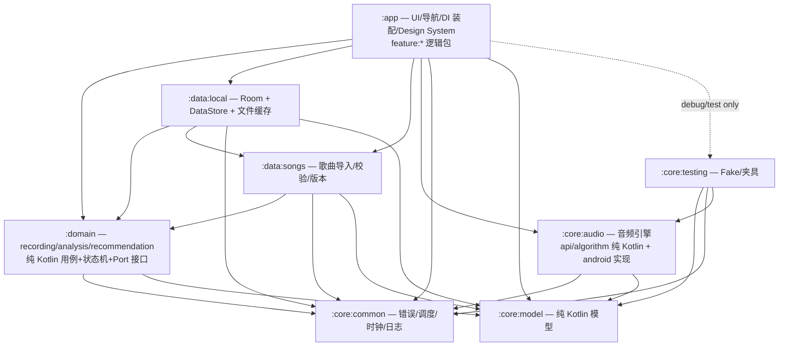

# ARCHITECTURE.md — matchsong MVP 架构设计文档

- **里程碑：** M0（MVP 与架构冻结）
- **状态：** DRAFT（M0.2 交付物）
- **版本：** 0.1.0
- **日期：** 2026-07-31
- **依据：** SPEC.md（§7 推荐系统、§8 数据模型、§9 架构概要、§10 隐私、§11 非功能需求、§12 验收条件）、PLAN.md §2.2（默认技术栈）与 §6.2 M0.2、ADR-001..003、docs/experiments/pitch-detection-results.md、docs/experiments/audio-recording-spike-results.md
- **约定：** 工程判断标注 [推测]；可追溯编号（FR-xxx / ACC-xx / ADR-0xx）对应 SPEC/ADR 原文

> 注：当前仓库为纯 Kotlin/JVM 脚手架，M1 将按本文档创建 Android 工程；本文定义的是**目标架构**。
> 注：SPEC §9 为本文档的上位约束，模块划分以 SPEC §9 为准；本文在其基础上明确了"真实 Gradle 模块"与"逻辑边界"的取舍（见 §3）。

---

## 1. 架构目标与原则

### 1.1 架构目标

1. **可测试**：核心逻辑（domain、core:model、core:audio 算法）可在纯 JVM 上单测，不依赖 Android 设备（SPEC §11：核心逻辑行覆盖率 ≥ 80%）；
2. **可解释**：推荐理由由实测特征数据生成（FR-RECM-4），架构保证特征计算与解释生成同源、可追溯；
3. **隐私可审计**：原始音频只存在于临时缓存、分析后删除（FR-PRIV-1），无网络权限（SPEC §10.3），日志脱敏（FR-PRIV-4）；
4. **可演进**：MVP 合并 Gradle 模块但保留逻辑边界，未来拆分 feature / domain 模块时无需重构依赖关系（见 §3.2）；
5. **性能可证明**：分析管线全部在后台线程执行，关键路径有实测数据支撑（YIN 桌面实测 ~1.04ms/帧，见 §9.6），真机基准留待 M10。

### 1.2 架构原则

| # | 原则 | 说明 |
|---|---|---|
| P1 | **依赖单向**：`feature → domain → core` | `data` 只依赖 `domain` 的接口（Port）与 `core`，**实现** domain 接口；任何反向依赖（domain 依赖 data、feature 依赖 data 实现类）都是架构违规 |
| P2 | **UI 不依赖 Audio Engine 实现类** | feature 层只依赖 `AudioRecorder` / `RecordingPort` 等**接口**与纯 Kotlin 模型；`AndroidAudioRecorder`、`RecordingService` 等实现类仅被 DI 装配层引用 |
| P3 | **领域层纯净** | `domain` / `core:model` 为纯 Kotlin，零 Android import；Android 框架依赖只出现在 `app` 与 `core:audio` 的 `android` 子包 |
| P4 | **单一数据源** | 每个数据域只有一个权威来源：历史/收藏/反馈/同意记录 → Room；设置/Onboarding 标记 → DataStore；音频文件 → cache 目录；UI 状态 → ViewModel 的 StateFlow |
| P5 | **禁止跨层泄漏** | 不允许：UI 直接读写 Room/DataStore/文件；domain 直接使用 Android API；data 层反向调用 UI 状态 |
| P6 | **不可靠音频不得产生正式结果** | 质量门禁不合格（FR-QUAL-3）或有效帧不足（FR-ANAL-8）时，流水线短路，不生成音域/推荐（ACC-7/8/9） |
| P7 | **结果诚实** | 所有输出标注"本次录音估计"，不输出音色类型、唱功分数、医学/绝对化结论（SPEC §1、ADR-001）；算法版本随结果落库（FR-HX-1） |
| P8 | **可取消、可恢复** | 长任务（录音、分析）支持取消；取消/崩溃不产生半成品结果，临时文件必被清理（SPEC §6） |
| P9 | **无空 catch** | 所有异常必须被捕获、记录（Logger）并映射为类型化错误（见 §12）；空 catch 视为违规 |

---

## 2. 分层总览

```text
┌─────────────────────────────────────────────────────────────┐
│  UI 层（:app）  Compose + Navigation Compose + MVVM          │
│  feature:onboarding / recording / analysis / recommendation  │
│  / history / settings + Design System（design 包）           │
├─────────────────────────────────────────────────────────────┤
│  Domain 层（:domain，纯 Kotlin）                              │
│  recording（状态机+用例） analysis（质量→音高→音域统计）        │
│  recommendation（候选→变调→评分→排序→解释）                    │
│  定义 Port：*Repository、RecordingPort                        │
├─────────────────────────────────────────────────────────────┤
│  Data 层（:data:local、:data:songs）                          │
│  Room（songs/history/favorites/feedback/consent）             │
│  DataStore（settings/onboarding） 文件缓存（PCM/WAV）          │
├─────────────────────────────────────────────────────────────┤
│  Core 层（纯 Kotlin：:core:common/:core:model/:core:audio 算法│
│  Android 实现：core:audio 的 android 子包、:app）              │
└─────────────────────────────────────────────────────────────┘
```

- **core:common**：错误模型、DispatcherProvider、Clock、Logger 接口（纯 Kotlin；Logger 的 Android 实现放在 `app`）；
- **core:model**：纯 Kotlin 数据模型（SPEC §8 清单），无任何依赖；
- **core:audio**：音频引擎。`api`/`algorithm` 子包为纯 Kotlin（AudioRecorder 接口、帧管线、YIN、质量指标、WAV 读写、频率↔MIDI 转换）；`android` 子包含 AndroidAudioRecorder、RecordingService、AndroidRecordingPort（Android 框架依赖）；
- **core:testing**：测试工具（Fake 数据工厂、音频夹具），只以 `testImplementation`/`debugImplementation` 方式被引用，绝不进入 Release（FR-SHELL-3）；
- **data:local**：Room + DataStore + 文件缓存；**data:songs**：歌曲数据集导入/校验/版本（纯 Kotlin）；
- **domain**：三个逻辑域 recording / analysis / recommendation（用例 + 状态机 + 统计算法 + Port 接口）；
- **app**：UI、导航、Design System、DI 装配、Logger/Dispatcher 的 Android 实现。

---

## 3. 模块划分

### 3.1 真实 Gradle 模块 vs 逻辑边界

SPEC §9 提出 16 个逻辑单元。MVP 为**单 APK 模块化单工程**，Gradle 模块合并为 **8 个**，其余以**包级逻辑边界**保留（满足 PLAN M0.2："小型 MVP 可以减少 Gradle Module 数量，但必须保持逻辑边界"）：

| 真实 Gradle 模块 | 包含的逻辑边界（SPEC §9 名称） | 说明 |
|---|---|---|
| `:app` | `feature:onboarding`、`feature:recording`、`feature:analysis`、`feature:recommendation`、`feature:history`、`feature:settings`（均为 `matchsong.app.feature.*` 包） + `design`（Design System） + `di`（装配） | UI 单 Activity + Navigation Compose；feature 包间**禁止互相依赖**，每个 feature 拥有独立导航图与 ViewModel，未来可整体平移为独立 Gradle 模块 |
| `:domain` | `domain:recording`、`domain:analysis`、`domain:recommendation`（`matchsong.domain.*` 包） | 纯 Kotlin；三域共用同一模块但**包间依赖受控**：`recommendation` 只依赖 `analysis` 的 `VoiceAnalysisResult`（数据模型），`recording` 与 `analysis` 互不依赖 |
| `:data:local` | — | Room（全部 Entity/DAO）+ DataStore + 文件缓存管理 |
| `:data:songs` | — | 歌曲数据导入/校验/版本（纯 Kotlin，不接触 Room） |
| `:core:common` | — | 错误模型、DispatcherProvider、Clock、Logger 接口 |
| `:core:model` | — | 纯 Kotlin 数据模型（SPEC §8） |
| `:core:audio` | — | 音频采集/分析引擎（接口 + 纯 Kotlin 算法 + Android 实现子包） |
| `:core:testing` | — | Fake 数据工厂、WAV 夹具（`testImplementation`/`debugImplementation` 引入） |

### 3.2 合并理由（[推测]）

1. **feature 合并进 `:app`**：Compose + Navigation + Hilt 下 feature 独立模块的收益主要在多人并行与动态特性，MVP 单 APK、功能间依赖稀疏，以"feature 包互不依赖 + 独立导航图"即可获得同等隔离；拆分成本在后续里程碑为一次性操作。
2. **domain 三域合一**：三域共享 `core:model` 与错误模型，且总量小；合并为一个纯 Kotlin 模块减少 Hilt/Gradle 配置，同时保留包级边界与包间依赖规则。
3. **`data:songs` 保持独立**：导入/校验逻辑无 Android 依赖，独立模块可直接 JVM 单测，且与 `data:local`（Room）职责清晰分离。
4. **备选方案与拒绝理由**：
   - 全量 16 模块：边界最强，但配置/编译开销对 MVP 不成比例；
   - 极端精简（`app` + `core` 两模块）：domain 无法独立于 Android 测试，违背测试目标；
   - 合并 `data:songs` 进 `data:local`：导入校验混入 Room 层，JVM 测试性下降，故不采用。
5. **包名与模块名对齐**（如 `matchsong.domain.analysis`），保证未来拆分时包路径不变。

### 3.3 模块依赖（Gradle 层面）

| 模块 | 依赖 |
|---|---|
| `:app` | `:domain`、`:data:local`、`:data:songs`、`:core:audio`、`:core:model`、`:core:common`、`:core:testing`（仅 debug/test） |
| `:domain` | `:core:model`、`:core:common` |
| `:data:local` | `:domain`（Port 接口）、`:data:songs`、`:core:model`、`:core:common` |
| `:data:songs` | `:core:model`、`:core:common` |
| `:core:audio` | `:core:model`、`:core:common` |
| `:core:common` | — |
| `:core:model` | — |
| `:core:testing` | `:core:model`、`:core:common`、`:core:audio`（Fake 需要 AudioRecorder 接口） |

---

## 4. 依赖方向与模块依赖图

### 4.1 依赖方向规则

1. `feature → domain → core`；`data → domain`（实现 Port 接口）+ `data → core`；
2. `domain` 通过 **Port 接口**（`SongRepository`、`AnalysisHistoryRepository`、`FavoritesRepository`、`FeedbackRepository`、`ConsentRepository`、`SettingsRepository`、`RecordingPort`）声明数据需求，`data:local`/`core:audio(android)` 实现之，Hilt 绑定；
3. UI（feature 包）**只允许**引用：`domain` 用例与模型、`core:model`、`core:audio` 的**接口**（`AudioRecorder`）与纯 Kotlin 类型；禁止 import `core:audio.android.*` 中的实现类（P2）；
4. `core:audio` 内部：`android` 子包依赖 `api`/`algorithm` 子包，反向禁止。

### 4.2 模块依赖图



> 虚线 `APP -.-> CT` 表示 `core:testing` 仅以 `debugImplementation`/`testImplementation` 引入，Release 不打包（FR-SHELL-3）。

---

## 5. UI 层（`:app`）

### 5.1 技术选型（PLAN §2.2）

- Jetpack Compose + Material 3；Navigation Compose 单 Activity 导航；
- MVVM：ViewModel + StateFlow（UI 状态）+ SharedFlow/Channel（一次性事件，如导航、Toast）；
- 单向数据流：`UiState → Composable → 事件 → ViewModel → 用例 → 新 UiState`，业务逻辑不进 Composable；
- 注意：PLAN §2.2 技术栈中的 **Media3 不在 MVP 使用**——采集与回放路径已由 ADR-002 确定为 AudioRecord（无 PCM 访问以外的需求）；仅当 M8 实现"保存/回放录音"时再引入 Media3 或 MediaCodec，本架构不预留 Media3 依赖。

### 5.2 导航（FR-SHELL-1）

路由覆盖全部 MVP 页面：

```text
启动 Splash
→ Onboarding（隐私与录音说明，FR-ONB）
→ 首页 Home（"开始测试"入口、历史入口、设置入口）
→ 录音准备 Prepare（选择清唱/跟唱音阶；时长提示）
→ 录音 Recording（倒计时 3s → 录音 15-30s，音量条 + 过低/削波提示，可提前停止）
→ 质量结果 QualityResult（合格 → 进入分析；不合格 → 原因 + 重录建议，FR-QUAL-3）
→ 分析中 Analyzing（进度展示）
→ 声音结果 VoiceResult（稳定音域/舒适音区/音高分布/置信度/算法版本 + "本次录音估计"声明，FR-ANAL-7）
→ 推荐列表 RecommendationList（Top 10 + 理由 + 变调建议）
→ 推荐详情 RecommendationDetail（理由明细、变调前后音域对比、收藏/反馈）
→ 收藏 Favorites / 历史 History / 设置 Settings（含删除确认 Dialog）
```

每个 feature 包持有自己的 NavGraph 构建函数，`app` 汇总注册；feature 包间不直接导航跳转，统一经 `app` 的路由表。

### 5.3 状态呈现（FR-SHELL-2）

Design System 位于 `matchsong.app.design`：Typography / Spacing / Shape / 色板 + 通用状态组件：

- `LoadingState`、`EmptyState`、`ErrorState`（含重试回调）、`PermissionState`（说明 + 去设置）、`QualityWarningState`（质量失败原因 + 建议重录）；
- 业务页不得硬编码样式/状态组件，统一复用 design 包。

### 5.4 权限流程（UI 职责）

- 权限请求本身是框架交互（`rememberLauncherForActivityResult` / Activity Result API），UI 负责发起与接收回调，并将结果**事件**交给 domain 的 `PermissionStateMachine`（见 §6.2）；
- "永久拒绝 → 引导去系统设置"与"从设置返回后刷新状态"（FR-REC-5、ACC-3）由 feature:recording 的 ViewModel 处理生命周期回调并重新注入事件。

### 5.5 Fake 数据流程（FR-SHELL-3）

- debug 构建下，DI 可将 repository 绑定切换为 `core:testing` 的 FakeRepository（见 §16），串联全流程演示；UI 用明显的"测试数据"标记；
- Fake 绑定只存在于 `debug`/`test` source set 的 Hilt 模块，Release 不包含。

---

## 6. Domain 层（`:domain`，纯 Kotlin）

### 6.1 职责与用例清单

| 逻辑域 | 用例（Use Case） | 关键 Port 接口（由 data/core:audio 实现） |
|---|---|---|
| `domain:recording` | `StartRecordingUseCase`、`StopRecordingUseCase`、`ObserveRecordingStateUseCase`、`ObserveVolumeUseCase`、`CheckStorageSpaceUseCase`、`CleanupStaleRecordingsUseCase` | `RecordingPort`（start/stop/stateFlow/volumeFlow）、`Clock` |
| `domain:analysis` | `AnalyzeRecordingUseCase`（质量→音高→音域，可取消）、`ObserveAnalysisProgressUseCase`、`GetLatestAnalysisUseCase` | `WavFileSource`（core:audio）、`QualityAnalyzer`（core:audio）、`PitchTracker`（core:audio）、`AnalysisHistoryRepository` |
| `domain:recommendation` | `GetRecommendationsUseCase`、`GetSongDetailsUseCase`、`ToggleFavoriteUseCase`、`SubmitFeedbackUseCase` | `SongRepository`、`FavoritesRepository`、`FeedbackRepository`、`SettingsRepository` |
| 横切（放 `domain` 根包） | `GetOnboardingStatusUseCase`、`AcceptConsentUseCase`、`GetSettingsUseCase`、`SaveSettingsUseCase`、`DeleteHistoryItemUseCase`、`DeleteAllDataUseCase` | `ConsentRepository`、`SettingsRepository`、`AnalysisHistoryRepository`、`FavoritesRepository`、`CacheCleaner` |

规则：用例只做编排与纯计算，不触碰 Android API；所有长任务为 `suspend`，调度交由 DispatcherProvider（见 §14）。

### 6.2 状态机（纯 Kotlin，JVM 可测）

**PermissionStateMachine（FR-REC-5）**

```text
Idle → Requesting → Granted
                   → Denied（可重试）→ Requesting（重试）
                   → PermanentlyDenied（shouldShowRationale=false）→ 引导去设置
                                                                    → ReturnedFromSettings → 重新判定
                   → Unavailable（无麦克风）
```

事件：`Request`、`PermissionResult(granted, shouldShowRationale)`、`AppResumed`。状态不持久化，每次会话重建。

**RecordingStateMachine（FR-REC-6，MVP 无 Pause）**

```text
Idle → Preparing（申请资源/检查空间/启动服务）→ Countdown(3s) → Recording → Stopping → Completed
任何状态 → Failed（初始化失败/无麦克风/麦克风被占用/读取错误/焦点丢失中断/取消）
```

事件：`Start`、`Prepared`、`Tick`（倒计时）、`RecordingStarted`、`UserStop` / `AutoStop(30s)` / `FocusLost` / `Error`、`Stopped`、`Failed(cause)`。

- 焦点丢失（来电等）：MVP 无 Pause，**优雅停止** → `Stopping → Completed`，并在会话上标记 `interrupted=true` 供质量/结果页提示（ADR-002 遗留项，M3 必须实现 AudioFocusRequest，见 §8.4；具体标记策略 [推测]）；
- 取消录音：`Recording → Stopping → Completed（partial=false 标记丢弃）`，PCM 文件删除。

### 6.3 领域统计算法（domain:analysis）

- **稳定音域估计**（FR-ANAL-3）：异常值剔除（[推测] 采用 P5/P95 分位数方案，具体窗口在 M5 校准）→ 输出稳定最低/最高音（MIDI）、覆盖范围、置信度、样本充足性；
- **舒适音区估计**（FR-ANAL-4）：基于音高分布/停留时间/稳定音符比例/边缘样本数 → 舒适最低/最高音、主要演唱音区、置信度；
- **稳定性指标**（FR-ANAL-5）：稳定片段比例、音高波动（有效帧音分中位绝对偏差）、长音波动、有效帧比例；**不输出"唱功分数"**；
- **数据充足性门禁**（FR-ANAL-8）：有效演唱帧 < 阈值 → 不输出音域/推荐（ACC-9）；阈值集中配置（QualityConfig/AnalysisConfig）。

### 6.4 推荐评分与解释（domain:recommendation）

见 §10（Recommendation Engine）——纯 Kotlin、确定性、权重版本化。

---

## 7. Data 层与 Storage

### 7.1 Room（`:data:local`）

单一数据库 `matchsong.db`（版本化 + Migration 测试），包含全部 Entity/DAO：

| 表 | Entity | 关键字段（依据 SPEC §8 / FR-SONG-1） | 说明 |
|---|---|---|---|
| `song` | `SongMetadataEntity` | id、名称、歌手、语言、风格、原调、最低/最高音（**MIDI Int**，FR-SONG-5）、主要音区、音域跨度、高音持续负担、长音负担、跳进难度、节奏难度、总体难度、推荐变调范围、试听/外部链接、数据来源、可信度、数据版本 | 初始导入由 `data:songs` 生成数据 + `data:local` 的 `SongImportRepository` 落库（FR-SONG-4）；支持搜索/筛选/收藏关系 |
| `analysis_history` | `AnalysisHistoryEntity` | id、时间戳、稳定最低/最高音、舒适音区、稳定性摘要、置信度、算法版本、推荐结果引用（Top 推荐歌曲 ID 列表 + 权重版本，序列化存储 [推测]）、录音会话摘要 | **不含原始音频**（FR-HX-1、ACC-14） |
| `favorites` | `FavoriteEntity` | songId（唯一索引）、收藏时间 | 收藏/取消（FR-HX-2） |
| `feedback` | `FeedbackEntity` | id、analysisId、songId、反馈类型（适合唱/太高/太低/太难/不喜欢风格/理由不准确）、时间 | 仅保存，MVP 不自动调权重（FR-HX-3） |
| `consent` | `ConsentRecordEntity` | 隐私说明版本、同意时间、状态 | 版本变更需重新同意（SPEC §10.6、FR-ONB-2/3） |

DAO：`SongDao`、`AnalysisHistoryDao`、`FavoriteDao`、`FeedbackDao`、`ConsentDao`；所有写操作 `suspend`，主线程安全（Room 自身保证）。

### 7.2 DataStore（Preferences，`:data:local`）

- `UserSettings`：语言、风格偏好、排除风格（FR-RECM-1 消费）；
- Onboarding 标记：`onboardingCompleted` + 已同意的 `consentVersion`（FR-ONB-2/3、ACC-1/2/15）；
- 预留：推荐权重覆盖（MVP 不用，见 §10.4）。

### 7.3 文件缓存（音频临时文件）

目录：`cacheDir/recordings/`（cache 目录，系统可清理）：

```text
recordings/{sessionId}.pcm    录音中：AudioRecord 原始 PCM 流（44.1kHz/16bit/mono）
recordings/{sessionId}.wav    停止后：补 WAV header（FR-REC-7），供质量检测与分析
```

生命周期（FR-PRIV-1、FR-REC-8、ACC-14）：

1. 录音开始 → 创建 `.pcm`；录音前检查可用空间（30s 约 2.65MB，SPEC §6）；
2. 停止 → 写 `.wav`（含 header）；
3. 质量门禁 + 分析消费 `.wav`；
4. 分析完成/取消/失败 → `finally` 中删除 `.pcm` 与 `.wav`（取消场景用 `NonCancellable` 保证删除）；
5. 下次启动清理过期残留文件（启动时执行 `CleanupStaleRecordingsUseCase`）。

### 7.4 数据删除（FR-HX-4、ACC-15）

`DeleteAllDataUseCase`：清 Room（历史/收藏/反馈/同意记录）+ DataStore（设置/Onboarding 标记）+ 清空录音缓存目录 → 应用回到首次启动状态（重新 Onboarding）。单条删除：删除对应 `analysis_history` 行及其推荐引用。所有删除流程可测（FR-PRIV-5）。

---

## 8. Audio Engine 与 Recording Service

### 8.1 core:audio 内部结构

```text
matchsong.core.audio.api        （纯 Kotlin 接口）
    AudioRecorder               start(sessionId) / stop() / 帧流（Flow<FloatArray> 或 read 回调）
    AudioFrameSource            WAV 文件 / PCM 流 / Fake 的统一帧源（FR-QUAL-4 输入可替换）
    QualityAnalyzer             输入帧源 → AudioQualityReport
    PitchTracker                输入帧源 → PitchTrack
matchsong.core.audio.algorithm  （纯 Kotlin 实现）
    YinPitchDetector            ADR-003 实现（差分函数 + CMND + 抛物线插值）
    AudioFramePipeline          分帧：2048 帧长 / 1024 hop（ADR-003、spike §2）
    AudioQualityMetrics         RMS / 峰值 / 削波 / 静音比例 / 噪声估计（FR-QUAL-1）
    PitchPostProcessor          无效帧过滤 / 八度错误近似修正 / 中值滤波 / 短时跳变过滤（FR-ANAL-2）
    WavFileWriter / WavFileReader
    PitchNotation               频率 ↔ MIDI ↔ 音名转换（FR-ANAL-2）
matchsong.core.audio.android    （Android 实现，仅 DI 装配层可引用）
    AndroidAudioRecorder        AudioRecord 封装（VOICE_RECOGNITION / 44.1kHz / 16bit / mono，ADR-002）
    RecordingService            前台服务（§8.3）
    AndroidRecordingPort        RecordingPort 的服务端实现（§8.3）
```

**分层铁律**：`feature` 只依赖 `api` 子包接口；`algorithm` 不依赖 `android`；`android` 依赖 `api`/`algorithm`。

### 8.2 AudioRecorder 接口与实现（ADR-002）

- **接口**（纯 Kotlin）：`start(config, outputFile)`、`stop()`、`frames: Flow<AudioChunk>`（含 RMS/峰值元数据），支持错误回调；
- **AndroidAudioRecorder**（Android 实现）：`AudioRecord` 封装——`getMinBufferSize` 探测缓冲、运行时采样率探测（44.1kHz 不支持时降级 48kHz/16kHz，ADR-002）、`VOICE_RECOGNITION` 源（M5 对比 `MIC`）、16bit mono PCM；
- **FakeAudioRecorder**（core:testing）：按配置生成正弦/静音/噪声/削波帧流（FR-QUAL-4 的 Fake Frame Source，JVM 可测）；
- 采集线程独立于 UI 线程，`read()` 阻塞于专用线程，帧流经协程通道（带背压）交给下游（§14）。

### 8.3 Recording Service（前台服务）

位置：`core:audio` 的 `android` 子包（录音子系统是音频引擎的一部分，ADR-002"录音承载于前台服务"）。

- Manifest：`RECORD_AUDIO` + `FOREGROUND_SERVICE` + `FOREGROUND_SERVICE_MICROPHONE`（API 34+ 强制声明）；`foregroundServiceType="microphone"`（spike §3.3 已实测：去掉 `maxSdkVersion="33"` 限制后 API 36 正常）；
- 启动：`startForegroundService`（API 26+），`startForeground` 时带 `type=FOREGROUND_SERVICE_TYPE_MICROPHONE`（API 34+）；
- 通知：录音期间前台通知常驻（FR-REC-3、ACC-4/5），含"停止录音"动作（[推测] MVP 提供通知内停止入口）；通知渠道在 Application 初始化时创建；
- **与 UI 通信**：`AndroidRecordingPort` 实现 domain 的 `RecordingPort`——
  - `start`：bind + startForegroundService（带重试/超时，[推测] 超时 5s）；
  - `stateFlow: StateFlow<RecordingState>`（含 sessionId、中断标记、错误）；
  - `volumeFlow: SharedFlow<VolumeLevel>`（RMS/峰值，节流 ≤10Hz，FR-REC-4）；
  - 进程重建/服务被杀：`onTaskRemoved`/`onDestroy` 兜底停止 AudioRecord 并清理文件；UI 侧绑定失败 → 状态机置 `Failed`（"录音中断"）（SPEC §6"App 进程被系统重建"场景，恢复策略 [推测]：MVP 回到录音准备页）；
- 停止：`stop()` → 停止 AudioRecord → 写 WAV → `stopSelf()`；服务不持有 UI 引用（无泄漏）。

### 8.4 音频焦点（M3 必须实现，spike 未实现）

- 录音开始时申请 `AudioFocusRequest(AUDIOFOCUS_GAIN_TRANSIENT)`（人声采集短会话，[推测] 采用 TRANSIENT 而非 GAIN，避免长时间独占）；
- 回调：`AUDIOFOCUS_LOSS`（来电等）→ 按 §6.2 优雅停止并标记 `interrupted`；`LOSS_TRANSIENT` 同理（MVP 无 Pause，FR-REC-6）；
- 焦点获取失败（被其他 App 占用）→ 不开始录音，`Failed(RecordingError.MicBusy)`；
- 停止/取消录音时释放焦点。

---

## 9. Analysis Pipeline

### 9.1 流水线（domain:analysis 编排，core:audio 提供信号级算法）

```text
WAV/PCM 文件
  → ① 质量门禁 QualityAnalyzer（core:audio，FR-QUAL-1..3）
  → ② 音高追踪 PitchTracker（core:audio：分帧 2048/1024 → YIN → 帧过滤，FR-ANAL-1）
  → ③ 音高后处理 PitchPostProcessor（core:audio：无效帧/八度修正/中值滤波/跳变过滤，FR-ANAL-2）
  → ④ 稳定音域估计（domain:analysis，FR-ANAL-3）
  → ⑤ 舒适音区估计（domain:analysis，FR-ANAL-4）
  → ⑥ 稳定性指标（domain:analysis，FR-ANAL-5）
  → ⑦ 组装 VoiceAnalysisResult（FR-ANAL-6）+ 数据充足性门禁（FR-ANAL-8）
```

### 9.2 各阶段要点

1. **质量门禁**（`AudioQualityReport`：时长、静音比例、平均 RMS、峰值、削波比例、有效声音比例、近似噪声水平、可分析帧数、isUsable、confidence）：阈值集中在 `QualityConfig`（静音阈值、低音量阈值、最小有效声音时长、最小有效帧比例、削波比例上限，FR-QUAL-2），默认值取自 spike 过滤规则（RMS<0.01、YIN 可信度<0.5、65~1046Hz，spike §5.3）；`isUsable=false` → 流水线短路，返回 `QualityError`（原因：过短/无声/太小/嘈杂/削波/有效片段不足，FR-QUAL-3、ACC-7/8）；
2. **音高追踪**：`AudioFramePipeline`（2048 帧 / 1024 hop，50% 重叠）→ `YinPitchDetector`（65-1046Hz 工作范围，ADR-003）→ 帧过滤（RMS < 0.01 或可信度 < 0.5 或越界 → 丢弃）→ `PitchTrack`（`PitchFrame`: 时间戳、f0Hz、置信度、RMS）；
3. **后处理**：相邻有效帧频差 > 半音（6%）标记不稳定（spike §5.3）；八度错误近似修正（[推测] 基于轨迹连续性，M5 真机人声数据校准）；中值滤波（窗口 [推测] 5 帧）平滑短时抖动；
4. **统计**（§6.3）：稳定音域 P5/P95 分位数 + 异常值剔除；舒适音区基于分布/停留时间；稳定性基于有效帧；
5. **结果**：`VoiceAnalysisResult` = 质量报告 + 音高轨迹 + 稳定音域 + 舒适音区 + 稳定性 + 置信度 + 警告 + `algorithmVersion`（常量版本号，随历史落库，FR-HX-1）。

### 9.3 置信度（SPEC §13）

| 级别 | 判定 | 行为 |
|---|---|---|
| High | 有效帧 ≥ 阈值且质量报告可用，confidence ≥ 0.7 | 正常结果 + 推荐 |
| Medium | 0.5 ≤ confidence < 0.7 | 结果 + "基于有限样本"标注 |
| Low | confidence < 0.5 | 不生成正式推荐（ACC-9） |
| Failed | 质量失败/异常 | 不进入分析（§6 异常流程） |

### 9.4 取消与恢复

- `AnalyzeRecordingUseCase` 在 ViewModel 作用域中运行；取消 → 各阶段边界与帧批处理循环内检查 `isActive`，尽早退出；
- `finally`（`NonCancellable`）删除临时 WAV/PCM，不产生半成品结果（SPEC §6）；
- 进度：`StateFlow<AnalysisProgress>`（阶段 + 百分比），节流更新。

### 9.5 线程与性能

- 全程后台：文件读 IO → `Dispatchers.IO`；质量/音高/统计（CPU 密集）→ `Dispatchers.Default`；进度与结果回 UI（Main）——详见 §14；
- 性能核算：30s 录音 = 1,323,000 采样 / hop 1024 ≈ **1292 个 YIN 帧**；桌面 JVM 实测 ~1.04ms/帧 → 端到端 < 2s，远低于 SPEC §11"30s 分析 ≤ 10s（中端设备）"目标；即使移动端弱 5-10 倍（spike 结论：余量 45 倍）仍满足；
- 备注：SPEC §11 性能行"~15k 帧 → 约 15s"疑为将**采样点数**误作 **YIN 帧数**（30s×44100/1024≈1.3k 帧）[推测]；若 M10 真机基准不达标，备选优化：帧批并行（YIN 各帧相互独立，可分块并行）、hop 加倍（牺牲时间分辨率），二者均在 M5/M10 验证后决定。

### 9.6 算法版本

`ALGORITHM_VERSION`（如 `"1.0.0"`）随 `VoiceAnalysisResult` 与历史记录保存；质量/YIN/统计参数变更即升版本，保证历史结果可解释（FR-HX-1、P7）。

---

## 10. Recommendation Engine（domain:recommendation）

### 10.1 流水线（SPEC §7.1）

```text
VoiceAnalysisResult + UserSettings + 候选歌曲（SongRepository）
→ ① CandidateFilter（候选过滤）
→ ② KeyShiftEvaluation（变调评估）
→ ③ FeatureScoring（特征评分）
→ ④ Ranking（排序）
→ ⑤ ExplanationGeneration（解释生成）
→ RecommendationResult（Top 10 + 理由 + 变调建议 + totalConfidence + emptyStateReason）
```

### 10.2 各阶段

1. **CandidateFilter**（FR-RECM-1）：语言匹配、排除用户排除的风格、数据不完整（缺音域字段/可信度过低）剔除、超出可调整音域剔除；**不以歌手性别硬过滤**；
2. **KeyShiftEvaluation**（FR-RECM-2）：对每候选计算原调匹配度、升降半音数、变调后最低/最高音/主要音区；超出合理变调范围（默认 ±6 半音，可配置）→ 标记不可调；变调后最高音落入用户音域或标记不可调（ACC-17）；
3. **FeatureScoring**（FR-RECM-3）：六个特征 + 一个乘子（SPEC §7.2 默认权重 v1）：

   | 特征 | 权重 v1 |
   |---|---|
   | RangeFit | 0.30 |
   | TessituraFit | 0.25 |
   | HighNoteBurdenFit | 0.15 |
   | DifficultyFit | 0.10 |
   | PitchStabilityFit | 0.10 |
   | PreferenceFit | 0.10 |
   | ConfidenceAdjustment | 乘子（confidence<0.5 显著降权） |

   总分 0-100；每个特征按实际数值映射 0-1 再加权（映射曲线 M6 校准，[推测] 线性分段函数）；
4. **Ranking**（FR-RECM-7、ACC-13）：按总分降序；**确定性 tie-break**（songId），无随机扰动 → 相同输入 + 相同权重版本 → 完全一致排序；
5. **ExplanationGeneration**（FR-RECM-4、ACC-16）：模板 + 实际特征数据填充（如"大部分旋律在你的舒适音区"），解释必须与分数构成一致；每项 ≥ 1 条解释（ACC-11）；禁止无数据文案；
6. **输出**（SPEC §7.3）：`RecommendationResult`（top 10、score、keyShiftSemitones、explanation、fitBreakdown、totalConfidence: Low/Medium/High、emptyStateReason）。

### 10.3 置信度与降级

- 低置信度（<0.5）→ **不生成正式推荐**（ACC-9）；中置信度 → 分数经 `ConfidenceAdjustment` 乘子降权 + "基于有限样本"标注（FR-RECM-6）；
- 无候选/无高分匹配 → `emptyStateReason` + 建议（扩大风格、建议变调、展示接近匹配），**不伪造高分**（FR-RECM-5、ACC-12）。

### 10.4 权重配置版本化

- `RecommendationWeights(version: Int, weights: Map<Feature, Double>)`，MVP 内置 v1（上表），随代码发布；
- 版本号写入 `RecommendationResult` 与历史记录（可追溯）；DataStore 预留用户级覆盖槽位，MVP 不启用 [推测]；
- 权重变更 = 新版本，不原地修改，保证历史结果可复算（P7、ACC-13）。

---

## 11. Storage 汇总

| 数据 | 存储介质 | 生命周期 | 敏感 | 对应需求 |
|---|---|---|---|---|
| 原始 PCM/WAV | `cacheDir/recordings/` | 录音开始 → 分析完成即删 | **高**（原始音频） | FR-REC-7/8、FR-PRIV-1、ACC-14 |
| 音高轨迹/音域统计（派生特征） | Room `analysis_history`（摘要形式） | 用户删除前 | 低 | FR-HX-1 |
| 歌曲元数据 | Room `song` | 随 App 数据 | 低 | FR-SONG-4 |
| 收藏 | Room `favorites` | 用户删除前 | 低 | FR-HX-2 |
| 反馈 | Room `feedback` | 用户删除前 | 低 | FR-HX-3 |
| 同意记录 | Room `consent` | 删除全部数据时清除 | 低 | FR-ONB-2/3 |
| 设置/Onboarding 标记 | DataStore | 删除全部数据时清除 | 低 | ACC-15 |
| 缓存清理 | 启动时 `CleanupStaleRecordingsUseCase` | 每次启动 | — | FR-REC-8 |

**备份**：MVP 无后端、无备份（SPEC §10.3 无网络权限）；数据删除流程完整可测（FR-PRIV-5）。

---

## 12. Error Model

### 12.1 统一结果类型（core:common，纯 Kotlin）

```kotlin
sealed interface OperationResult<out T> {
    data class Success<T>(val data: T) : OperationResult<T>
    data class Failure(val error: AppError) : OperationResult<Nothing>
}
```

用例返回值统一用 `OperationResult`（领域层可空结果用 `Failure(…InsufficientData)` 表达，而非 null 裸奔）；协程取消通过 `CancellationException` 正常传播（结构化并发），不包装为业务错误。

### 12.2 错误层级（sealed class）

```text
AppError
├── PermissionError     NotRequested / Denied / PermanentlyDenied / Unavailable
├── RecordingError      InitFailed(无麦克风/被占用/读取失败) / Interrupted(焦点丢失) / Canceled
├── QualityError        TooShort / Silent / TooQuiet / Noisy / Clipping / InsufficientValidFrames
├── AnalysisError       Canceled / InsufficientData / Internal
├── StorageError        NoSpace / IO / CorruptFile
├── DatabaseError       Query / Insert / Corrupt
└── UnknownError        （兜底，必须记录堆栈）
```

### 12.3 用户可见映射（SPEC §6 异常流程）

| AppError | 用户文案（示例） | 动作 |
|---|---|---|
| PermissionError.Denied | "需要麦克风权限才能测试" | 重试请求 |
| PermissionError.PermanentlyDenied | "请在系统设置中开启麦克风" | 跳设置，返回后刷新 |
| RecordingError.InitFailed | "无法开始录音（麦克风不可用或被占用）" | 重试 |
| RecordingError.Interrupted | "录音被来电中断，本次结果可能不完整" | 查看/重录 |
| QualityError.TooShort | "录音过短，请至少演唱 10 秒" | 重录 |
| QualityError.Silent / TooQuiet | "没有检测到声音 / 声音太小，请靠近麦克风" | 重录 |
| QualityError.Noisy | "环境嘈杂，请到安静环境重录" | 重录 |
| QualityError.Clipping | "麦克风削波，请降低音量" | 重录 |
| AnalysisError.InsufficientData | "有效演唱片段不足，请重录" | 重录 |
| StorageError.NoSpace | "存储空间不足" | 清理后重试 |
| DatabaseError | "数据读取失败" | 重试 |
| UnknownError | "出错了，请重试" | 重试 |

**规则（P9）**：禁止空 catch；每个 catch 必须 `logger.e` 记录 + 映射为类型化错误；未预期异常包 `UnknownError` 并保留堆栈。

---

## 13. 日志策略（FR-PRIV-4）

- **Logger 接口**（core:common，纯 Kotlin）：`d/i/w/e(tag, message, throwable?)`；Android 实现 `AndroidLogger`（android.util.Log）在 `app` 经 Hilt 注入；测试用 `TestLogger`（记录调用供断言）；
- **tag 约定**：`MatchSong:<Layer>`，如 `MatchSong:Rec`、`MatchSong:Audio`、`MatchSong:Analysis`、`MatchSong:Recm`、`MatchSong:Data`；
- **Debug（full）**：录音帧数/时长、质量指标、音高轨迹统计、各阶段耗时、算法参数、错误堆栈；
- **Release（脱敏）**：
  - 禁止输出：文件路径（仅相对标识/会话号）、设备标识（IMEI/ANDROID_ID/序列号）、**任何原始音频样本与音频内容**（任何级别均禁止）；
  - 允许：聚合指标（帧数、耗时、质量统计）、错误类型与脱敏消息；
  - `minifyEnabled` + R8 移除 debug 日志调用（BuildConfig.DEBUG 分支），并额外做字符串脱敏过滤器（[推测] 简单 `LogRedactor` 在 Logger 实现层统一替换路径/ID 模式）；
- **审计**：同意记录、数据删除等隐私操作在 debug 与 release 均记录事件类型与时间（不含内容）。

---

## 14. 线程与协程调度策略

### 14.1 DispatcherProvider（core:common）

```kotlin
interface DispatcherProvider {
    val main: CoroutineDispatcher   // 仅 UI/ViewModel 使用
    val io: CoroutineDispatcher     // 文件/网络/阻塞 IO
    val default: CoroutineDispatcher // CPU 密集（YIN、质量、统计、推荐评分）
}
```

- 实现注入（Hilt）：生产用 `Dispatchers.Main/IO/Default`；测试用 `TestDispatcherProvider`（StandardTestDispatcher）保证确定性；
- **规则**：domain 代码禁止硬编码 `Dispatchers.*`，一律经 DispatcherProvider 注入；`Clock`（`nowMillis/nowNanos`）同理注入（测试可控时间，倒计时/耗时测量用）。

### 14.2 调度矩阵

| 任务 | 调度器 | 说明 |
|---|---|---|
| 录音采集 read 循环 | 专用线程（Service 内，非协程调度器） | `AudioRecord.read` 阻塞；每 chunk 计算 RMS/峰值，经通道（带背压）输出 |
| 音量反馈 UI 更新 | Main（收集） | 节流 **≤10Hz**（FR-REC-4）：`volumeFlow` conflate + 100ms 采样（sample/debounce），避免帧级刷新卡 UI（SPEC §11 性能-录音） |
| WAV/文件读写 | `Dispatchers.IO` | 录音写盘、分析读盘、清理 |
| 质量/音高/统计/推荐评分 | `Dispatchers.Default` | CPU 密集纯计算 |
| 状态流收集/导航 | `Dispatchers.Main.immediate` | ViewModel 内 collect |
| 倒计时 3s | Clock + 主线程 tick | RecordingStateMachine 事件源 |

### 14.3 Main-Safe 与取消

- 所有用例 `suspend`，ViewModel 用 `viewModelScope` 启动，结果回 Main 后更新 StateFlow；Composable 只 collect，不发起副作用；
- **取消传播**：分析用例在阶段边界与帧循环内检查 `isActive`；录音取消 → `RecordingPort.stop()` → 服务停录 + 文件清理（`NonCancellable` 保证清理执行）；结构化并发保证无泄漏协程；
- **背压**：采集→分析为流式管道，若下游慢于上游（MVP 分析在录制后执行，无实时背压需求；实时音量反馈只取聚合 RMS），音量流 conflate 丢弃中间值。

---

## 15. DI（Hilt，PLAN §2.2）

- `@HiltAndroidApp` Application（创建通知渠道、初始化 Logger/DispatcherProvider）；`@AndroidEntryPoint` 单 Activity；
- 模块与绑定：

| Hilt 模块 | 绑定/提供 | 备注 |
|---|---|---|
| `CoreModule` | `DispatcherProvider`、`Clock`、`Logger` | 单例 |
| `AudioModule` | `AudioRecorder → AndroidAudioRecorder`；`RecordingPort → AndroidRecordingPort`；`QualityAnalyzer`、`PitchTracker`（构造器注入）；`QualityConfig`、`AnalysisConfig` | **仅此模块引用 `core:audio.android` 实现类**（P2）；Fake 绑定放 debug/test source set |
| `DatabaseModule` | `MatchSongDatabase`、各 DAO | 单例；Room In-Memory 用于测试 |
| `DataStoreModule` | Settings/Onboarding DataStore + Preferences | 单例 |
| `RepositoryModule` | `SongRepository → RoomSongRepository`（组合 data:songs 导入器）、`AnalysisHistoryRepository → RoomAnalysisHistoryRepository`、`FavoritesRepository`、`FeedbackRepository`、`ConsentRepository`、`SettingsRepository`、`CacheCleaner` | 实现 domain Port（P1） |
| 用例绑定 | 构造器 `@Inject`，接口才用 `@Binds` | 不单独建 UseCaseModule（避免样板） |

- debug/test 覆盖：`core:testing` 的 FakeRepository / FakeAudioRecorder 经 `debugImplementation` + debug source set 的 Hilt 模块替换（FR-SHELL-3），Release 不含。

---

## 16. 测试支撑（core:testing）

### 16.1 内容

| 工具 | 用途 | 对应 |
|---|---|---|
| `FakeAudioRecorder` | 生成正弦/静音/噪声/削波帧流 | FR-QUAL-4 Fake Frame Source、FR-SHELL-3 |
| `WavTestFileFactory` | JVM 内生成标准 WAV 夹具（含 header） | 分析/质量测试输入 |
| `FakeClock` / `TestDispatcherProvider` | 确定性时间与调度 | 状态机、倒计时、节流测试 |
| `FakeRecordingPort` / `FakeRepositories`（songs/history/settings/favorites/feedback） | 全流程串联（UI 演示 + 集成测试） | FR-SHELL-3 |
| 样例 WAV assets | 音高/音域回归基线 | M5 |

仅以 `testImplementation`/`debugImplementation` 引入 → **Release 不含测试代码**（FR-SHELL-3）。

### 16.2 测试分层（PLAN §2.2）

| 层 | 运行位置 | 工具 | 覆盖 |
|---|---|---|---|
| domain 单测（状态机、统计、评分、解释、错误映射） | JVM | JUnit + MockK + Turbine | 无需设备 |
| core:model / core:audio 算法单测（YIN、过滤、质量、WAV 读写、音符转换） | JVM | JUnit | 无需设备；含 spike 复现信号集（正弦/静音/白噪声/削波） |
| data:songs 导入校验 | JVM | JUnit | JSON/CSV 夹具 |
| data:local（Room/DataStore） | JVM（Robolectric）或 androidTest | Room In-Memory + Turbine | DAO、迁移测试 |
| Compose UI / 导航流 | androidTest | Compose UI Test + AndroidX Test | ACC-1..17 关键流程 |
| 性能/内存/耗电 | M10 | Macrobenchmark | SPEC §11 基准 |

覆盖率目标：`domain` / `core:audio` / `core:model` ≥ 80% 行覆盖率（SPEC §11），由 JaCoCo（JVM 单测）度量；架构上保证这些模块无 Android 依赖，从而可达成该指标。

---

## 17. 关键端到端流程（验收映射）

```text
启动 → Onboarding(ACC-1/2) → 首页 → 录音准备(ACC-3) → 录音 15-30s(ACC-4/5, FR-REC-2/3)
→ 质量门禁(ACC-7/8) → 分析(ACC-6/10, FR-ANAL) → 声音结果(标注"本次录音估计")
→ 推荐(ACC-11/12/13/16/17) → 原始音频删除(ACC-14) → 历史/收藏/删除(ACC-15)
```

每个环节对应的模块：`feature:onboarding`(consent) → `feature:recording`(权限状态机/录音状态机/RecordingPort) → `core:audio`(质量/音高) → `domain:analysis`(统计) → `domain:recommendation`(推荐) → `data:local`(持久化) → `feature:*`(展示)。

---

## 18. M0.2 验收对照

| PLAN M0.2 要求 | 章节 |
|---|---|
| UI 层 | §2、§5 |
| Domain 层 | §2、§6 |
| Data 层 | §2、§7 |
| Audio Engine | §8 |
| Recording Service | §8.3/8.4 |
| Analysis Pipeline | §9 |
| Recommendation Engine | §10 |
| Storage | §7、§11 |
| Error Model | §12 |
| 日志策略 | §13 |
| 依赖方向 | §1.2、§3.3、§4 |
| 线程和协程调度策略 | §14 |
| 逻辑边界保留（模块精简） | §3 |
| DI（Hilt） | §15 |
| 测试支撑 | §16 |
| 架构原则 | §1 |

---

## 19. 变更记录

| 版本 | 日期 | 变更 |
|---|---|---|
| 0.1.0 | 2026-07-31 | 初稿（M0.2），基于 SPEC v0.1.0、PLAN §2.2/§6.2、ADR-001..003 与两份 spike 结果 |
