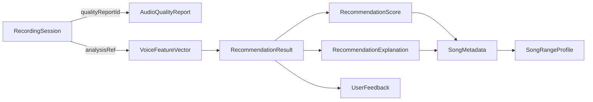

# M0.3 数据模型定义

- **里程碑：** M0（MVP 与架构冻结）
- **状态：** 待评审
- **版本：** 0.1.0
- **日期：** 2026-07-31
- **依据：** SPEC.md §5/§7/§8/§10/§12、PLAN.md §6.2（M0.3）/§10.2（质量指标）/§11.2（M5 分析）/§12.2（歌曲字段）/§13（M7 推荐）、docs/experiments/pitch-detection-results.md（YIN 实测阈值）、docs/research/academic-research.md §6（隐私风险）、ADR-002/ADR-003
- **交付物：** PLAN M0.3「定义数据模型」——15 个模型 × 每字段 9 项属性（类型/单位/合法范围/可空/来源/保存位置/敏感/保留时间 + 说明）

---

## 1. 全局约定

### 1.1 内部标准：MIDI Note

- 所有音高字段以 **MIDI Note 为内部标准**（PLAN §12.2、FR-SONG-5），频率（Hz）仅在需要处与 MIDI 并列存储（PitchFrame）。
- 换算公式（`Pitch.kt` 已实现，见 pitch-detection-results.md）：

```text
midi = 69 + 12 * log2(f / 440)          // 60 = C4 (261.63Hz)
f    = 440 * 2^((midi - 69) / 12)
```

- MIDI Note 以 `Double` 存储（整数半音 + 小数音分，供稳定性/分位数计算）；对用户展示时取整并转音名（FR-ANAL-2）。
- 分析工作范围：**65Hz (C2, MIDI 36) ~ 1046Hz (C6, MIDI 84)**（ADR-003，Spike 实测推荐工作范围）；歌曲数据校验范围放宽到 0~127（见各表合法范围）。
- 变调以**半音**（semitones）为单位，正数升调、负数降调（FR-RECM-2）。

### 1.2 属性取值域（统一枚举）

| 属性 | 取值 | 说明 |
|---|---|---|
| 数据来源 | `用户输入` / `音频分析` / `歌曲数据` / `系统` | 用户输入=用户直接提供；音频分析=由录音/派生特征计算；歌曲数据=导入数据集；系统=应用自身状态/时间/配置 |
| 保存位置 | `内存` / `DataStore` / `Room` / `文件缓存` / `不持久化` | 内存=仅分析期对象；DataStore=偏好/同意等轻量 KV；Room=结构化历史与歌曲数据；文件缓存=原始音频临时文件 |
| 是否敏感 | `敏感` / `非敏感` | 音频派生特征一律敏感（academic-research.md §6：派生特征仍可能泄露身份）；歌曲数据/偏好/同意记录为非敏感 |
| 保留时间 | `会话` / `分析期` / `用户删除前` / `应用生命周期` | 会话=一次录音流程内；分析期=分析完成后即释放；用户删除前=随历史/数据删除；应用生命周期=持久化直到重置 |

### 1.3 可空性约定

- 分析结果字段的"无值"（如质量不合格时无音域）一律用**可空 + 显式原因**表达，不用哨兵值（如 -1）；判断依据用 `isUsable`/`sampleSufficiency`/`emptyStateReason` 等显式字段（SPEC §7.4、FR-ANAL-8）。
- 歌曲数据中依赖导入质量（FR-SONG-2）的字段（试听链接、可信度）可为空，但 **ID、歌曲名、最低音、最高音、原调、语言、数据来源、数据版本不可为空**（M6.5 校验）。

### 1.4 阈值集中配置原则

- 所有阈值（质量检测 M4.2、音高过滤 ADR-003 §5.3、分位数 M5.3、置信度分档 SPEC §13、推荐权重与变调范围 M7.3/FR-RECM-2）**集中定义为一个配置对象 + 常量默认值**，禁止散落代码（PLAN §10.3 M4.2）。
- 各模型表中标注"配置常量"的字段均引用 §6.1 常量表；算法/权重/模板变更一律记录版本（见 §6.2）。
- SPEC/PLAN 未给出默认值的阈值标记 `[推测]`，为保守默认，M4/M5/M7 实测标定（PLAN M4/M5 阶段任务）。

---

## 2. 模型定义

### 2.1 RecordingSession —— 录音会话

记录一次完整录音流程的状态、配置快照与时间线；是质量报告与分析结果的挂载点。

| 字段 | 类型 | 单位 | 合法范围 | 可空 | 来源 | 保存位置 | 敏感 | 保留时间 |
|---|---|---|---|---|---|---|---|---|
| sessionId | String (UUID) | — | 非空 UUID | 否 | 系统 | Room | 非敏感 | 用户删除前 |
| config | RecordingConfig | — | 见 §2.2 | 否 | 系统（录音时配置快照） | Room（随会话） | 非敏感 | 用户删除前 |
| state | RecordingState 枚举 | — | Idle/Preparing/Countdown/Recording/Stopping/Completed/Failed（FR-REC-6） | 否 | 系统 | 内存（当前值）+ Room（最终态） | 非敏感 | 会话（内存）/用户删除前（最终态） |
| stateTimeline | List\<StateTransition\> | — | 时间单调递增 | 否（可为空列表） | 系统 | 内存 + Room（摘要） | 非敏感 | 用户删除前 |
| qualityReportId | String (UUID)? | — | 非空 UUID | 是（未检测时） | 系统（引用 §2.3） | Room（外键） | 敏感 | 用户删除前 |
| analysisRef | String (UUID)? | — | 非空 UUID | 是（未分析时） | 系统（引用 §2.7 VoiceFeatureVector） | Room（外键） | 敏感 | 用户删除前 |
| wavFilePath | String? | — | cache 目录内路径 | 是（已删除后为 null） | 系统 | 文件缓存 | 敏感（原始音频，FR-PRIV-1） | 分析期（完成后删除） |
| source | RecordingSource 枚举 | — | USER_RECORDING / TEST_WAV / FAKE（FR-QUAL-4、FR-SHELL-3） | 否 | 系统 | Room | 非敏感 | 应用生命周期 |
| startedAtMs | Long | epoch 毫秒 | ≥ 0 | 否 | 系统 | Room | 非敏感 | 用户删除前 |
| endedAtMs | Long | epoch 毫秒 | ≥ startedAtMs | 是（未结束时） | 系统 | Room | 非敏感 | 用户删除前 |
| durationMs | Long | 毫秒 | 0 ~ 配置 maxDurationMs（§6.1 R-4） | 否 | 系统（派生） | Room | 非敏感 | 用户删除前 |

**StateTransition**（内嵌）：`{ state: RecordingState, atMs: Long, reason: String? }`——状态与时间戳；`reason` 仅在 Failed 时记录错误码（SPEC §6 异常流程），可空。

> 说明：录音结束即生成 WAV 到 cache（FR-REC-7），`wavFilePath` 仅指向该临时文件；分析完成后置 null 并删除文件（FR-PRIV-1、ACC-14）。进程被系统重建时凭 Room 中会话恢复流程（SPEC §6）。

### 2.2 RecordingConfig —— 录音配置

音频采集参数（ADR-002）。全局默认值随应用配置保存；每次录音开始时**固化快照**进 RecordingSession，防止后续配置变更影响历史解读。

| 字段 | 类型 | 单位 | 合法范围 | 可空 | 来源 | 保存位置 | 敏感 | 保留时间 |
|---|---|---|---|---|---|---|---|---|
| sampleRateHz | Int | Hz | 44100（默认）/ 48000 / 16000（运行时降级，ADR-002） | 否 | 系统（默认值，配置常量 R-1） | DataStore（默认）+ Room（快照） | 非敏感 | 应用生命周期 |
| channelConfig | 枚举 | — | MONO（单人声单声源） | 否 | 系统 | 同上 | 非敏感 | 应用生命周期 |
| encoding | 枚举 | — | PCM_16BIT（ADR-002） | 否 | 系统 | 同上 | 非敏感 | 应用生命周期 |
| audioSource | 枚举 | — | VOICE_RECOGNITION（默认）/ MIC（若 AGC 影响削波检测则回退，ADR-002 待复核） | 否 | 系统 | 同上 | 非敏感 | 应用生命周期 |
| minUsableDurationMs | Long | 毫秒 | 1000 ~ 15000（配置常量 R-3，默认 10000，SPEC §6"至少演唱 10 秒"） | 否 | 系统（配置常量） | 同上 | 非敏感 | 应用生命周期 |
| autoStopDurationMs | Long | 毫秒 | minUsable ~ maxDuration（配置常量 R-4，默认 20000，ACC-4 20 秒自动停止） | 否 | 系统（配置常量） | 同上 | 非敏感 | 应用生命周期 |
| maxDurationMs | Long | 毫秒 | 5000 ~ 60000（配置常量 R-4，默认 30000，FR-REC-2 15-30 秒） | 否 | 系统（配置常量） | 同上 | 非敏感 | 应用生命周期 |
| frameSize / hopSize | Int | 样本 | 2048 / 1024（ADR-003；仅随快照记录供分析复现，不参与录音） | 否 | 系统 | 同上 | 非敏感 | 应用生命周期 |
| configVersion | Int | — | ≥ 1，递增 | 否 | 系统 | DataStore | 非敏感 | 应用生命周期 |

> 说明：MVP 无用户可改录音配置；DataStore 存默认值是为了测试注入与未来设置页扩展。`frameSize/hopSize` 属分析参数，因与录音强绑定故随快照记录（FR-ANAL-1）。

### 2.3 AudioQualityReport —— 音频质量报告

质量检测输出（FR-QUAL-1，字段集 = PLAN §10.2 + M4.4）。不合格录音不得进入正式分析（FR-QUAL-3、ACC-7/8）。

| 字段 | 类型 | 单位 | 合法范围 | 可空 | 来源 | 保存位置 | 敏感 | 保留时间 |
|---|---|---|---|---|---|---|---|---|
| reportId | String (UUID) | — | 非空 UUID | 否 | 系统 | Room | 敏感 | 用户删除前 |
| sessionId | String (UUID) | — | 非空 UUID | 否 | 系统（引用 §2.1） | Room（外键） | 敏感 | 用户删除前 |
| isUsable | Boolean | — | true/false | 否 | 音频分析 | 内存 + Room | 敏感 | 分析期（内存）/用户删除前（Room） |
| confidence | Double | 0~1 | [0, 1] | 否 | 音频分析 | 内存 + Room | 敏感 | 同上 |
| durationMs | Long | 毫秒 | 0 ~ maxDurationMs | 否 | 音频分析 | 内存 + Room | 敏感 | 同上 |
| silenceRatio | Double | 比例 | [0, 1]（静音帧/总帧，RMS < 静音阈值 Q-1） | 否 | 音频分析 | 内存 + Room | 敏感 | 同上 |
| clippingRatio | Double | 比例 | [0, 1]（削波帧/总帧，判定见 §6.1 Q-3） | 否 | 音频分析 | 内存 + Room | 敏感 | 同上 |
| averageRms | Double | 归一化幅值 | [0, 1] | 否 | 音频分析 | 内存 + Room | 敏感 | 同上 |
| peak | Double | 归一化幅值 | [0, 1]（峰值样本幅值） | 否 | 音频分析 | 内存 + Room | 敏感 | 同上 |
| activeRatio | Double | 比例 | [0, 1]（有效声音帧/总帧，有效 = 非静音且非削波） | 否 | 音频分析 | 内存 + Room | 敏感 | 同上 |
| noiseEstimate | Double | 归一化幅值 | [0, 1]（近似噪声水平，取低幅值帧的 RMS 分位 `[推测]`） | 否 | 音频分析 | 内存 + Room | 敏感 | 同上 |
| analyzableFrameCount | Int | 帧 | ≥ 0（满足可分析条件的帧数） | 否 | 音频分析 | 内存 + Room | 敏感 | 同上 |
| vocalActivityRanges | List\<TimeRange\> | 毫秒区间 | 区间内 start < end | 否（可为空列表） | 音频分析（可能的人声活动区间，PLAN §10.2） | 内存 | 敏感 | 分析期 |
| warnings | List\<QualityWarning\> | 枚举 | TOO_SHORT / SILENT / TOO_QUIET / NOISY / CLIPPING / INSUFFICIENT_VOICE（FR-QUAL-3、M4.5） | 否（可为空列表） | 音频分析 | 内存 + Room | 敏感 | 用户删除前 |
| recommendedAction | 枚举 | — | RETRY / PROCEED（质量失败 → 建议重录，M4.5） | 否 | 音频分析 | 内存 + Room | 敏感 | 用户删除前 |
| qualityVersion | String | — | 语义化版本 | 否 | 系统（算法版本，FR-ANAL-6） | 内存 + Room | 非敏感 | 用户删除前 |
| generatedAtMs | Long | epoch 毫秒 | ≥ 0 | 否 | 系统 | 内存 + Room | 非敏感 | 用户删除前 |

### 2.4 PitchFrame —— 单帧音高

YIN 逐帧输出（FR-ANAL-1），帧长 2048@44.1kHz、hop 1024（约 46ms/帧，ADR-003）。

| 字段 | 类型 | 单位 | 合法范围 | 可空 | 来源 | 保存位置 | 敏感 | 保留时间 |
|---|---|---|---|---|---|---|---|---|
| timestampMs | Long | 毫秒 | ≥ 0，相对录音起点 | 否 | 音频分析 | 内存（PitchTrack.frames） | 敏感 | 分析期 |
| f0Hz | Double | Hz | 65 ~ 1046（工作范围，A-1/A-2） | 是（无声帧为 null） | 音频分析 | 内存 | 敏感 | 分析期 |
| midiNote | Double | MIDI Note | 36.0 ~ 84.0（与 f0Hz 一一换算） | 是（无声帧为 null） | 音频分析（派生） | 内存 | 敏感 | 分析期 |
| confidence | Double | 0~1 | [0, 1]（= 1 − CMND_min，YIN） | 否 | 音频分析 | 内存 | 敏感 | 分析期 |
| rms | Double | 归一化幅值 | [0, 1] | 否 | 音频分析 | 内存 | 敏感 | 分析期 |
| isVoiced | Boolean | — | true/false（RMS ≥ 0.01 且 confidence ≥ 0.5 且频率在界内，ADR-003 §5.3） | 否 | 音频分析（派生） | 内存 | 敏感 | 分析期 |

> 说明：**不持久化**（隐私最小化，仅保留派生摘要，FR-HX-1）。30s 录音约 650 帧、每帧约 56B，内存开销可忽略（SPEC §11 内存 ≤200MB）。

### 2.5 PitchTrack —— 音高轨迹

整条录音的有效帧序列 + 算法与后处理元数据（FR-ANAL-2/6）。

| 字段 | 类型 | 单位 | 合法范围 | 可空 | 来源 | 保存位置 | 敏感 | 保留时间 |
|---|---|---|---|---|---|---|---|---|
| trackId | String (UUID) | — | 非空 UUID | 否 | 系统 | 内存（不持久化） | 敏感 | 分析期 |
| sessionId | String (UUID) | — | 非空 UUID | 否 | 系统（引用） | 内存 | 敏感 | 分析期 |
| frames | List\<PitchFrame\> | — | 帧时间戳单调递增 | 否（可为空列表） | 音频分析 | 内存 | 敏感 | 分析期 |
| sampleRateHz | Int | Hz | 44100 | 否 | 系统（快照 §2.2） | 内存 | 非敏感 | 分析期 |
| frameSize / hopSize | Int | 样本 | 2048 / 1024 | 否 | 系统（快照） | 内存 | 非敏感 | 分析期 |
| method | 枚举 | — | YIN（ADR-003 唯一方法） | 否 | 系统 | 内存 | 非敏感 | 分析期 |
| algorithmVersion | String | — | 语义化版本 | 否 | 系统（FR-ANAL-6） | 内存 + Room（随摘要） | 非敏感 | 用户删除前 |
| processingSteps | List\<String\> | — | 如 MEDIAN_FILTER / OCTAVE_CORRECTION / TRANSIENT_FILTER（FR-ANAL-2 各后处理项） | 否（可为空列表） | 音频分析 | 内存 | 非敏感 | 分析期 |
| totalFrameCount | Int | 帧 | ≥ 0 | 否 | 音频分析（派生） | 内存 | 非敏感 | 分析期 |
| voicedFrameCount | Int | 帧 | 0 ~ totalFrameCount | 否 | 音频分析（派生） | 内存 | 非敏感 | 分析期 |
| createdAtMs | Long | epoch 毫秒 | ≥ 0 | 否 | 系统 | 内存 | 非敏感 | 分析期 |

### 2.6 VocalRangeEstimate —— 稳定音域估计

M5.3 输出。**禁止取全部帧极值**：异常值剔除 + 分位数（默认 P5/P95，可配置）+ 最低/最高稳定音 + 覆盖 + 置信度 + 样本充足性。

| 字段 | 类型 | 单位 | 合法范围 | 可空 | 来源 | 保存位置 | 敏感 | 保留时间 |
|---|---|---|---|---|---|---|---|---|
| estimateId | String (UUID) | — | 非空 UUID | 否 | 系统 | 内存 + Room（随 VoiceFeatureVector） | 敏感 | 用户删除前 |
| sessionId | String (UUID) | — | 非空 UUID | 否 | 系统（引用） | 内存 + Room | 敏感 | 用户删除前 |
| lowQuantile | Double | 比例 | (0, 1)，默认 0.05（配置常量 A-4） | 否 | 系统（配置快照） | 内存 | 非敏感 | 分析期 |
| highQuantile | Double | 比例 | (0, 1)，默认 0.95（配置常量 A-4），且 > lowQuantile | 否 | 系统（配置快照） | 内存 | 非敏感 | 分析期 |
| stableLowestMidi | Double | MIDI Note | 36.0 ~ 84.0 | 是（样本不足时 null，FR-ANAL-8） | 音频分析 | 内存 + Room | 敏感 | 用户删除前 |
| stableHighestMidi | Double | MIDI Note | 36.0 ~ 84.0，且 ≥ stableLowestMidi | 是（同左） | 音频分析 | 内存 + Room | 敏感 | 用户删除前 |
| rangeSpanSemitones | Double | 半音 | ≥ 0（= stableHighest − stableLowest） | 是（同左） | 音频分析（派生） | 内存 + Room | 敏感 | 用户删除前 |
| coverage | Double | 比例 | [0, 1]（有效音高帧落入稳定区间的比例，M5.3"录音覆盖范围"） | 否 | 音频分析 | 内存 + Room | 敏感 | 用户删除前 |
| confidence | Double | 0~1 | [0, 1]（分布稳定性/帧数综合） | 否 | 音频分析 | 内存 + Room | 敏感 | 用户删除前 |
| sampleSufficiency | Boolean | — | true/false（有效帧 ≥ 阈值 A-5 才输出正式结果，ACC-9） | 否 | 音频分析 | 内存 + Room | 敏感 | 用户删除前 |
| methodVersion | String | — | 语义化版本（含分位数参数） | 否 | 系统 | 内存 + Room | 非敏感 | 用户删除前 |

> 说明：`stableLowest/stableHighest` 用分位数而非极值（PLAN M5.3 明确要求）；`coverage` 用于解释"本次演唱覆盖了多少音区"（ACC-10 展示"本次录音估计"）。

### 2.7 VoiceFeatureVector —— 声音特征向量

推荐引擎消费的用户侧特征（FR-ANAL-6 的 VoiceAnalysisResult 中除原始轨迹外的部分）；历史摘要的持久化主体（FR-HX-1）。

| 字段 | 类型 | 单位 | 合法范围 | 可空 | 来源 | 保存位置 | 敏感 | 保留时间 |
|---|---|---|---|---|---|---|---|---|
| vectorId | String (UUID) | — | 非空 UUID | 否 | 系统 | Room | 敏感 | 用户删除前 |
| sessionId | String (UUID) | — | 非空 UUID | 否 | 系统（引用） | Room（外键） | 敏感 | 用户删除前 |
| stableLowestMidi | Double | MIDI Note | 36.0 ~ 84.0 | 是（样本不足） | 音频分析（= §2.6） | Room | 敏感 | 用户删除前 |
| stableHighestMidi | Double | MIDI Note | 36.0 ~ 84.0 | 是（同左） | 音频分析 | Room | 敏感 | 用户删除前 |
| comfortableLowestMidi | Double | MIDI Note | 36.0 ~ 84.0 | 是（M5.4 无法估计时） | 音频分析（M5.4 舒适音区） | Room | 敏感 | 用户删除前 |
| comfortableHighestMidi | Double | MIDI Note | 36.0 ~ 84.0 | 是（同左） | 音频分析 | Room | 敏感 | 用户删除前 |
| primaryRangeLowMidi / primaryRangeHighMidi | Double | MIDI Note | 36.0 ~ 84.0 | 是（同左） | 音频分析（M5.4 主要演唱音区，`[推测]` 以区间表示） | Room | 敏感 | 用户删除前 |
| stableFrameRatio | Double | 比例 | [0, 1]（稳定片段比例，M5.5） | 否 | 音频分析 | Room | 敏感 | 用户删除前 |
| pitchDeviationCents | Double | 音分 | ≥ 0（音高波动，M5.5；同音片段内 F0 抖动） | 否 | 音频分析 | Room | 敏感 | 用户删除前 |
| longNoteDeviationCents | Double | 音分 | ≥ 0（长音波动，M5.5） | 否 | 音频分析 | Room | 敏感 | 用户删除前 |
| voicedFrameRatio | Double | 比例 | [0, 1]（有效帧比例，M5.5） | 否 | 音频分析 | Room | 敏感 | 用户删除前 |
| overallConfidence | Double | 0~1 | [0, 1]（FR-ANAL-6 分析置信度） | 否 | 音频分析 | Room | 敏感 | 用户删除前 |
| confidenceLevel | 枚举 | — | HIGH(≥0.7) / MEDIUM([0.5,0.7)) / LOW(<0.5)（SPEC §13 分档，常量 A-6） | 否 | 音频分析（派生） | Room | 敏感 | 用户删除前 |
| warnings | List\<AnalysisWarning\> | 枚举 | INSUFFICIENT_SAMPLES / LOW_CONFIDENCE / QUALITY_SUSPECT（`[推测]` 枚举，对应 SPEC §7.4 降级行为） | 否（可为空列表） | 音频分析 | Room | 敏感 | 用户删除前 |
| featureVectorVersion | Int | — | ≥ 1（特征 schema 版本，供推荐引擎判定兼容） | 否 | 系统 | Room | 非敏感 | 用户删除前 |
| algorithmVersion | String | — | 语义化版本（FR-ANAL-6） | 否 | 系统 | Room | 非敏感 | 用户删除前 |
| analyzedAtMs | Long | epoch 毫秒 | ≥ 0 | 否 | 系统 | Room | 非敏感 | 用户删除前 |

> 说明：LOW 置信度不生成正式推荐（ACC-9/§13）；MEDIUM 推荐时标注"基于有限样本"（SPEC §7.4）。`primaryRange*` 的结构为 `[推测]`——M5.4 未规定主要演唱音区的表示形式，采用区间低/高两字段，M5 实现时可调整为单字段或其他结构（仅影响 featureVectorVersion 递增）。

### 2.8 SongMetadata —— 歌曲元数据

歌曲数据（FR-SONG-1、PLAN §12.2 全部字段），Room 主实体（M6.4）。所有音高字段 MIDI 内部标准（FR-SONG-5）。

| 字段 | 类型 | 单位 | 合法范围 | 可空 | 来源 | 保存位置 | 敏感 | 保留时间 |
|---|---|---|---|---|---|---|---|---|
| songId | String (UUID) | — | 非空唯一 | 否 | 歌曲数据 | Room | 非敏感 | 应用生命周期 |
| title | String | — | 非空，≤ 200 字符 | 否 | 歌曲数据 | Room | 非敏感 | 应用生命周期 |
| artist | String | — | 非空，≤ 200 字符 | 否 | 歌曲数据 | Room | 非敏感 | 应用生命周期 |
| language | String | — | ISO 639-1（zh/en/...） | 否 | 歌曲数据 | Room | 非敏感 | 应用生命周期 |
| genre | String | — | 受控风格词表（M6 定义） | 否 | 歌曲数据 | Room | 非敏感 | 应用生命周期 |
| originalKeyMidi | Double | MIDI Note | 0 ~ 127 | 否 | 歌曲数据 | Room | 非敏感 | 应用生命周期 |
| lowestMidi | Double | MIDI Note | 0 ~ 127 | 否 | 歌曲数据 | Room | 非敏感 | 应用生命周期 |
| highestMidi | Double | MIDI Note | 0 ~ 127，且 ≥ lowestMidi（M6.5 校验） | 否 | 歌曲数据 | Room | 非敏感 | 应用生命周期 |
| primaryRangeLowMidi / primaryRangeHighMidi | Double | MIDI Note | 0 ~ 127，low ≤ high | 否 | 歌曲数据（主要音区） | Room | 非敏感 | 应用生命周期 |
| rangeSpanSemitones | Double | 半音 | ≥ 0（= highest − lowest，导入时校验派生） | 否 | 歌曲数据（派生） | Room | 非敏感 | 应用生命周期 |
| highNoteBurden | Double | 0~1 | [0, 1]（高音持续负担，越高越密集） | 否 | 歌曲数据 | Room | 非敏感 | 应用生命周期 |
| longNoteBurden | Double | 0~1 | [0, 1]（长音负担） | 否 | 歌曲数据 | Room | 非敏感 | 应用生命周期 |
| leapDifficulty | Double | 0~1 | [0, 1]（跳进难度） | 否 | 歌曲数据 | Room | 非敏感 | 应用生命周期 |
| rhythmDifficulty | Double | 0~1 | [0, 1]（节奏难度） | 否 | 歌曲数据 | Room | 非敏感 | 应用生命周期 |
| overallDifficulty | Double | 0~1 | [0, 1]（总体难度） | 否 | 歌曲数据 | Room | 非敏感 | 应用生命周期 |
| maxDownShiftSemitones | Int | 半音 | [-12, 0]（推荐变调范围下限，FR-SONG-1） | 否 | 歌曲数据 | Room | 非敏感 | 应用生命周期 |
| maxUpShiftSemitones | Int | 半音 | [0, 12]（推荐变调范围上限） | 否 | 歌曲数据 | Room | 非敏感 | 应用生命周期 |
| audioUrl / externalUrl | String | URL | http(s) 或空 | 是（可无试听） | 歌曲数据 | Room | 非敏感 | 应用生命周期 |
| dataSource | String | — | 非空（来源声明，FR-SONG-2/M6.5 不得缺失） | 否 | 歌曲数据 | Room | 非敏感 | 应用生命周期 |
| credibility | 枚举 | — | HIGH / MEDIUM / LOW（数据可信度，FR-SONG-1） | 否 | 歌曲数据 | Room | 非敏感 | 应用生命周期 |
| dataVersion | String | — | 语义化版本（数据版本，FR-SONG-1/M6.4） | 否 | 歌曲数据 | Room | 非敏感 | 应用生命周期 |
| importBatchId | String | — | 非空（导入批次，M6.2 工具）`[推测]` | 否 | 歌曲数据 | Room | 非敏感 | 应用生命周期 |

> 说明：难度/负担类字段取值 0~1 连续值，展示时映射为低/中/高；`[推测]` 的仅 `importBatchId`。导入工具与 App 解耦、字段校验/重复/音域/来源/版本检查在 M6.2（不进入本模型）。

### 2.9 SongRangeProfile —— 歌曲音域画像

歌曲侧"可变调音域画像"，供变调评估（M7.2/FR-RECM-2）直接消费；导入时由 SongMetadata 派生并冗余存储（避免推荐期重复计算）。

| 字段 | 类型 | 单位 | 合法范围 | 可空 | 来源 | 保存位置 | 敏感 | 保留时间 |
|---|---|---|---|---|---|---|---|---|
| songId | String (UUID) | — | 非空唯一（1:1 对应 §2.8） | 否 | 歌曲数据（派生） | Room | 非敏感 | 应用生命周期 |
| originalLowestMidi | Double | MIDI Note | 0 ~ 127 | 否 | 歌曲数据（= lowestMidi） | Room | 非敏感 | 应用生命周期 |
| originalHighestMidi | Double | MIDI Note | 0 ~ 127 | 否 | 歌曲数据（= highestMidi） | Room | 非敏感 | 应用生命周期 |
| originalPrimaryLowMidi / originalPrimaryHighMidi | Double | MIDI Note | 0 ~ 127 | 否 | 歌曲数据（= 主要音区） | Room | 非敏感 | 应用生命周期 |
| originalRangeSpanSemitones | Double | 半音 | ≥ 0 | 否 | 歌曲数据（派生） | Room | 非敏感 | 应用生命周期 |
| tessituraPosition | Double | 比例 | [0, 1]（主要音区在歌曲音域内的相对位置 = (primaryLow − lowest)/(span)，`[推测]`） | 否 | 歌曲数据（派生） | Room | 非敏感 | 应用生命周期 |
| highNoteBurden / longNoteBurden / leapDifficulty / rhythmDifficulty | Double | 0~1 | [0, 1]（负担指标冗余，随变调不变） | 否 | 歌曲数据（派生拷贝） | Room | 非敏感 | 应用生命周期 |
| maxDownShiftSemitones / maxUpShiftSemitones | Int | 半音 | [-12, 0] / [0, 12]（来自 §2.8） | 否 | 歌曲数据 | Room | 非敏感 | 应用生命周期 |
| profileVersion | String | — | 语义化版本（画像派生逻辑版本） | 否 | 系统 | Room | 非敏感 | 应用生命周期 |

> 说明：变调后的音域（transposedLowest/transposedHighest/transposedPrimaryRange）是**每次评估的中间量**（M7.2），在内存中计算、不持久化——同一歌曲 × 不同 keyShift 的组合存在推荐结果中即可回溯（§2.10 fitBreakdown、§2.12 items）。

### 2.10 RecommendationScore —— 推荐分数

单曲特征分解分数（FR-RECM-3、SPEC §7.2）。

| 字段 | 类型 | 单位 | 合法范围 | 可空 | 来源 | 保存位置 | 敏感 | 保留时间 |
|---|---|---|---|---|---|---|---|---|
| scoreId | String (UUID) | — | 非空 UUID | 否 | 系统 | Room | 敏感 | 用户删除前 |
| resultId | String (UUID) | — | 非空 UUID（引用 §2.12） | 否 | 系统 | Room（外键） | 敏感 | 用户删除前 |
| songId | String (UUID) | — | 非空 UUID | 否 | 系统（引用 §2.8） | Room（外键） | 敏感 | 用户删除前 |
| total | Double | 0~100 | [0, 100]（SPEC §7.2 评分范围） | 否 | 推荐引擎 | Room | 敏感 | 用户删除前 |
| rangeFit | Double | 0~100 | [0, 100] | 否 | 推荐引擎 | Room | 敏感 | 用户删除前 |
| tessituraFit | Double | 0~100 | [0, 100] | 否 | 推荐引擎 | Room | 敏感 | 用户删除前 |
| highNoteBurdenFit | Double | 0~100 | [0, 100] | 否 | 推荐引擎 | Room | 敏感 | 用户删除前 |
| difficultyFit | Double | 0~100 | [0, 100] | 否 | 推荐引擎 | Room | 敏感 | 用户删除前 |
| pitchStabilityFit | Double | 0~100 | [0, 100] | 否 | 推荐引擎 | Room | 敏感 | 用户删除前 |
| preferenceFit | Double | 0~100 | [0, 100] | 否 | 推荐引擎 | Room | 敏感 | 用户删除前 |
| confidenceAdjustment | Double | 乘子 | (0, 1]（默认：confidence ≥ 0.5 时 = 1，< 0.5 时显著降权，SPEC §7.2；实现见 M7.3） | 否 | 推荐引擎 | Room | 敏感 | 用户删除前 |
| fitBreakdown | Map\<Feature, FitLevel\> | 枚举 | Feature ∈ {RangeFit, TessituraFit, HighNoteBurdenFit, DifficultyFit, PitchStabilityFit, PreferenceFit}，FitLevel ∈ {POOR, PARTIAL, GOOD}（SPEC §7.3 fitBreakdown） | 否 | 推荐引擎 | Room | 敏感 | 用户删除前 |
| weightsVersion | String | — | 语义化版本（M7.3 权重版本） | 否 | 系统 | Room | 非敏感 | 用户删除前 |
| engineVersion | String | — | 语义化版本 | 否 | 系统 | Room | 非敏感 | 用户删除前 |
| generatedAtMs | Long | epoch 毫秒 | ≥ 0 | 否 | 系统 | Room | 非敏感 | 用户删除前 |

> 说明：标记敏感——分数由用户声音特征计算（academic-research.md §6：派生特征仍可能泄露身份），与历史同生命周期删除（ACC-15）。`confidenceAdjustment` 为乘子不参与权重归一。

### 2.11 RecommendationExplanation —— 推荐解释

单条解释项，由**实际评分特征**生成（FR-RECM-4、ACC-16），模板 + 数据填充。

| 字段 | 类型 | 单位 | 合法范围 | 可空 | 来源 | 保存位置 | 敏感 | 保留时间 |
|---|---|---|---|---|---|---|---|---|
| explanationId | String (UUID) | — | 非空 UUID | 否 | 系统 | Room | 敏感 | 用户删除前 |
| resultId | String (UUID) | — | 非空 UUID（引用 §2.12） | 否 | 系统 | Room（外键） | 敏感 | 用户删除前 |
| songId | String (UUID) | — | 非空 UUID | 否 | 系统 | Room（外键） | 敏感 | 用户删除前 |
| feature | Feature 枚举 | — | 对应 §2.10 的 6 个特征之一（由哪个特征触发） | 否 | 推荐引擎 | Room | 敏感 | 用户删除前 |
| templateId | String | — | 非空（模板标识，如 "tessitura_fit_high"） | 否 | 系统 | Room | 非敏感 | 用户删除前 |
| templateVersion | String | — | 语义化版本（模板文案版本） | 否 | 系统 | Room | 非敏感 | 用户删除前 |
| text | String | — | 非空，≤ 200 字符（生成文案，含实际数值） | 否 | 推荐引擎 | Room | 敏感 | 用户删除前 |
| evidence | Map\<String, Double\> | 混合 | 填充模板的实测值（如 {stableHighestMidi: 72.0, songHighestMidi: 75.0}），供 ACC-16 一致性校验 | 否（可为空 Map） | 推荐引擎 | Room | 敏感 | 用户删除前 |

> 说明：MVP 解释文案示例见 PLAN M7.4（"大部分旋律位于你的舒适音区"等）；禁止无数据依据文案（FR-RECM-4）。`evidence` 使解释可追溯到实际特征值（M7.6"推荐解释与分数一致"测试）。

### 2.12 RecommendationResult —— 推荐结果

整次推荐的输出（SPEC §7.3）。

| 字段 | 类型 | 单位 | 合法范围 | 可空 | 来源 | 保存位置 | 敏感 | 保留时间 |
|---|---|---|---|---|---|---|---|---|
| resultId | String (UUID) | — | 非空 UUID | 否 | 系统 | Room | 敏感 | 用户删除前 |
| sessionId | String (UUID) | — | 非空 UUID（引用 §2.1） | 否 | 系统 | Room（外键） | 敏感 | 用户删除前 |
| items | List\<RecommendationItem\> | — | 0 ~ TOP_N（配置常量 R-5，默认 Top 10） | 否（可为空列表） | 推荐引擎 | Room | 敏感 | 用户删除前 |
| totalConfidence | 枚举 | — | HIGH / MEDIUM / LOW（SPEC §7.4 判定） | 否 | 推荐引擎 | Room | 敏感 | 用户删除前 |
| emptyStateReason | String? | — | 无结果时非空（如"无候选满足最低匹配阈值"，FR-RECM-5/ACC-12） | 是 | 推荐引擎 | Room | 非敏感 | 用户删除前 |
| candidateCount | Int | 首 | ≥ 0（过滤后候选数，`[推测]` 调试/降级说明用） | 否 | 推荐引擎 | Room | 非敏感 | 用户删除前 |
| weightsVersion / engineVersion | String | — | 语义化版本（与 §2.10 一致） | 否 | 系统 | Room | 非敏感 | 用户删除前 |
| generatedAtMs | Long | epoch 毫秒 | ≥ 0 | 否 | 系统 | Room | 非敏感 | 用户删除前 |

**RecommendationItem**（内嵌，SPEC §7.3）：`{ songId, score: RecommendationScore, keyShiftSemitones: Int（-6~+6，默认配置 R-6；0 = 原调）, explanations: List<RecommendationExplanation>, fitBreakdown }`。
`keyShiftSemitones` 可空（歌曲不可调时标记为 null 并在 emptyStateReason/解释中说明，ACC-17"或标记不可调"）。

> 说明：LOW 置信度不生成正式推荐（§7.4）→ items 为空且 `emptyStateReason = "有效演唱片段不足，请重录"`（ACC-9）。结果可重复性（ACC-13）由"相同输入 + 相同权重版本 + 确定性排序"保证（M7.6）。

### 2.13 UserFeedback —— 用户反馈

推荐详情页的反馈（FR-HX-3）。MVP 仅保存，不自动调权重（PLAN §13.4 附注）。

| 字段 | 类型 | 单位 | 合法范围 | 可空 | 来源 | 保存位置 | 敏感 | 保留时间 |
|---|---|---|---|---|---|---|---|---|
| feedbackId | String (UUID) | — | 非空 UUID | 否 | 系统 | Room | 非敏感 | 用户删除前 |
| resultId | String (UUID) | — | 非空 UUID（引用 §2.12） | 否 | 系统 | Room（外键） | 非敏感 | 用户删除前 |
| songId | String (UUID) | — | 非空 UUID | 否 | 系统 | Room（外键） | 非敏感 | 用户删除前 |
| feedbackType | 枚举 | — | SUITABLE / TOO_HIGH / TOO_LOW / TOO_HARD / DISLIKE_STYLE / INACCURATE_REASON（FR-HX-3 六类） | 否 | 用户输入 | Room | 非敏感 | 用户删除前 |
| createdAtMs | Long | epoch 毫秒 | ≥ 0 | 否 | 系统 | Room | 非敏感 | 用户删除前 |
| appVersion | String | — | 语义化版本（`[推测]`，便于未来反馈分析） | 否 | 系统 | Room | 非敏感 | 用户删除前 |

> 说明：非敏感（不含音频特征；属用户偏好类个人数据，仍受 FR-PRIV-5 删除流程约束）。FR-HX-3 未定义自由文本反馈，MVP 不设 comment 字段。

### 2.14 UserSettings —— 用户设置

偏好与数据管理标志（SPEC §4.2 设置页）。

| 字段 | 类型 | 单位 | 合法范围 | 可空 | 来源 | 保存位置 | 敏感 | 保留时间 |
|---|---|---|---|---|---|---|---|---|
| uiLanguage | 枚举 | — | ZH / EN（SPEC §2.1 中英文曲库使用者；`[推测]` 文案语言与曲库语言分离） | 否 | 用户输入 | DataStore | 非敏感 | 应用生命周期（重置清除） |
| preferredLanguages | List\<String\> | — | ISO 639-1 子集（候选过滤用，FR-RECM-1） | 否（可为空 = 不限） | 用户输入 | DataStore | 非敏感 | 应用生命周期（重置清除） |
| excludedGenres | List\<String\> | — | 受控风格词表子集（FR-RECM-1 排除风格） | 否（可为空 = 无排除） | 用户输入 | DataStore | 非敏感 | 应用生命周期（重置清除） |
| keepHistory | Boolean | — | true/false（是否保存历史摘要，默认 true；`[推测]` 数据管理开关） | 否 | 用户输入 | DataStore | 非敏感 | 应用生命周期（重置清除） |
| settingsVersion | Int | — | ≥ 1（schema 版本，DataStore 迁移用） | 否 | 系统 | DataStore | 非敏感 | 应用生命周期 |
| updatedAtMs | Long | epoch 毫秒 | ≥ 0 | 否 | 系统 | DataStore | 非敏感 | 应用生命周期 |

> 说明：数据管理动作（删除历史/收藏/缓存/重置，FR-HX-4）是**操作**而非设置，不落模型；`keepHistory` 为 `[推测]` 的开关（SPEC 未明确，M9 数据管理细化时确认）。ACC-15"删除全部数据"= 清 Room + DataStore + 文件缓存并恢复首次启动。

### 2.15 ConsentRecord —— 隐私同意记录

Onboarding 同意持久化（FR-ONB-1/2/3、SPEC §10.6）。

| 字段 | 类型 | 单位 | 合法范围 | 可空 | 来源 | 保存位置 | 敏感 | 保留时间 |
|---|---|---|---|---|---|---|---|---|
| privacyNoticeVersion | String | — | 非空（如 "1.0"）；隐私说明变更需重新同意（SPEC §10.6） | 否 | 系统 | DataStore | 非敏感 | 应用生命周期 |
| granted | Boolean | — | true/false | 否 | 用户输入 | DataStore | 非敏感 | 应用生命周期 |
| grantedAtMs | Long | epoch 毫秒 | ≥ 0 | 是（未同意时为 null） | 系统 | DataStore | 非敏感 | 应用生命周期 |
| noticeLanguage | String | — | ISO 639-1（展示同意时所用语言，`[推测]`） | 否 | 系统 | DataStore | 非敏感 | 应用生命周期 |
| updatedAtMs | Long | epoch 毫秒 | ≥ 0 | 否 | 系统 | DataStore | 非敏感 | 应用生命周期 |

> 说明：单例记录（无多用户，N-8）。`granted=false` 时应用停留在 Onboarding、不请求权限、不采集音频（ACC-2）。清除全部数据（ACC-15）后记录删除 → 再次启动重新展示 Onboarding。

---

## 3. 存储映射

### 3.1 总览

| 模型 | 主存储 | 次要/临时存储 | 持久化内容 |
|---|---|---|---|
| RecordingSession | Room（表 `recording_session`） | 内存（state 当前值）、文件缓存（wavFilePath 指向） | 会话摘要 + 配置快照 + 时间线 |
| RecordingConfig | DataStore（默认值） | Room（随会话快照） | 全局默认配置 + 每会话快照 |
| AudioQualityReport | Room（表 `audio_quality_report`） | 内存（vocalActivityRanges 等细节） | 质量摘要（warnings/recommendedAction/指标） |
| PitchFrame | —（不持久化） | 内存（PitchTrack.frames） | 无 |
| PitchTrack | —（不持久化） | 内存 | 仅 algorithmVersion 等元数据随摘要入 Room |
| VocalRangeEstimate | Room（并入 `voice_feature_vector`） | 内存 | 稳定音域摘要字段 |
| VoiceFeatureVector | Room（表 `voice_feature_vector`） | — | 历史摘要主体（FR-HX-1） |
| SongMetadata | Room（表 `song_metadata`） | — | 全部歌曲字段（版本化） |
| SongRangeProfile | Room（表 `song_range_profile`） | 内存（变调中间量） | 派生画像（导入时重建） |
| RecommendationScore | Room（表 `recommendation_score`） | — | 特征分解分数 |
| RecommendationExplanation | Room（表 `recommendation_explanation`） | — | 解释文本 + 证据 |
| RecommendationResult | Room（表 `recommendation_result`） | — | Top N 结果 + totalConfidence + 降级原因 |
| UserFeedback | Room（表 `user_feedback`） | — | 六类反馈 |
| UserSettings | DataStore（Proto） | — | 偏好 + 数据管理标志 |
| ConsentRecord | DataStore（Proto） | — | 同意版本/时间/状态 |

### 3.2 Room 表清单（`data:local`，SPEC §9）

| 表 | 对应模型 | 关键关系 | 说明 |
|---|---|---|---|
| `recording_session` | §2.1 | 1 — N `audio_quality_report`、`voice_feature_vector`、`recommendation_result` | 会话摘要 |
| `audio_quality_report` | §2.3 | N — 1 `recording_session` | 质量摘要 |
| `voice_feature_vector` | §2.6/§2.7 | N — 1 `recording_session`；含 VocalRangeEstimate 字段 | 历史摘要主体（FR-HX-1） |
| `song_metadata` | §2.8 | 1 — 1 `song_range_profile`；1 — N `recommendation_score`/`explanation`/`user_feedback`；N — N `favorite` | 歌曲数据（M6.4：Entity/DAO/版本/导入/升级/搜索/筛选） |
| `song_range_profile` | §2.9 | 1 — 1 `song_metadata` | 变调评估画像 |
| `recommendation_result` | §2.12 | N — 1 `recording_session`；1 — N `recommendation_score`、`recommendation_explanation` | 结果主体（items 用 `@TypeConverter` 或子表） |
| `recommendation_score` | §2.10 | N — 1 `recommendation_result` | 分数分解 |
| `recommendation_explanation` | §2.11 | N — 1 `recommendation_result` | 解释 + evidence |
| `user_feedback` | §2.13 | N — 1 `recommendation_result` | 反馈（FR-HX-3） |
| `favorite` | 关联表 | N — N `song_metadata`（songId + favoritedAtMs） | 收藏关系（FR-HX-2、M6.4） |

- **Room schema 版本**：与 `song_metadata.dataVersion`、`feature_vector.featureVectorVersion` 分开管理；M6.5 要求 Room Migration 与数据版本回滚策略。
- **DataStore**（Proto）：`user_settings`、`consent_record`、`recording_config_defaults`（§2.2 默认值）。
- **文件缓存（cache 目录）**：录音临时 PCM/WAV（FR-REC-7）；分析完成即删（FR-PRIV-1）；下次启动清理过期残留（FR-REC-8）。
- **不持久化**：PitchFrame、PitchTrack、变调中间量（transposed 音域）、质量检测的 vocalActivityRanges —— 隐私最小化 + 内存可控（SPEC §11 ≤200MB）。

### 3.3 数据流关系



---

## 4. 敏感数据处理（academic-research.md §6 落实）

1. **敏感判定原则**：凡由麦克风音频派生的数据（AudioQualityReport、PitchFrame、PitchTrack、VocalRangeEstimate、VoiceFeatureVector、RecommendationScore/Explanation/Result）一律 `敏感`；歌曲数据、偏好、同意记录为 `非敏感`。依据：原始人声具生物识别敏感性，**派生特征仍可能泄露身份**（academic-research §6），推荐分数/解释含用户音域信息，一并按敏感对待。
2. **原始音频默认不保留**：PCM/WAV 仅存 cache 临时文件，分析完成即删（FR-PRIV-1、ACC-14）；用户主动保存/分享需明确提示 + 二次确认（FR-PRIV-2，P1）。
3. **无网络路径**：MVP 无网络权限、无后端，不存在上传原始音频或声音特征的通道（FR-PRIV-3、N-5/N-6）。
4. **派生特征存储**：历史仅存分析摘要（VoiceFeatureVector + 质量/推荐摘要），不含原始音频与逐帧轨迹（FR-HX-1）。建议 Room 启用加密（SQLCipher）保护派生特征 `[推测-实现建议]`，并在隐私政策中说明（academic-research §6）。
5. **日志脱敏**：Release 日志不含文件名、路径、设备标识、音频内容（FR-PRIV-4）；Session/分析相关日志只记 ID 不记内容。
6. **删除流程**：单条历史、全部历史、收藏、设置、缓存音频、重置应用全链路可删（FR-PRIV-5、FR-HX-4）；"删除全部数据"清空 Room + DataStore + 文件缓存并恢复首次启动状态（ACC-15）。
7. **同意版本化**：ConsentRecord 记录隐私说明版本与同意时间；隐私说明变更须重新同意（SPEC §10.6、FR-ONB-2/3）。
8. **权限最小化**：仅 RECORD_AUDIO + FOREGROUND_SERVICE(+_MICROPHONE)（SPEC §10.5）；录音必须伴随可见 UI + 前台通知（FR-REC-9）。

---

## 5. 版本化与集中配置

### 5.1 集中配置常量（默认值）

所有值集中在 `core:model` 的配置对象（如 `AnalysisConfig`/`QualityConfig`/`RecommendationConfig`），随版本记录；`[推测]` 项为保守默认，M4/M5/M7 实测标定。

| 常量 | 默认值 | 依据 | 用途 |
|---|---|---|---|
| Q-1 静音 RMS 阈值 | 0.01（归一化幅值） | pitch-detection-results §5.3 实测 | silenceRatio、isVoiced |
| Q-2 低音量 RMS 阈值 | 0.02 `[推测]` | —（须 > Q-1，M4.2 标定） | TOO_QUIET |
| Q-3 削波判定 | 连续满幅样本 ≥ 3 或削波帧比例 > 0.05 `[推测]` | M4.3 | clippingRatio、CLIPPING |
| Q-4 最小有效声音时长 | 5s `[推测]` | M4.2 | TOO_SHORT/INSUFFICIENT_VOICE |
| Q-5 最小有效帧比例 | 0.30 `[推测]` | M4.2 | INSUFFICIENT_VOICE |
| A-1 频率下限 | 65 Hz（MIDI 36） | ADR-003 §5.2 | 分析工作范围 |
| A-2 频率上限 | 1046 Hz（MIDI 84） | ADR-003 §5.2 | 分析工作范围 |
| A-3 帧长 / 步进 | 2048 / 1024（@44.1kHz，≈46ms/帧） | ADR-003 | PitchFrame |
| A-4 音域分位数 | P5 / P95 | PLAN M5.3（可配置） | VocalRangeEstimate |
| A-5 有效帧充足阈值 | 120 帧（≈5.5s 有效演唱）`[推测]` | FR-ANAL-8/ACC-9 | sampleSufficiency |
| A-6 置信度分档 | HIGH ≥ 0.7；MEDIUM ∈ [0.5, 0.7)；LOW < 0.5 | SPEC §13 | confidenceLevel |
| R-1 采样率 | 44100 Hz（降级 48000/16000） | ADR-002 | RecordingConfig |
| R-2 声道 / 编码 / 音源 | MONO / PCM_16BIT / VOICE_RECOGNITION | ADR-002、FR-REC-1 | RecordingConfig |
| R-3 最短可用时长 | 10 000 ms | SPEC §6"至少演唱 10 秒" | minUsableDurationMs |
| R-4 自动停止 / 上限 | 20 000 ms / 30 000 ms | ACC-4、FR-REC-2 | autoStop/maxDurationMs |
| R-5 Top N | 10 | SPEC §7.3 | RecommendationResult.items |
| R-6 合理变调范围 | ±6 半音（可配置） | FR-RECM-2 | keyShift 判定 |
| R-7 最低匹配阈值 | 60 分 `[推测]` | FR-RECM-5（无高匹配时降级） | 空状态判定 |
| W-1 评分权重 v1 | RangeFit 0.30 / TessituraFit 0.25 / HighNoteBurdenFit 0.15 / DifficultyFit 0.10 / PitchStabilityFit 0.10 / PreferenceFit 0.10；ConfidenceAdjustment 乘子（confidence < 0.5 显著降权） | SPEC §7.2（待校准） | RecommendationScore |

### 5.2 数据版本化

| 版本对象 | 存储字段 | 变更触发 | 用户可见影响 |
|---|---|---|---|
| 歌曲数据版本 | `SongMetadata.dataVersion`（M6.4 数据升级、M6.5 回滚策略） | 数据集导入/升级 | 历史中的旧结果按原版本解读，不被新数据改写 |
| 分析算法版本 | `VoiceFeatureVector.algorithmVersion`、`PitchTrack.algorithmVersion`、`AudioQualityReport.qualityVersion`（FR-ANAL-6） | YIN/后处理/质量算法变更 | 结果页展示（ACC-10）、历史标注 |
| 推荐权重版本 | `RecommendationScore.weightsVersion`、`RecommendationResult.weightsVersion`（M7.3） | 权重调整 | 可重复性（ACC-13）：同版本输入 → 同结果 |
| 解释模板版本 | `RecommendationExplanation.templateVersion` | 文案/模板变更 | 历史解释与当时模板一致 |
| 特征 schema 版本 | `VoiceFeatureVector.featureVectorVersion` | 特征字段增删改 | 推荐引擎兼容性判定 |
| 配置版本 | `RecordingConfig.configVersion`、`UserSettings.settingsVersion` | schema 变更 | DataStore 迁移、会话快照解读 |
| Room schema | 数据库版本号 | 表结构变更 | Room Migration（M6.5） |
| 隐私说明版本 | `ConsentRecord.privacyNoticeVersion`（SPEC §10.6） | 隐私说明变更 | 强制重新同意（FR-ONB-3） |

> 原则：**结果可追溯**——历史中的每个结果都携带算法/权重/模板/歌曲数据版本，回放与审计不依赖当前代码状态；**删除优先**——任何版本升级不得重建已删除数据。

---

## 6. 验收对照（PLAN M0.3）

| 验收项 | 落实 |
|---|---|
| 15 个模型全部定义 | §2.1 ~ §2.15，每字段含 类型/单位/合法范围/可空/来源/保存位置/敏感/保留时间 8 项 + 说明 |
| 数据模型完整 | 存储映射（§3）、敏感数据处理（§4）、版本化与集中配置（§5）、枚举与常量（§5.1）齐全 |
