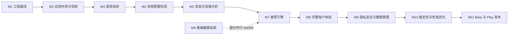

# Task Breakdown — matchsong MVP 细化任务分解

- **里程碑：** M0.5（细化剩余任务）
- **状态：** DRAFT → 待批准
- **版本：** 0.1.0
- **日期：** 2026-07-31
- **依据：** PLAN.md §6.2（M0.5）与 §7~§17（M1..M11）、§22（Backlog）；SPEC.md v0.1.0（FR-* / ACC-*）；ARCHITECTURE.md v0.1.0（模块与包路径）；docs/architecture/data-model.md（模型定义）；TESTING.md v0.1.0 与 docs/testing/test-fixture-manifest.md、device-matrix.md（测试分层与夹具）

---

## 1. 任务模板

每个任务必须包含且仅包含以下 10 个字段（PLAN M0.5 要求，模板原文）：

```text
Task ID
状态（NOT_STARTED）
目标
前置依赖
涉及文件
实施步骤
测试步骤
验收标准
风险
回滚方式
```

- **状态** 取值：`NOT_STARTED`（默认，本计划全部为未开始）/ `IN_PROGRESS` / `BLOCKED` / `DONE` / `DEFERRED`（PLAN §3.3）。
- **回滚方式** 必须具体：git revert 指定提交 / 删除功能开关 / 恢复数据备份等，按任务类型给出真实可行方案。
- 本文件中 Backlog 任务状态一律 `DEFERRED`（PLAN §3.3 合法状态，表示"MVP 后再评估"）。

## 2. 编号约定

- **子任务 ID 采用连字符后缀**：`M{里程碑}.{原任务序号}-{子任务序号}`，例如 `M3.3-1`、`M3.3-2`。
- 原 PLAN 任务已足够小且原子时，**不拆分**，保留为单个任务（ID 与 PLAN 一致，如 `M3.4-1` 仅当拆分时出现；不拆分的直接使用 `M1.5-1` 风格的唯一子任务或保持原 ID）。
- 任务间的引用使用 `M3.3-1` 这样的 ID，里程碑级依赖使用 `M1 退出条件` 等门禁表述。
- Backlog 任务 ID 为 `B-1`、`B-2`、…，与 M1..M11 任务不混排（独立章节）。

## 3. Milestone 依赖总览



| 依赖 | 说明 |
|---|---|
| M1 → M2 | M2 需要 M1 的工程骨架、Design System 基础、core:testing Fake 工厂与导航依赖 |
| M2 → M3 | M3 录音页 UI 复用 M2 的 Navigation/Design System；M2 退出条件要求"无麦克风和音频算法依赖"，故权限与录音在 M3 |
| M3 → M4 | M4 消费 M3 产出的 PCM/WAV 与录音状态机；M4 测试使用 M3 的 FakeAudioRecorder 帧流 |
| M4 → M5 | M5 分析流水线以 M4 的 `AudioQualityReport`（isUsable）为前置门禁（ACC-7/8） |
| M5 → M7 | M7 推荐引擎消费 M5 的 `VoiceAnalysisResult` 与置信度（FR-RECM-6） |
| M6 → M7 | M7 候选过滤/评分需要 M6 的歌曲数据与 Room 存储（FR-SONG-4）；**M6 数据准备可与 M4/M5 并行**（PLAN §4），但不得影响音频分析主流程验证 |
| M7 → M8 | M8 完整用户体验需要推荐结果、收藏、历史、反馈全部就绪 |
| M8 → M9 | M9 在 M8 完整数据流之上做隐私生命周期、删除与安全审计 |
| M9 → M10 | M10 性能/稳定性基准基于 M9 已加固的代码基线 |
| M10 → M11 | M11 发布要求 M10 达到 SPEC 性能指标且无 P0/P1 Bug |

> 顺序约束：不得改变已经批准的 Milestone 顺序。若未来必须调整（例如 M6 提前或 NDK 引入），必须先创建 ADR 说明原因（PLAN M0.5 规则）。

## 4. 各 Milestone 进入/退出条件（来自 PLAN）

| Milestone | 进入条件（Entry Gate） | 退出条件（Exit Gate） |
|---|---|---|
| M1 | M0 全部完成（SPEC/ARCHITECTURE/data-model/TESTING 已批准、MVP 范围冻结） | Debug/Release 均可构建；CI 通过；静态检查通过；单元测试框架可运行；基础模块边界确定；无业务功能实现 |
| M2 | M1 质量门禁通过（PLAN §3.4） | 完整 UI 骨架可运行；所有 MVP 页面可导航；Fake 数据与生产数据边界明确；Compose UI 测试通过；无麦克风和音频算法依赖 |
| M3 | M2 质量门禁通过 | 可稳定录制 15~30 秒；录音期间始终有前台通知；权限异常有清晰反馈；原始音频默认存入临时目录；录音结束资源正确释放；录音测试和人工检查通过；未展示正式分析结果 |
| M4 | M3 质量门禁通过 | 无效录音可被稳定拒绝；质量阈值可配置；每种拒绝状态有明确提示；测试夹具拥有来源和预期；不合格音频不进入正式分析 |
| M5 | M4 质量门禁通过 | 已验证音频可输出稳定音高轨迹；音域不是简单极值；结果含置信度；数据不足时拒绝过度推断；中端设备处理耗时满足 SPEC；测试和人工样本验证通过 |
| M6 | M1 质量门禁通过（可与 M4/M5 并行） | 存在可用的 MVP 歌曲数据集；所有歌曲通过自动校验；每条关键数据存在来源或可信度声明；数据可安全升级；推荐引擎无需读取硬编码歌曲列表 |
| M7 | M5 + M6 质量门禁通过 | 推荐结果可重复；排序逻辑可测试；推荐理由可追溯到实际数据；支持升降调建议；低置信度输入有降级处理；没有歌曲时有合理空状态 |
| M8 | M2~M7 质量门禁通过 | 用户可完整完成一次测试；失败后可恢复；无阻塞性 UX 问题；Fake Audio E2E 测试通过；真机手工流程通过；所有结果均明确为"本次录音估计" |
| M9 | M8 质量门禁通过 | 没有静默录音路径；原始录音默认不永久保存；用户可删除所有个人数据；Release 日志不包含敏感信息；安全审计无高严重度问题；隐私文档与实际代码一致 |
| M10 | M9 质量门禁通过 | 达到 SPEC 性能指标；目标设备矩阵通过；无 P0/P1 Bug；Release 构建稳定；完整回归通过；已记录所有剩余 P2/P3 问题 |
| M11 | M10 质量门禁通过 | AAB 可正常签名；Internal Testing 通过；商店材料完整；隐私声明与代码一致；发布检查表通过；已准备回滚版本；产品负责人作出明确发布决定 |

> 质量门禁（PLAN §3.4）：当前 Milestone 必须任务全部完成、可构建、单元/集成测试通过、静态检查通过、无未解释严重错误、文档同步、遗留风险已记录、生成 `docs/milestones/M{n}-acceptance.md` 验收记录。

---

# M1：Android 工程基线（细化）

> 原 PLAN 任务：M1.1 初始化工程配置 / M1.2 建立代码质量工具 / M1.3 建立 CI / M1.4 建立通用基础设施 / M1.5 建立目录与文档。
> 细化原则：M1.1 拆为工程骨架与模块骨架；M1.2 拆为静态检查、测试框架、依赖扫描；M1.4 拆为错误模型、调度/时钟、Logger、测试工具、Fake 工厂。

## M1.1 初始化工程配置

### M1.1-1 Gradle 根配置与 Version Catalog
- **状态**：NOT_STARTED
- **目标**：建立 Gradle Kotlin DSL 根工程与依赖版本集中管理，为全部模块提供统一构建基础。
- **前置依赖**：M0 退出条件（ARCHITECTURE.md 已批准，模块清单 §3.1 冻结）
- **涉及文件**：`settings.gradle.kts`、`build.gradle.kts`（根）、`gradle/libs.versions.toml`、`gradle/wrapper/gradle-wrapper.properties`、`.gitignore`
- **实施步骤**：
  1. 初始化 Gradle Wrapper，固定 Gradle 版本（与 AGP 兼容，版本号以官方兼容表为准，写入 Version Catalog）；
  2. 在 `libs.versions.toml` 集中声明：Kotlin、AGP、Compose BOM、Material3、Navigation Compose、Hilt、Room、DataStore、Kotlinx Serialization、Coroutines、JUnit5、MockK、Turbine、AndroidX Test、JaCoCo 等版本；
  3. `settings.gradle.kts` 注册 8 个真实 Gradle 模块：`:app`、`:domain`、`:data:local`、`:data:songs`、`:core:common`、`:core:model`、`:core:audio`、`:core:testing`；
  4. 根 `build.gradle.kts` 配置统一插件声明（apply false）与公共配置（JDK/Kotlin toolchain）。
- **测试步骤**：不涉及业务测试；运行 `./gradlew help`、`./gradlew projects` 验证工程可解析；运行 `./gradlew buildEnvironment` 确认依赖解析无冲突（本任务不要求构建出 APK）。
- **验收标准**：`gradlew projects` 列出 8 个模块；`libs.versions.toml` 中无硬编码版本散落；Gradle 同步无报错。
- **风险**：Gradle/AGP/Kotlin 版本组合不兼容导致同步失败；离线环境无法下载依赖（需预先缓存）。
- **回滚方式**：git revert 本任务提交，恢复仓库到 M0 状态；版本组合问题可回退到 M-1 实验中已验证的组合（experiments 工程 JDK 17 + Kotlin 2.1.0 基线）。

### M1.1-2 :app 模块基础配置
- **状态**：NOT_STARTED
- **目标**：配置 `:app` 为可编译的空 Compose 应用（单 Activity、Material 3），确定 minSdk/targetSdk 与 Build Types。
- **前置依赖**：M1.1-1
- **涉及文件**：`app/build.gradle.kts`、`app/src/main/AndroidManifest.xml`、`app/src/main/kotlin/matchsong/app/MainActivity.kt`、`app/src/main/kotlin/matchsong/app/MatchSongApplication.kt`、`app/src/main/res/values/strings.xml`、`app/src/main/res/values/themes.xml`
- **实施步骤**：
  1. `app/build.gradle.kts` 启用 Kotlin + Compose + Hilt 插件，配置 `minSdk 26`、`targetSdk 36`（SPEC §11）、Java/Kotlin toolchain 17；
  2. 声明 Debug/Release 两个 Build Type（Release 默认 `minifyEnabled=true` + `isMinifyEnabled`，R8 规则文件占位，M11.1 细化）；
  3. 创建 `MainActivity`（`@AndroidEntryPoint`，空 Compose 内容）+ `MatchSongApplication`（`@HiltAndroidApp`）；
  4. 配置 Compose Compiler 与 Kotlin 版本对应关系（经 Version Catalog）。
- **测试步骤**：`./gradlew :app:assembleDebug` 成功；`./gradlew :app:assembleRelease` 成功；模拟器 spike_avd 上 `installDebug` 启动空应用不崩溃（adb + `am start` 验证进程存活）。
- **验收标准**：Debug/Release 均可构建（PLAN M1.1 验收条件）；空应用在模拟器与真机可启动；`minSdk/targetSdk` 与 SPEC §11 一致。
- **风险**：Compose/AGP/Kotlin 三者版本不兼容是最大风险（遵循官方兼容矩阵）；targetSdk 36 的前台服务/通知限制影响 M3（已知，记录）。
- **回滚方式**：git revert 本任务提交；若版本兼容问题，回退 `libs.versions.toml` 相关版本条目并重新同步。

### M1.1-3 core/domain/data 模块骨架与依赖方向
- **状态**：NOT_STARTED
- **目标**：创建 7 个非 app 模块的空骨架，按 ARCHITECTURE.md §3.3 配置模块间依赖，验证依赖方向规则可编译执行。
- **前置依赖**：M1.1-1
- **涉及文件**：`core/common/build.gradle.kts`、`core/model/build.gradle.kts`、`core/audio/build.gradle.kts`、`core/testing/build.gradle.kts`、`domain/build.gradle.kts`、`data/local/build.gradle.kts`、`data/songs/build.gradle.kts` 及各自的 `src/main/kotlin/matchsong/…` 占位包
- **实施步骤**：
  1. 按 ARCHITECTURE.md §3.3 依赖表逐个创建模块：`:core:common`（无依赖）、`:core:model`（无依赖）、`:core:audio`→core:model/core:common、`:domain`→core:model/core:common、`:data:songs`→core:model/core:common、`:data:local`→domain/data:songs/core:model/core:common、`:core:testing`→core:model/core:common/core:audio；
  2. `:app` 声明对 `:domain`、`:data:local`、`:data:songs`、`:core:audio`、`:core:model`、`:core:common` 的依赖，`:core:testing` 仅 `debugImplementation`/`testImplementation`（FR-SHELL-3：Release 不含测试代码）；
  3. 每个模块创建逻辑包占位（`matchsong.domain.recording/.analysis/.recommendation`、`matchsong.core.audio.api/.algorithm/.android`、`matchsong.data.local`、`matchsong.data.songs` 等），放一个最小可编译的占位文件；
  4. 用 Gradle 依赖报告或 Lint 规则校验"feature 不依赖 core:audio.android 实现类"等方向约束（人工 code review + 后续 Detekt 规则，M1.2-1）。
- **测试步骤**：`./gradlew :app:assembleDebug` 全模块编译通过；`./gradlew :core:model:compileKotlin`、`:domain:compileKotlin` 单独编译通过（验证纯 Kotlin 模块无 Android 依赖——可临时用 `compileOnly`/类路径检查）。
- **验收标准**：8 模块全部编译通过；依赖方向与 ARCHITECTURE.md §3.3 一致；domain/core:model/core:audio(algorithm) 无 Android import（可通过 grep 检查）。
- **风险**：占位文件被后续任务遗忘删除（各任务落地时自然替换）；模块依赖配置错误导致循环依赖（Gradle 会直接报错，风险可控）。
- **回滚方式**：git revert 本任务提交；循环依赖仅影响编译期，不产生数据/运行时副作用。

### M1.1-4 空应用双构建验证与启动冒烟
- **状态**：NOT_STARTED
- **目标**：完成 M1.1 的最终验证：Debug/Release 构建产物可用，空应用可启动。
- **前置依赖**：M1.1-2、M1.1-3
- **涉及文件**：无新文件（验证性任务；产物 `app/build/outputs/apk/debug/`、`…/release/`）
- **实施步骤**：
  1. 执行 `./gradlew assembleDebug assembleRelease`（Release 需先配置签名占位或 debug 签名，M11.1 正式化）；
  2. 模拟器 spike_avd 安装 Debug APK 并启动，观察 logcat 无崩溃/无 ANR；
  3. 记录启动耗时基线（供 M10.1 对比）。
- **测试步骤**：`adb install -r app/build/outputs/apk/debug/app-debug.apk && adb shell am start -n matchsong.app/.MainActivity`；logcat 检查 `FATAL EXCEPTION` 为空。
- **验收标准**：对应 PLAN M1.1 验收条件（Debug/Release 构建成功、空应用可启动）；M1 退出条件第 1 条达成。
- **风险**：Release 未签名导致 assembleRelease 失败（用 debug keystore 占位并在 M11.1 替换）；模拟器启动慢（spike_avd 已知可用）。
- **回滚方式**：本任务无代码变更；若构建失败，回滚到 M1.1-3 并修正。

## M1.2 建立代码质量工具

### M1.2-1 静态检查（Lint / Detekt / Ktlint）与统一检查命令
- **状态**：NOT_STARTED
- **目标**：配置 Android Lint、Detekt、Ktlint，提供一条本地统一检查命令，并准备 CI 复用（M1.3）。
- **前置依赖**：M1.1-3
- **涉及文件**：根 `build.gradle.kts`（插件注册）、`config/detekt/detekt.yml`、`.editorconfig`、`config/lint/lint.xml`、`gradle/libs.versions.toml`（版本条目）
- **实施步骤**：
  1. 引入 Detekt 与 Ktlint 插件，在根构建脚本注册任务；
  2. 编写 `detekt.yml`（含架构规则：禁止空 catch、禁止 println、复杂度上限等）与 `.editorconfig`（ktlint 风格）；
  3. 配置 Lint 严重级别（error/warning），明确"不得通过关闭规则掩盖问题"（PLAN M1.2）；
  4. 定义聚合任务 `./gradlew checkQuality`（= lintDebug + detekt + ktlintCheck），记录在 README。
- **测试步骤**：故意在临时文件写入违规代码（如空 catch），运行 `checkQuality` 应失败；修复后应通过——验证规则真正生效而非空转。
- **验收标准**：`checkQuality` 一条命令全绿；CI（M1.3）执行同一套检查；无规则被静默关闭（豁免须在 lint.xml/detekt.yml 注释理由）。
- **风险**：Detekt/Ktlint 默认规则过严导致大量样板误报（需裁剪或 baseline）；规则配置与模块结构不匹配。
- **回滚方式**：git revert 配置提交；规则误报时调整 detekt.yml/editorconfig 单独提交（可逆）。

### M1.2-2 单元测试框架与覆盖率报告（JUnit5 + MockK + Turbine + JaCoCo）
- **状态**：NOT_STARTED
- **目标**：建立 JVM 单元测试可运行环境与 JaCoCo 行覆盖率门禁（core 逻辑 ≥ 80%，UI 层 ≥ 60%，TESTING.md §4）。
- **前置依赖**：M1.1-3、M1.2-1
- **涉及文件**：各模块 `build.gradle.kts`（testImplementation 依赖）、`core/model/src/test/kotlin/…/PlaceholderTest.kt`（首个冒烟测试）、根 `build.gradle.kts`（JaCoCo 聚合）
- **实施步骤**：
  1. 每个纯 Kotlin 模块配置 JUnit5（Jupiter）+ MockK + Turbine 测试依赖；
  2. 根工程配置 JaCoCo 聚合报告，定义覆盖率阈值：`domain`/`core:audio`/`core:model` 行覆盖率 ≥ 80%，`app`/`feature` 层 ≥ 60%（TESTING.md §4）；
  3. 写 1~2 个冒烟测试（如 core:model 一个纯函数）验证测试运行链路；
  4. 覆盖率门禁接入 `check` 任务（阈值不达标构建失败）。
- **测试步骤**：`./gradlew testDebugUnitTest` 全部通过；`./gradlew jacocoTestReport` 生成报告；故意把覆盖率降下来验证门禁会失败（一次性验证，随后恢复）。
- **验收标准**：PLAN M1.2 验收条件（本地统一检查命令 + CI 同套检查）；覆盖率门禁可执行；冒烟测试通过。
- **风险**：JaCoCo 与 JUnit5/Compose 模块组合的配置坑（android 模块需 `enableUnitTestCoverage`）；阈值初始阶段必然不达标（属预期，随 M3+ 填充）。
- **回滚方式**：git revert 配置提交；覆盖率门禁失败时可在 PR 内修正或临时调整阈值并记录理由（不得静默关闭）。

### M1.2-3 依赖版本检查与漏洞扫描
- **状态**：NOT_STARTED
- **目标**：引入依赖版本检查（过时提示）与依赖漏洞扫描（OWASP Dependency-Check 或等价工具），并接入检查命令。
- **前置依赖**：M1.1-1
- **涉及文件**：根 `build.gradle.kts`（插件）、`gradle/libs.versions.toml`、CI 配置（M1.3 复用）
- **实施步骤**：
  1. 引入 Gradle Versions Plugin（`dependencyUpdates`）输出过时依赖报告；
  2. 引入依赖漏洞扫描插件（OWASP Dependency-Check / `dependencyCheckAnalyze`），配置 NVD 数据源（离线时记录限制）；
  3. 将两项加入 `checkQuality` 或 CI 独立阶段（PLAN M1.3"条件允许时增加：依赖扫描"）。
- **测试步骤**：运行 `./gradlew dependencyUpdates` 与漏洞扫描任务，确认报告生成且无致命报错；人工抽查报告内容合理。
- **验收标准**：两个任务可运行并产出报告；已知高危漏洞要么升级依赖要么记录理由（PLAN M1.2 不允许掩盖）。
- **风险**：NVD 数据源下载慢/不可用（离线限制需记录）；扫描结果误报（需人工评估）。
- **回滚方式**：git revert 插件配置提交；扫描任务失败不阻塞主构建（CI 中设为可降级阶段，记录原因）。

## M1.3 建立 CI

### M1.3-1 CI 工作流基础（PR 门禁）
- **状态**：NOT_STARTED
- **目标**：配置 CI（GitHub Actions 或仓库既有 CI），PR 自动执行必选检查并阻止未通过的合并。
- **前置依赖**：M1.2-1、M1.2-2
- **涉及文件**：`.github/workflows/ci.yml`（或等价 CI 配置）、`README.md`（CI 徽章）
- **实施步骤**：
  1. 创建 PR 触发工作流：job1（Linux runner）执行 `assembleDebug` + `testDebugUnitTest` + `lintDebug` + `detekt` + `ktlintCheck`（PLAN M1.3 必选五项）；
  2. 配置 JaCoCo 覆盖率检查步骤（阈值同 M1.2-2）；
  3. 配置分支保护：CI 失败阻止合并；结果可追踪（check 状态回写）；
  4. 缓存 Gradle 依赖与 wrapper 加速。
- **测试步骤**：推送一个测试分支触发 CI，验证五项任务全部执行且状态回写；制造一次失败（临时改坏代码）验证阻止合并生效，随后恢复。
- **验收标准**：PLAN M1.3 验收条件（PR 自动执行、失败阻止合并、结果可追踪）全部达成。
- **风险**：CI 运行环境与本地不一致（JDK/Android SDK 版本）；runner 无模拟器（仪器测试放独立 job，见 M1.3-2）。
- **回滚方式**：git revert CI 配置提交；CI 故障不影响本地开发。

### M1.3-2 CI 扩展（模拟器 job：UI/仪器测试 + Release 构建 + 依赖扫描）
- **状态**：NOT_STARTED
- **目标**：在条件允许时增加模拟器 job 与发布前检查：Compose UI 测试、仪器测试、Release 构建、依赖扫描。
- **前置依赖**：M1.3-1（M2 起 UI 测试、M3 起仪器测试按需并入）
- **涉及文件**：`.github/workflows/ci.yml`（新增 job）、`spike_avd` 等价 CI AVD 配置（API 36 x86_64）
- **实施步骤**：
  1. 新增模拟器 job：创建 API 36 x86_64 AVD，运行 `connectedDebugAndroidTest`（M2 起启用 UI 套件，M3 起启用仪器套件）；
  2. 增加 release job：`assembleRelease`（M11.1 签名就绪后启用）；
  3. 增加依赖扫描 job（M1.2-3 插件复用）；
  4. 明确各 job 的启用里程碑（避免早期空转）。
- **测试步骤**：模拟器 job 跑通一次空测试；Release job 在签名占位下构建成功。
- **验收标准**：PLAN M1.3"条件允许时"各项就绪且可追踪；CI 总时长可接受（缓存生效）。
- **风险**：CI 模拟器不稳定（需重试策略）；AVD 创建耗时（用可复用镜像/缓存）。
- **回滚方式**：git revert CI 配置提交；模拟器 job 故障不影响必选五项门禁。

## M1.4 建立通用基础设施

### M1.4-1 错误模型与 Operation Result（core:common）
- **状态**：NOT_STARTED
- **目标**：实现统一结果类型 `OperationResult` 与 `AppError` 错误层级（ARCHITECTURE.md §12）。
- **前置依赖**：M1.1-3
- **涉及文件**：`core/common/src/main/kotlin/matchsong/core/common/result/OperationResult.kt`、`core/common/src/main/kotlin/matchsong/core/common/error/AppError.kt`（含 PermissionError/RecordingError/QualityError/AnalysisError/StorageError/DatabaseError/UnknownError）
- **实施步骤**：
  1. 定义 `sealed interface OperationResult<out T>`（Success/Failure）；
  2. 定义 `sealed class AppError` 及各子类（字段：cause、userMessageKey 或错误码，字段按 ARCHITECTURE.md §12.2）；
  3. 提供错误 → 用户文案映射表（§12.3 示例文案放 core:common 或 feature 层资源，本任务先实现类型化错误本身）；
  4. 写单元测试覆盖每个错误子类构造与消息。
- **测试步骤**：JVM 单元测试：各错误类型构造、OperationResult 的 when 分支穷尽性（sealed 保证）、错误码映射。
- **验收标准**：错误模型与 ARCHITECTURE.md §12 一致；PLAN M1.4"统一错误模型、Result 或应用级 Operation Result"达成；核心逻辑覆盖率门禁计入。
- **风险**：错误模型设计过度（MVP 只需 §12.2 层级，禁止提前扩展）；错误码与文案解耦不到位导致后续重复映射。
- **回滚方式**：git revert 本任务提交；错误模型是纯 Kotlin 新增类型，无迁移成本。

### M1.4-2 DispatcherProvider 与 Clock 抽象（core:common）
- **状态**：NOT_STARTED
- **目标**：实现协程调度器注入与时间抽象，保证 domain 层可确定性测试（ARCHITECTURE.md §14）。
- **前置依赖**：M1.4-1
- **涉及文件**：`core/common/src/main/kotlin/matchsong/core/common/dispatcher/DispatcherProvider.kt`、`core/common/src/main/kotlin/matchsong/core/common/time/Clock.kt`、`core/common/src/test/kotlin/…/DispatcherProviderTest.kt`
- **实施步骤**：
  1. 定义 `interface DispatcherProvider { main; io; default }` 与生产实现（绑定 `Dispatchers.Main/IO/Default`，Hilt 注入见 M1.4-5/DI 任务）；
  2. 定义 `interface Clock { nowMillis(); nowNanos() }` 与生产实现；
  3. 为测试提供 `TestDispatcherProvider`（StandardTestDispatcher）与 `FakeClock`——两者放 core:testing（M1.4-4），本任务只定义接口与生产实现；
  4. 写冒烟测试验证注入可替换。
- **测试步骤**：JVM 单元测试：生产实现返回正确调度器；Clock 单调递增。
- **验收标准**：PLAN M1.4"Dispatcher Provider、时钟抽象"达成；domain 层后续禁止硬编码 `Dispatchers.*`（Detekt 规则可加，M1.2-1 补充）。
- **风险**：`Dispatchers.Main` 在 JVM 单测中不可用（测试必须注入 TestDispatcherProvider——这正是本抽象的用途）。
- **回滚方式**：git revert 本任务提交；新增抽象不影响现有编译。

### M1.4-3 Logger 接口与 Release 日志脱敏（core:common + app）
- **状态**：NOT_STARTED
- **目标**：定义 Logger 接口（core:common），提供 Android 实现与 Release 脱敏策略（ARCHITECTURE.md §13，FR-PRIV-4）。
- **前置依赖**：M1.4-1
- **涉及文件**：`core/common/src/main/kotlin/matchsong/core/common/log/Logger.kt`（接口：d/i/w/e）、`app/src/main/kotlin/matchsong/app/di/CoreModule.kt`（AndroidLogger 绑定）、`app/src/main/kotlin/matchsong/app/log/AndroidLogger.kt`、`core/common/src/test/kotlin/…/LogRedactorTest.kt`
- **实施步骤**：
  1. 定义 Logger 接口（tag 约定 `MatchSong:<Layer>`）；
  2. 实现 `AndroidLogger`（android.util.Log 封装）并在 `CoreModule`（Hilt）绑定；
  3. 实现 `LogRedactor` 脱敏过滤器：Release 下替换文件路径/设备标识/会话号之外的敏感模式（§13 禁止项：路径、IMEI/ANDROID_ID、音频内容）；
  4. Debug 全量、Release 脱敏两套行为，用 BuildConfig.DEBUG 分支 + 字符串过滤器实现。
- **测试步骤**：JVM 单元测试（LogRedactor）：输入含路径/ANDROID_ID 的字符串，断言脱敏输出不含原文；接口 mock 测试 tag 约定。
- **验收标准**：FR-PRIV-4（Release 日志不含文件名、路径、设备标识、音频内容）在 Logger 层达成；PLAN M1.4"Logger 接口、Debug 日志、Release 日志脱敏"达成。
- **风险**：脱敏过滤器漏覆盖（需持续维护模式列表，M9.4 复查）；过度脱敏导致 Release 排障困难（保留聚合指标与错误类型）。
- **回滚方式**：git revert 本任务提交；脱敏为纯函数，无状态风险。

### M1.4-4 core:testing 测试工具（FakeClock / TestDispatcherProvider / WavTestFileFactory）
- **状态**：NOT_STARTED
- **目标**：实现 core:testing 的基础测试工具：确定性时间/调度与 WAV 夹具工厂（TESTING.md §5、ARCHITECTURE.md §16.1）。
- **前置依赖**：M1.4-2、M1.1-3（core:testing 模块存在）
- **涉及文件**：`core/testing/src/main/kotlin/matchsong/core/testing/FakeClock.kt`、`core/testing/src/main/kotlin/matchsong/core/testing/TestDispatcherProvider.kt`、`core/testing/src/main/kotlin/matchsong/core/testing/WavTestFileFactory.kt`、`core/testing/src/test/kotlin/…` 
- **实施步骤**：
  1. 实现 `FakeClock`（可推进的虚拟时钟）与 `TestDispatcherProvider`（StandardTestDispatcher）；
  2. 实现 `WavTestFileFactory`：JVM 内生成标准 44.1kHz/16bit/mono WAV（含 RIFF/WAVE header，格式见 test-fixture-manifest.md §3.1），支持参数化（时长/频率/幅值/信号类型）；
  3. 与夹具清单对齐：`FIX-SINE-*`、`FIX-SILENCE`、`FIX-NOISE-WHITE`、`FIX-CLIPPED-440`、`FIX-TALK-150` 等由 WavTestFileFactory 一键再生成（test-fixture-manifest.md §2.1）；
  4. 输出目录约定 `core/testing/src/test/resources/audio-fixtures/`。
- **测试步骤**：JVM 测试：生成的 WAV 能被自实现 reader 回读且 header 字段正确（采样率/位深/声道）；FakeClock 推进后 nowMillis 正确。
- **验收标准**：PLAN M1.4"测试工具模块、Fake 数据工厂"达成；夹具生成符合 test-fixture-manifest.md 格式约定；仅 `testImplementation`/`debugImplementation` 引入。
- **风险**：WAV header 细节错误导致后续分析任务排障（用已知 Spike 信号做回读校验）；资源文件与清单不一致（M4.6-1 的清单校验测试兜底）。
- **回滚方式**：git revert 本任务提交；测试工具不影响生产代码。

### M1.4-5 Fake 数据工厂（FakeAudioRecorder / FakeRepositories）
- **状态**：NOT_STARTED
- **目标**：实现 FakeAudioRecorder 与 Fake 仓库族，为 M2 全流程串联与全部测试层提供注入替身（FR-SHELL-3、ARCHITECTURE.md §16.1）。
- **前置依赖**：M1.4-4（core:testing 就绪）、M3.3-1 的 AudioRecorder 接口（本任务先定义接口或与 M3.3-1 协商接口后实现 Fake——依赖调整为：接口先行，见 M3.3-1）
- **涉及文件**：`core/audio/src/main/kotlin/matchsong/core/audio/api/AudioRecorder.kt`（接口，M3.3-1 定义）、`core/testing/src/main/kotlin/matchsong/core/testing/fake/FakeAudioRecorder.kt`、`core/testing/…/fake/FakeSongRepository.kt`、`FakeAnalysisHistoryRepository.kt`、`FakeSettingsRepository.kt`、`FakeFavoritesRepository.kt`、`FakeFeedbackRepository.kt`、`FakeConsentRepository.kt`
- **实施步骤**：
  1. 与 M3.3-1 约定 `AudioRecorder` 接口（start/stop/帧流），实现 `FakeAudioRecorder`：按配置生成正弦/静音/噪声/削波帧流（FR-QUAL-4 的 Fake Frame Source，JVM 可测）；
  2. 实现各 `Fake*Repository`（内存 Map 实现 domain Port 接口，返回确定性数据）；
  3. 提供 debug/test 用的 Hilt 绑定入口（debug source set 的 DI 模块，Release 不打包——FR-SHELL-3）。
- **测试步骤**：JVM 测试：FakeAudioRecorder 输出帧流的 RMS/频率符合配置；FakeRepositories 增删查行为正确。
- **验收标准**：FR-SHELL-3（Fake 数据流程可串联、明确标记测试数据、不得进入 Release）的基础设施就绪；M1 退出条件"基础模块边界确定"达成。
- **风险**：Fake 与真实实现行为漂移（Fake 只用于演示/测试，M8 E2E 用 Fake Audio 场景固定预期）；接口未冻结导致 Fake 频繁改（先冻结 AudioRecorder 接口，M3.3-1 评审）。
- **回滚方式**：git revert 本任务提交；Fake 不进 Release，无生产影响。

## M1.5 建立目录与文档

### M1.5-1 创建标准目录结构
- **状态**：NOT_STARTED
- **目标**：创建 PLAN M1.5 要求的目录骨架：docs/bugs、docs/testing、docs/decisions、docs/milestones、experiments。
- **前置依赖**：M1.1-1
- **涉及文件**：`docs/bugs/.gitkeep`、`docs/testing/`（已有 test-fixture-manifest.md、device-matrix.md、manual-test-checklist.md 待建）、`docs/decisions/`（已有 ADR-001..003）、`docs/milestones/`（已有 M-1-acceptance.md，M1 后追加 M1-acceptance.md 模板）、`experiments/`（已有 spike 工程）
- **实施步骤**：
  1. 创建缺失目录与占位文件（bug-log.md 模板、manual-test-checklist.md 模板、regression-suite.md 模板）；
  2. 在 README 记录目录用途（M1.5-2 一并做）。
- **测试步骤**：人工检查目录结构符合 PLAN M1.5 清单。
- **验收标准**：PLAN M1.5 列出的目录全部存在。
- **风险**：低；占位文档与后续实际内容不一致（各里程碑任务会填充）。
- **回滚方式**：git revert 本任务提交（仅目录/占位文件）。

### M1.5-2 基础文档（README / CHANGELOG / PRIVACY / SECURITY）
- **状态**：NOT_STARTED
- **目标**：创建 README.md、CHANGELOG.md、PRIVACY.md、SECURITY.md 初稿（PRIVACY 在 M9.1 细化）。
- **前置依赖**：M1.5-1
- **涉及文件**：`README.md`（构建/测试/检查命令、模块结构）、`CHANGELOG.md`（Unreleased 段）、`PRIVACY.md`（初稿：收集项=录音临时/声音特征/偏好/历史摘要；不上传；删除方式——数据清单详见 M9.1）、`SECURITY.md`（漏洞报告渠道、已知风险）
- **实施步骤**：
  1. README：环境要求（JDK 17、Android SDK 36）、`./gradlew checkQuality` 与测试命令、模块依赖图引用 ARCHITECTURE.md；
  2. CHANGELOG：采用 Keep a Changelog 风格，当前 Unreleased 记录 M0/M1 交付；
  3. PRIVACY 初稿基于 SPEC §10 与 data-model.md §4（敏感数据处理原则），标注"M9.1 数据清单落地后定稿"；
  4. SECURITY：报告渠道 + 依赖扫描策略引用。
- **测试步骤**：人工核对命令可执行（README 中的命令实际跑一遍）；文档与当前仓库状态一致。
- **验收标准**：PLAN M1.5 交付物齐备；文档不包含未实现的功能描述。
- **风险**：文档与代码漂移（后续任务更新 PRIVACY/SECURITY 是验收项的一部分，M9/M11 有复查任务）。
- **回滚方式**：git revert 本任务提交；文档变更无运行影响。
---

# M2：应用外壳与导航（细化）

> 原 PLAN 任务：M2.1 Navigation Compose / M2.2 Design System / M2.3 Onboarding 与隐私说明 / M2.4 Fake 数据流程 / M2.5 UI 测试。
> 细化原则：M2.1 拆为路由骨架与导航测试；M2.2 拆为设计令牌与状态组件；M2.3 拆为页面与同意持久化；M2.5 拆为基础设施与用例集。

## M2.1 Navigation Compose

### M2.1-1 路由定义与导航骨架
- **状态**：NOT_STARTED
- **目标**：用 Navigation Compose 建立覆盖全部 MVP 页面的路由表与导航宿主（FR-SHELL-1）。
- **前置依赖**：M1.1-2（:app 可编译）、M1.4-1（错误模型供状态页用）
- **涉及文件**：`app/src/main/kotlin/matchsong/app/navigation/AppNavHost.kt`、`app/src/main/kotlin/matchsong/app/navigation/Routes.kt`、`app/src/main/kotlin/matchsong/app/MainActivity.kt`（挂载 NavHost）、各 feature 包 `feature/{onboarding,recording,analysis,recommendation,history,settings}/…Navigation.kt`（占位目标页）
- **实施步骤**：
  1. 定义路由常量（`Routes`）：Splash、Onboarding、Home、Prepare、Recording、QualityResult、Analyzing、VoiceResult、RecommendationList、RecommendationDetail、Favorites、History、Settings、DeleteConfirm（FR-SHELL-1 清单）；
  2. 实现 `AppNavHost`：NavHost + composable 注册；各 feature 包提供自己的 NavGraph 构建函数，`app` 汇总注册（ARCHITECTURE.md §5.2：feature 包间不直接导航，统一经 app 路由表）；
  3. 每个页面先放占位 Composable（标题文本），M2.2 起逐步替换为真实页面；
  4. 定义导航参数（推荐详情 songId、历史 analysisId 等）与参数校验。
- **测试步骤**：UI 测试（M2.5-1 基础设施就绪后）：导航到每个路由，断言目标页可见；无效参数路由显示 ErrorState 或回退。
- **验收标准**：FR-SHELL-1（路由覆盖全部 MVP 页面）；全部页面可导航（M2 退出条件）；无麦克风/音频算法依赖。
- **风险**：路由与页面命名漂移（Routes 单点定义，页面引用常量）；深链不需要时避免过度设计（MVP 无深链需求，PLAN 说"如需要"）。
- **回滚方式**：git revert 本任务提交；路由骨架无数据副作用。

### M2.1-2 返回栈、参数传递与状态恢复
- **状态**：NOT_STARTED
- **目标**：实现页面间参数传递、返回栈行为、Activity 重建后的导航状态恢复（FR-SHELL-1、SPEC §6 进程重建场景的导航侧）。
- **前置依赖**：M2.1-1
- **涉及文件**：`app/src/main/kotlin/matchsong/app/navigation/AppNavHost.kt`（扩展）、`app/src/main/kotlin/matchsong/app/navigation/NavArgs.kt`、feature 包内 ViewModel 的 `SavedStateHandle` 使用（首批：recommendation 详情、history 详情）
- **实施步骤**：
  1. 为 RecommendationDetail（songId）与 History（analysisId）定义类型安全参数（Type-safe navigation 或 route 模板）；
  2. 定义返回栈约定：录音流程（Prepare→Recording→QualityResult→Analyzing→VoiceResult→RecommendationList）为前进栈，"重新录制"= popUpTo(Prepare) 或导航回 Prepare；
  3. 验证 Activity 重建（旋转/进程重建）后 NavHost 状态经 `rememberSaveable`/`SavedStateHandle` 恢复；
  4. 无效参数（如 songId 不存在）→ 导航到 ErrorState 或回退上一页。
- **测试步骤**：UI 测试：正常导航、返回键回退、Activity 重建（`ActivityScenario.recreate()`）后仍在原页、无效参数处理（M2.5-2 覆盖）。
- **验收标准**：PLAN M2.1 测试项（正常导航/返回键/重建 Activity/无效参数）全部可测通过；参数类型安全。
- **风险**：保存状态与 ViewModel 作用域配合出错（用 SavedStateHandle 而非进程级存储）；MVP 无深链，避免引入深链复杂度。
- **回滚方式**：git revert 本任务提交；导航状态问题仅影响 UX，无数据风险。

### M2.1-3 导航测试套件（并入 M2.5-2，此处登记用例）
- **状态**：NOT_STARTED
- **目标**：登记并执行 M2.1 的导航测试用例（正常导航、返回键、重建、无效参数），作为 M2.5 UI 测试的导航子集。
- **前置依赖**：M2.1-2、M2.5-1
- **涉及文件**：`app/src/androidTest/kotlin/matchsong/app/navigation/NavigationTest.kt`
- **实施步骤**：
  1. 编写导航用例：首次启动到 Onboarding、同意后到首页、录音流程逐步前进、返回键逐级回退、recreate 后导航保持、无效 songId 处理；
  2. 用例使用 Fake Repository（M1.4-5）隔离数据。
- **测试步骤**：`./gradlew :app:connectedDebugAndroidTest`（模拟器 spike_avd）运行 NavigationTest。
- **验收标准**：PLAN M2.1 测试项全部通过；M2 退出条件"所有 MVP 页面可导航 + Compose UI 测试通过"。
- **风险**：Compose 测试在模拟器上稳定性（重试/等待策略）；Fake 数据不足导致页面状态缺失（Fake 工厂补数据）。
- **回滚方式**：git revert 测试提交；测试失败不阻塞产品代码回滚。

## M2.2 Design System

### M2.2-1 设计令牌（Typography / Spacing / Shape / 色板）
- **状态**：NOT_STARTED
- **目标**：建立 Design System 令牌层，业务页不得硬编码样式（FR-SHELL-2）。
- **前置依赖**：M2.1-1
- **涉及文件**：`app/src/main/kotlin/matchsong/app/design/Theme.kt`、`app/src/main/kotlin/matchsong/app/design/Type.kt`、`app/src/main/kotlin/matchsong/app/design/Spacing.kt`、`app/src/main/kotlin/matchsong/app/design/Shape.kt`、`app/src/main/res/values/`（color/strings）
- **实施步骤**：
  1. 基于 Material 3 定义色板（light/dark，语义色：primary/error/success/警告色）；
  2. 定义 Typography（标题/正文/标注层级）、Spacing（4dp 基准网格）、Shape（圆角等级）；
  3. 在 `Theme.kt` 组装 MaterialTheme；写一条文档注释说明"新增令牌先加这里"。
- **测试步骤**：UI 测试冒烟：主题可应用无崩溃；快照性检查（可选，MVP 不强制截图测试）。
- **验收标准**：FR-SHELL-2 令牌部分达成；业务页不硬编码颜色/字号（后续代码评审项）。
- **风险**：设计令牌过度抽象（MVP 只需 SPEC 页面所需的最小集合）；暗色主题未被要求（MVP 不做深色适配，标记为不引入）。
- **回滚方式**：git revert 本任务提交；令牌变更影响所有页面样式，评审后合入。

### M2.2-2 基础组件库
- **状态**：NOT_STARTED
- **目标**：实现复用组件：按钮、卡片、列表项、输入/选择、顶部栏等（FR-SHELL-2 的 Component）。
- **前置依赖**：M2.2-1
- **涉及文件**：`app/src/main/kotlin/matchsong/app/design/components/`（PrimaryButton.kt、SongCard.kt、ListItem.kt、TopBar.kt、FilterChip.kt 等）
- **实施步骤**：
  1. 按页面需求盘点组件清单（M2.3~M2.4 页面先行梳理）；
  2. 逐个实现组件，统一使用设计令牌；
  3. 每个组件提供 contentDescription/无障碍属性。
- **测试步骤**：UI 测试（组件级 compose rule）：按钮点击回调、列表项内容显示。
- **验收标准**：FR-SHELL-2 组件部分达成；业务页复用组件，无重复实现。
- **风险**：组件提前设计过度（按需实现，MVP 完成后未用组件删除）；无障碍属性遗漏（compose 语义测试）。
- **回滚方式**：git revert 本任务提交。

### M2.2-3 通用状态组件（Loading / Empty / Error / Permission / QualityWarning）
- **状态**：NOT_STARTED
- **目标**：实现五种通用状态组件，供全部页面复用（FR-SHELL-2 状态清单）。
- **前置依赖**：M2.2-1、M1.4-1（错误模型映射）
- **涉及文件**：`app/src/main/kotlin/matchsong/app/design/components/state/LoadingState.kt`、`EmptyState.kt`、`ErrorState.kt`（含重试回调）、`PermissionState.kt`（说明+去设置按钮）、`QualityWarningState.kt`（质量失败原因+建议重录）
- **实施步骤**：
  1. LoadingState：居中进度指示；
  2. EmptyState：图标+文案+可选动作；
  3. ErrorState：错误文案+重试回调；
  4. PermissionState：麦克风用途说明+重试/去设置；
  5. QualityWarningState：接收 `QualityError` 原因（M4.5 文案映射）并展示建议重录。
- **测试步骤**：UI 测试：每种状态组件按输入渲染对应文案与回调；QualityWarningState 接收不同 QualityError 枚举展示对应提示（文案映射测试放 M4.5）。
- **验收标准**：FR-SHELL-2 状态清单齐备；业务页不自行实现状态 UI。
- **风险**：状态组件与错误模型耦合过紧（组件只依赖错误类型/文案 key，不依赖具体错误实现——保持解耦）。
- **回滚方式**：git revert 本任务提交。

## M2.3 Onboarding 与隐私说明

### M2.3-1 Onboarding 页面 UI
- **状态**：NOT_STARTED
- **目标**：实现 Onboarding 页面，展示六项隐私说明并给出"同意/不同意"操作（FR-ONB-1、PLAN M2.3 内容清单）。
- **前置依赖**：M2.2-2、M2.2-3
- **涉及文件**：`app/src/main/kotlin/matchsong/app/feature/onboarding/OnboardingScreen.kt`、`OnboardingViewModel.kt`、`app/src/main/res/values/strings.xml`（六项说明文案：为什么需要麦克风/录音用途/是否上传（否）/是否保存（默认否，临时缓存）/如何删除数据/结果非医学或专业诊断）
- **实施步骤**：
  1. 编写六项说明的展示布局（可滚动）+ 同意/不同意按钮；
  2. ViewModel：同意 → `AcceptConsentUseCase`（M2.3-2）；不同意 → 停留在 Onboarding，不请求任何权限、不采集音频（ACC-2）；
  3. 本阶段不请求真实权限（PLAN M2.3：权限流程在 M3 完成）。
- **测试步骤**：UI 测试：首次启动展示 Onboarding；点击"不同意"停留在本页（ACC-2）；点击"同意"导航到首页（ACC-1）。
- **验收标准**：FR-ONB-1/2 页面与交互完成；无权限请求发生（M3 才接权限）。
- **风险**：隐私文案措辞不准确（引用 SPEC §5.1 原文，文案评审）；"不同意"退出策略（MVP：停留 Onboarding，不提供退出应用强制逻辑）。
- **回滚方式**：git revert 本任务提交；文案变更独立提交可回退。

### M2.3-2 同意状态持久化（ConsentRecord）
- **状态**：NOT_STARTED
- **目标**：将同意状态持久化（DataStore），同意后不再展示 Onboarding（除非清除数据）；版本变更需重新同意（FR-ONB-3、SPEC §10.6）。
- **前置依赖**：M2.3-1、M1.4-5（FakeConsentRepository 契约）、data-model.md §2.15（ConsentRecord 字段）
- **涉及文件**：`data/local/src/main/kotlin/matchsong/data/local/datastore/ConsentDataStore.kt`、`data/local/…/ConsentRepositoryImpl.kt`（实现 domain 的 ConsentRepository Port）、`domain/src/main/kotlin/matchsong/domain/usecase/AcceptConsentUseCase.kt`、`GetOnboardingStatusUseCase.kt`、`app/…/di/DataStoreModule.kt`
- **实施步骤**：
  1. 定义 `ConsentRepository` Port（domain）与 DataStore 实现（存 `privacyNoticeVersion`、`granted`、`grantedAtMs`、`noticeLanguage`，字段见 data-model.md §2.15）；
  2. 实现 `AcceptConsentUseCase` / `GetOnboardingStatusUseCase`（版本不一致 → 视为未同意，重新展示）；
  3. 启动页（Splash）根据状态分流：未同意 → Onboarding；已同意 → 首页（ACC-1）；
  4. 隐私说明版本常量（如 "1.0"）与文案同源。
- **测试步骤**：集成测试（Room In-Memory 不适用 DataStore，用 Preferences DataStore 测试规则或 Fake）：同意后重启状态保留；版本变更后重新要求同意；清除数据后回到首次启动状态（ACC-15 联动，M9 验证）。
- **验收标准**：FR-ONB-2/3（显式同意后才进入主界面；同意持久化；同意后不再展示）达成；ACC-1/ACC-2 通过。
- **风险**：DataStore 与 Room 双存储的同意记录冲突（data-model.md §3.1：consent 在 Room 表 `consent`；DataStore 存 onboarding 标记——需统一：以 data-model.md 为准，本任务实现 Room 的 ConsentRecord，DataStore 仅存 onboardingCompleted 标记，两处一致性在集成测试断言）。
- **回滚方式**：git revert 本任务提交；同意记录删除后自动回到首次启动（ACC-15 行为本身即回滚机制）。

## M2.4 Fake 数据流程

### M2.4-1 Fake Repository 全流程装配（debug Hilt 绑定）
- **状态**：NOT_STARTED
- **目标**：将 M1.4-5 的 Fake 工厂装配进 debug 构建的 DI，使全流程可脱离真实硬件运行（FR-SHELL-3）。
- **前置依赖**：M1.4-5、M2.3-2（ConsentRepository 有 Fake 版）
- **涉及文件**：`app/src/debug/kotlin/matchsong/app/di/DebugModule.kt`（debug source set 的 Hilt 模块，绑定 Fake*Repository 与 FakeAudioRecorder）、`core/testing/…/fake/FakeRepositories.kt`（M1.4-5 扩展）
- **实施步骤**：
  1. 在 debug source set 建 Hilt 模块，将各 Repository 绑定替换为 Fake 实现（`@Binds` 覆盖）；
  2. Fake 数据明确标记：页面顶部显示"测试数据"角标（M2.4-2 一并实现）；
  3. 验证 Release 构建不含 Fake（编译期：Release 无 debug source set，`assembleRelease` 失败则说明泄漏）。
- **测试步骤**：`assembleDebug` 成功；`assembleRelease` 成功且反编译/检查无 Fake 类（或 `classpath` 检查）；UI 测试用 Fake 跑通冒烟。
- **验收标准**：FR-SHELL-3：Fake 可串联全流程、明确标记测试数据、不得进入 Release。
- **风险**：debug 绑定覆盖泄漏到 Release（Hilt 模块按 source set 隔离，构建验证兜底）；Fake 与真实行为不一致导致测试误判（Fake 预期固定，见 M1.4-5）。
- **回滚方式**：git revert 本任务提交；删除 debug 模块即恢复生产绑定。

### M2.4-2 模拟全流程串联（首页→录音准备→模拟录音→模拟分析→模拟结果→模拟推荐）
- **状态**：NOT_STARTED
- **目标**：用 Fake 数据把 M2.1 的全部业务页面串联成可演示的完整流程（PLAN M2.4）。
- **前置依赖**：M2.4-1、M2.3-1
- **涉及文件**：`app/src/main/kotlin/matchsong/app/feature/home/HomeScreen.kt`（开始测试/历史/设置入口）、`feature/recording/PrepareScreen.kt`、`RecordingScreen.kt`（M3 前为占位，M2.4 用 FakeAudioRecorder 模拟）、`feature/analysis/AnalyzingScreen.kt`、`VoiceResultScreen.kt`、`feature/recommendation/RecommendationListScreen.kt`、`RecommendationDetailScreen.kt`、`feature/history/HistoryScreen.kt`、`feature/settings/SettingsScreen.kt`、`feature/favorites/FavoritesScreen.kt`
- **实施步骤**：
  1. 实现各页面 UI（基于设计令牌与状态组件）；首页三入口（开始测试/历史/设置）可用；
  2. 录音页在 debug 构建下走 FakeAudioRecorder（显示"模拟录音"），真实录音 M3 接入；
  3. 分析页显示进度，用 Fake 分析结果（预设 VoiceAnalysisResult）在 M5 前模拟；
  4. 声音结果页与推荐列表/详情用 Fake 歌曲与推荐数据展示（含"测试数据"标记）；
  5. 历史、收藏、设置页用 FakeRepository 展示基础列表与操作。
- **测试步骤**：UI 测试（M2.5-2）驱动完整 Fake 流程；人工在模拟器演示一遍。
- **验收标准**：PLAN M2.4 流程可串联；M2 退出条件"完整 UI 骨架可运行"达成。
- **风险**：M2 提前实现录音/分析 UI 导致 M3/M5 返工（UI 只消费状态，算法替换不影响 UI——按架构 P2 隔离，风险可控）；页面数量多导致本任务偏大（拆页实现，每页一个提交）。
- **回滚方式**：git revert 单页提交；Fake 流程不影响生产绑定。

## M2.5 UI 测试

### M2.5-1 Compose UI 测试基础设施
- **状态**：NOT_STARTED
- **目标**：配置 Compose UI 测试环境（createAndroidComposeRule、测试导航与 Fake 注入、spike_avd 上运行），供 M2.1-3/M2.5-2 及后续里程碑复用。
- **前置依赖**：M1.3-2（CI 模拟器 job，本地先行）、M2.4-1
- **涉及文件**：`app/build.gradle.kts`（androidTest 依赖：compose-ui-test-junit4、test-manifest）、`app/src/androidTest/kotlin/matchsong/app/testutil/TestRule.kt`、`app/src/androidTest/kotlin/matchsong/app/testutil/FakeGraph.kt`（测试导航图装配）
- **实施步骤**：
  1. 添加 Compose UI Test 与 AndroidX Test 依赖；
  2. 封装测试规则：测试环境自动注入 Fake Repository（经 debug DI 或测试 DI 覆盖）；
  3. 提供导航辅助（从任意路由启动测试）。
- **测试步骤**：运行一个冒烟测试（导航到首页）验证链路（`connectedDebugAndroidTest`）。
- **验收标准**：UI 测试可在 spike_avd 上运行；后续全部 UI/E2E 测试复用该基础设施。
- **风险**：模拟器上 Compose 测试偶发 flaky（加 waitFor/重试）；测试与 debug DI 耦合（保持测试注入点单一）。
- **回滚方式**：git revert 本任务提交。

### M2.5-2 UI 测试用例集（M2 范围）
- **状态**：NOT_STARTED
- **目标**：覆盖 PLAN M2.5 要求的 UI 用例：首次启动、已完成 Onboarding、页面导航、Loading、Empty、Error、Fake 推荐列表、数据删除确认弹窗。
- **前置依赖**：M2.5-1、M2.4-2
- **涉及文件**：`app/src/androidTest/kotlin/matchsong/app/feature/onboarding/OnboardingFlowTest.kt`、`…/navigation/NavigationTest.kt`（M2.1-3）、`…/states/StateComponentsTest.kt`、`…/recommendation/FakeRecommendationTest.kt`、`…/settings/DeleteConfirmTest.kt`
- **实施步骤**：
  1. 按用例清单编写测试（Fake 数据驱动）；
  2. Loading/Empty/Error 状态组件分别断言；
  3. 删除确认弹窗：确认后触发回调（真实删除 M9 验证，此处只验证弹窗交互）。
- **测试步骤**：`./gradlew :app:connectedDebugAndroidTest` 全部通过；CI 模拟器 job 同步执行（M1.3-2）。
- **验收标准**：PLAN M2.5 全部用例通过；M2 退出条件"Compose UI 测试通过"达成。
- **风险**：用例数量膨胀导致维护成本（MVP 只覆盖清单，不追求全页面快照）；Fake 数据与页面字段不同步（Fake 工厂集中维护）。
- **回滚方式**：git revert 测试提交；测试失败先修测试数据或页面，不回滚产品代码除非根因在页面。

---

# M3：录音系统（细化）

> 原 PLAN 任务：M3.1 麦克风权限状态机 / M3.2 Recording Foreground Service / M3.3 AudioRecord 封装 / M3.4 录音状态机 / M3.5 PCM/WAV 存储 / M3.6 音量反馈 / M3.7 录音测试。
> 细化原则：M3.1 拆为领域状态机与 UI 集成；M3.2 拆为服务生命周期、绑定/通信、焦点处理；M3.3 拆为接口、Android 实现、错误映射、Fake 实现、测试；M3.4 拆为状态机与存储；M3.5 拆为 WAV 写入与清理；M3.7 拆为自动化与人工。

## M3.1 麦克风权限状态机

### M3.1-1 权限状态机领域实现（PermissionStateMachine）
- **状态**：NOT_STARTED
- **目标**：实现纯 Kotlin 权限状态机（FR-REC-5、ARCHITECTURE.md §6.2），处理首次请求/拒绝/不再询问/设置返回/使用中撤销。
- **前置依赖**：M1.4-1（错误模型 PermissionError）、M1.4-2（Clock/Dispatcher）
- **涉及文件**：`domain/src/main/kotlin/matchsong/domain/recording/PermissionStateMachine.kt`、`domain/…/recording/PermissionState.kt`（NotRequested/Requesting/Granted/Denied/PermanentlyDenied/Unavailable）、`domain/src/test/kotlin/…/PermissionStateMachineTest.kt`
- **实施步骤**：
  1. 定义状态枚举与事件：`Request`、`PermissionResult(granted, shouldShowRationale)`、`AppResumed`（设置返回后重新判定，ARCHITECTURE.md §6.2）；
  2. 实现状态转移（含 PermanentlyDenied 判定：拒绝且 shouldShowRationale=false → 引导设置）；
  3. Unavailable：无麦克风硬件时进入（M3.3 初始化失败映射）；
  4. 状态不持久化，每次会话重建（ARCHITECTURE.md §6.2）。
- **测试步骤**：JVM 单元测试（MockK/Turbine）：覆盖全部转移路径：首次请求→授予；拒绝→可重试；拒绝+不再询问→PermanentlyDenied→去设置→AppResumed→重新判定；使用中撤销事件。
- **验收标准**：FR-REC-5 六状态 + 四类处理（首次/拒绝/不再询问/设置返回/使用中撤销）全部可测；状态机 JVM 可测（无 Android 依赖）。
- **风险**：shouldShowRationale 判定在部分厂商 ROM 上不可靠（真机验证，M3.7-2 覆盖）；撤销权限的监听（进程内 onResume 复查 + 服务侧错误回调双保险）。
- **回滚方式**：git revert 本任务提交；状态机无持久化副作用。

### M3.1-2 权限 UI 集成（请求发起、设置跳转与返回刷新）
- **状态**：NOT_STARTED
- **目标**：把权限状态机接入 UI：发起系统权限请求、PermanentlyDenied 跳系统设置、从设置返回刷新（ACC-3、ARCHITECTURE.md §5.4）。
- **前置依赖**：M3.1-1、M2.2-3（PermissionState 组件）
- **涉及文件**：`app/src/main/kotlin/matchsong/app/feature/recording/PermissionHandler.kt`（rememberLauncherForActivityResult 封装）、`feature/recording/PrepareScreen.kt`（"开始测试"触发权限）、`RecordingViewModel.kt`（生命周期回调注入事件）、`feature/recording/PermissionDeniedScreen.kt`（说明+重试/去设置）
- **实施步骤**：
  1. 录音准备页"开始测试"→ 请求 `RECORD_AUDIO`（Activity Result API）；
  2. 结果事件注入 PermissionStateMachine（ARCHITECTURE.md §5.4：UI 发起与接收，状态机判定）；
  3. 授予 → 进入录音页；拒绝 → 权限说明页可重试（ACC-3）；PermanentlyDenied → 引导去系统设置；
  4. `ON_RESUME` 时注入 `AppResumed` 重新判定（从设置返回后刷新）；
  5. 权限在录音中被撤销 → 通知录音状态机 Failed（联动 M3.2/M3.4）。
- **测试步骤**：仪器测试（spike_avd）：授予路径、拒绝路径、永久拒绝+设置返回（用 adb `pm revoke`/`grant` + 模拟设置返回）；UI 测试用 Fake 权限控制器。
- **验收标准**：ACC-3（请求→授予进录音页；拒绝→说明+重试；永久拒绝→引导设置）；FR-REC-5 全状态有 UI 反馈。
- **风险**：设置返回的判定依赖 onResume 时序（用状态机去重，防重复请求弹窗）；厂商 ROM 权限弹窗差异（真机清单覆盖）。
- **回滚方式**：git revert 本任务提交；权限流程不触碰数据。

## M3.2 Recording Foreground Service

### M3.2-1 前台服务生命周期与通知
- **状态**：NOT_STARTED
- **目标**：实现录音前台服务的启动/停止/通知（FR-REC-3/9、ARCHITECTURE.md §8.3），确保后台录音合法化且不得静默录音。
- **前置依赖**：M1.1-2（Manifest 可配置）、M3.1-1
- **涉及文件**：`core/audio/src/main/kotlin/matchsong/core/audio/android/RecordingService.kt`、`core/audio/…/android/RecordingNotification.kt`、`core/audio/src/main/AndroidManifest.xml`（RECORD_AUDIO + FOREGROUND_SERVICE + FOREGROUND_SERVICE_MICROPHONE，`foregroundServiceType="microphone"`，API 34+ 强制，spike §3.3 已验证）、`app/…/di/AudioModule.kt`
- **实施步骤**：
  1. Manifest 声明权限与服务类型（注意 `maxSdkVersion` 不设限，spike 实测 API 36 正常）；
  2. 实现服务：`onStartCommand`（startForegroundService 入口）、`startForeground` 带 `FOREGROUND_SERVICE_TYPE_MICROPHONE`（API 34+ 分支）、创建通知渠道（Application 初始化，M1.1-2 的 MatchSongApplication 扩展）；
  3. 通知含"停止录音"动作（MVP 提供通知内停止入口，[推测] ARCHITECTURE.md §8.3）；
  4. `onDestroy`/`onTaskRemoved` 兜底停止 AudioRecord 并清理文件（ARCHITECTURE.md §8.3 进程重建场景）。
- **测试步骤**：仪器测试（spike_avd）：启动服务后 `NotificationManager` 存在前台通知；停止后通知移除；杀进程后无残留文件（M3.5 联动）。
- **验收标准**：FR-REC-3（录音期间前台通知可见）、FR-REC-9（不得静默录音：任何录音伴随可见 UI + 前台通知）；M3 退出条件"录音过程中始终有前台通知"。
- **风险**：Android 12+/14+ 前台服务启动限制（`startForegroundService` 后必须 5s 内 startForeground，超时崩溃——启动流程加超时兜底）；厂商省电策略杀服务（真机清单）。
- **回滚方式**：git revert 本任务提交；服务停止即释放录音，无数据残留风险（清理逻辑兜底）。

### M3.2-2 RecordingPort 绑定、前后台切换与异常处理
- **状态**：NOT_STARTED
- **目标**：实现 AndroidRecordingPort 作为 UI 与服务的通信桥：bind、状态流、音量流、绑定失败/服务被杀的处理（ARCHITECTURE.md §8.3、PLAN M3.2 前后台/重建/异常/通知停止）。
- **前置依赖**：M3.2-1、M3.3-1（AudioRecorder 接口）
- **涉及文件**：`core/audio/src/main/kotlin/matchsong/core/audio/android/AndroidRecordingPort.kt`、`domain/src/main/kotlin/matchsong/domain/recording/RecordingPort.kt`（Port 接口：start/stop/stateFlow/volumeFlow）、`domain/…/recording/RecordingState.kt`（状态枚举与 sessionId/中断标记）
- **实施步骤**：
  1. 定义 domain `RecordingPort` 接口（ARCHITECTURE.md §6.1：start/stop/stateFlow/volumeFlow）；
  2. `AndroidRecordingPort`：bind + startForegroundService（带重试/超时，[推测] 5s），暴露 `stateFlow: StateFlow<RecordingState>` 与 `volumeFlow: SharedFlow<VolumeLevel>`；
  3. 后台切换（Home）：服务独立于 Activity 继续录音（ACC-5）；
  4. Activity 重建：重新 bind，状态流恢复（ViewModel collect）；
  5. 服务被杀/绑定失败：状态机置 `Failed`（"录音中断"），UI 提示重录（SPEC §6）；
  6. 用户从通知点"停止"：通知动作 → 服务停止 → 状态 Completed。
- **测试步骤**：仪器测试：bind 成功/失败路径；切后台 5s 录音未中断（ACC-5）；杀服务后状态 Failed；通知停止按钮触发 Completed。
- **验收标准**：FR-REC-3/9、ACC-5（后台录音持续）、M3.2 全部 PLAN 项（启动/停止/通知/绑定/切后台/重建/异常/通知停止）。
- **风险**：bind 与 startForegroundService 时序竞态（串行队列化，超时兜底）；服务与 Activity 生命周期不同步（状态流为单一事实源）。
- **回滚方式**：git revert 本任务提交；停止服务即回滚到无录音状态。

### M3.2-3 音频焦点处理（AudioFocus）
- **状态**：NOT_STARTED
- **目标**：录音时申请音频焦点，处理来电/其他 App 抢占：优雅停止并标记 interrupted（ARCHITECTURE.md §8.4，M3 必须实现）。
- **前置依赖**：M3.2-2、M3.4-1（状态机事件）
- **涉及文件**：`core/audio/src/main/kotlin/matchsong/core/audio/android/AudioFocusManager.kt`、`RecordingService.kt`（焦点回调接入）、`domain/…/recording/RecordingState.kt`（interrupted 标记）
- **实施步骤**：
  1. 录音开始申请 `AudioFocusRequest(AUDIOFOCUS_GAIN_TRANSIENT)`；
  2. 回调 `AUDIOFOCUS_LOSS`/`LOSS_TRANSIENT`（来电等）→ 优雅停止（Stopping→Completed）+ 标记 `interrupted=true`（MVP 无 Pause，FR-REC-6）；
  3. 焦点获取失败（被占用）→ 不开始录音，`Failed(RecordingError.MicBusy)`；
  4. 停止/取消时释放焦点。
- **测试步骤**：仪器测试：模拟焦点丢失（`AudioManager` 请求焦点占用）→ 断言录音停止且 interrupted 标记；占用时启动 → Failed(MicBusy)。
- **验收标准**：ARCHITECTURE.md §8.4 全部行为；FR-REC-6 状态机无 Pause 但中断有明确标记；来电中断场景（M3.7-2 人工清单）有对应提示文案。
- **风险**：焦点请求与释放的对称性（异常路径用 try/finally 保证释放）；模拟器焦点模拟不完全等同真机（真机清单补）。
- **回滚方式**：git revert 本任务提交；焦点逻辑失败只影响录音中断行为。

## M3.3 AudioRecord 封装

### M3.3-1 AudioRecorder 接口设计
- **状态**：NOT_STARTED
- **目标**：定义可替换的 AudioRecorder 接口（PLAN M3.3：AudioRecorder / AndroidAudioRecorder / FakeAudioRecorder），冻结契约供 M3.3-2~M3.3-4 与 M1.4-5 实现。
- **前置依赖**：M1.4-1（错误模型）
- **涉及文件**：`core/audio/src/main/kotlin/matchsong/core/audio/api/AudioRecorder.kt`、`core/audio/…/api/AudioChunk.kt`（含 RMS/峰值元数据）、`core/audio/…/api/RecordingConfig.kt`（引用 core:model 的 RecordingConfig）
- **实施步骤**：
  1. 定义接口：`start(config, outputFile)`、`stop()`、`frames: Flow<AudioChunk>`、错误回调（ARCHITECTURE.md §8.2）；
  2. 定义 `AudioChunk`（PCM 样本 + RMS/峰值元数据，供 M3.6 音量反馈复用）；
  3. 定义实现类的构造契约（AndroidAudioRecorder 需 Context；FakeAudioRecorder 需信号参数），明确分层铁律：feature 只依赖 api 包接口（ARCHITECTURE.md §8.1）。
- **测试步骤**：编译契约测试（fake 实现按接口编译）；代码评审确认接口最小化。
- **验收标准**：接口与 ARCHITECTURE.md §8.2 一致；FakeAudioRecorder（M1.4-5）按此接口实现并编译通过；P2 原则（UI 不依赖实现类）可执行。
- **风险**：接口设计遗漏（如取消支持、错误回调粒度）→ 后续返工（评审冻结后再实现）。
- **回滚方式**：git revert 本任务提交；接口冻结早于实现，返工成本低。

### M3.3-2 AndroidAudioRecorder 实现
- **状态**：NOT_STARTED
- **目标**：实现 AudioRecord 封装：初始化、采样率选择与降级、mono/PCM16、Buffer 读取、开始/停止、资源释放（FR-REC-1、ADR-002、ARCHITECTURE.md §8.2）。
- **前置依赖**：M3.3-1
- **涉及文件**：`core/audio/src/main/kotlin/matchsong/core/audio/android/AndroidAudioRecorder.kt`、`core/audio/src/test/kotlin/…`（Robolectric 或仪器层）
- **实施步骤**：
  1. `getMinBufferSize` 探测缓冲；运行时采样率探测（44.1kHz 不支持 → 降级 48k/16k，ADR-002）；
  2. `VOICE_RECOGNITION` 源（M5 阶段对比 MIC 的 AGC 影响，ADR-002 遗留项）；
  3. 专用采集线程阻塞 `read()`，帧流经协程通道（带背压）输出（ARCHITECTURE.md §14.2）；
  4. 开始/停止对称管理：start 幂等校验、stop 释放 AudioRecord 与线程、finally 兜底释放；
  5. PCM 写入 `cacheDir/recordings/{sessionId}.pcm`（M3.5-1 配合）。
- **测试步骤**：仪器测试（spike_avd）：真实采集 5s → 帧流非空且采样率正确；初始化失败（无权限/无麦克风模拟）→ 错误回调；重复 start/stop 不崩溃；stop 后资源释放（重复 start 成功）。
- **验收标准**：FR-REC-1（44.1kHz/16bit/mono PCM，VOICE_RECOGNITION）；M3 退出条件"稳定录制 15~30 秒 + 资源正确释放"。
- **风险**：厂商音频栈差异（采样率探测失败频发，降级路径覆盖）；采集线程泄漏（stop 必须 join/取消）；AGC 影响削波检测（ADR-002 遗留，M5 对比验证）。
- **回滚方式**：git revert 本任务提交；录音失败不影响其他功能。

### M3.3-3 错误映射与设备兼容降级
- **状态**：NOT_STARTED
- **目标**：把 AudioRecord 异常映射为类型化错误（RecordingError：InitFailed/Interrupted/Canceled），并实现设备兼容降级策略（PLAN M3.3 错误映射、设备兼容降级）。
- **前置依赖**：M3.3-2、M1.4-1
- **涉及文件**：`core/audio/src/main/kotlin/matchsong/core/audio/android/RecordingErrorMapper.kt`、`core/audio/…/android/SampleRateFallback.kt`（采样率降级策略）、`core/audio/src/test/kotlin/…/RecordingErrorMapperTest.kt`
- **实施步骤**：
  1. 捕获 AudioRecord 构造/read 异常（SecurityException、IllegalStateException、无麦克风设备）→ 映射 `RecordingError`（含根因，禁止空 catch，P9）；
  2. 采样率降级链：44100 → 48000 → 16000，每级验证 `AudioRecord.getState()==STATE_INITIALIZED`，全部失败 → `InitFailed`；
  3. 无麦克风设备检测（`AudioManager` 或构造失败）→ `Unavailable`（权限状态机联动）；
  4. 错误映射表集中定义，UI 文案引用（M12 §12.3 映射）。
- **测试步骤**：JVM 单元测试：模拟异常类型 → 断言映射结果；Robolectric/仪器：构造失败路径（覆盖权限拒绝时）。
- **验收标准**：PLAN M3.3 错误映射、设备兼容降级达成；无空 catch（Detekt 规则验证）。
- **风险**：降级采样率改变录音质量（质量检测阈值不变，但分析参数快照随会话记录，data-model §2.2 已支持）；部分设备 44.1k 支持不佳（降级链覆盖）。
- **回滚方式**：git revert 本任务提交；错误映射为纯函数。

### M3.3-4 FakeAudioRecorder 实现（按 M1.4-5 契约落地）
- **状态**：NOT_STARTED
- **目标**：按 M3.3-1 接口实现 FakeAudioRecorder：程序化生成正弦/静音/噪声/削波帧流（FR-QUAL-4 的 Fake Frame Source，JVM 可测）。
- **前置依赖**：M3.3-1、M1.4-5（契约已定义）
- **涉及文件**：`core/testing/src/main/kotlin/matchsong/core/testing/fake/FakeAudioRecorder.kt`、`core/testing/…/fake/FakeSignalConfig.kt`、`core/testing/src/test/kotlin/…/FakeAudioRecorderTest.kt`
- **实施步骤**：
  1. 实现接口：按配置（频率/幅值/信号类型/时长）生成 PCM 帧流；
  2. 支持：正弦、静音（幅值 1e-5）、白噪声、削波（限幅）、说话近似（基频+谐波+AM，FIX-TALK-150 风格）；
  3. 帧流元数据（RMS/峰值）与真实实现同构。
- **测试步骤**：JVM 测试：440Hz 配置 → 帧流 RMS/频率断言（与 FIX-SINE-440 预期一致）；静音/噪声/削波配置输出符合预期。
- **验收标准**：FR-QUAL-4 假流输入就绪；M3.7-1 自动化测试与 M8 E2E 可复用。
- **风险**：Fake 与真实 AudioRecord 帧语义差异（AudioChunk 契约统一，风险低）。
- **回滚方式**：git revert 本任务提交。

### M3.3-5 AudioRecord 封装测试套件（并入 M3.7-1 执行）
- **状态**：NOT_STARTED
- **目标**：登记 AudioRecorder 层测试：正常停止、初始化失败、读取失败、资源释放、采样率降级（PLAN M3.7 自动测试清单的封装部分）。
- **前置依赖**：M3.3-2、M3.3-3、M3.3-4
- **涉及文件**：`core/audio/src/androidTest/kotlin/…/AndroidAudioRecorderTest.kt`（仪器层真实采集）、`core/testing/src/test/kotlin/…/FakeAudioRecorderTest.kt`（JVM）
- **实施步骤**：
  1. 仪器测试：真实采集→停止→帧流完整；初始化失败→InitFailed；权限撤销→错误回调；
  2. JVM 测试：Fake 帧流与采样率降级策略；
  3. 与 M3.7-1 统一在录音测试阶段执行。
- **测试步骤**：`connectedDebugAndroidTest`（仪器套件）+ `testDebugUnitTest`（JVM 套件）。
- **验收标准**：PLAN M3.7 自动测试清单中 AudioRecord 相关项全部覆盖。
- **风险**：仪器测试对模拟器麦克风依赖（spike_avd 虚拟源可用，见 test-fixture-manifest §2.2 FIX-EMU-15S）。
- **回滚方式**：git revert 测试提交。

## M3.4 录音状态机

### M3.4-1 录音状态机实现与存储清理（RecordingStateMachine）
- **状态**：NOT_STARTED
- **目标**：实现纯 Kotlin 录音状态机（FR-REC-6：Idle/Preparing/Countdown/Recording/Stopping/Completed/Failed，MVP 无 Pause），并与录音会话存储联动（data-model §2.1 RecordingSession）。
- **前置依赖**：M3.3-1、M3.2-2、M1.4-2（Clock 驱动倒计时）
- **涉及文件**：`domain/src/main/kotlin/matchsong/domain/recording/RecordingStateMachine.kt`、`domain/…/recording/RecordingState.kt`、`domain/…/recording/RecordingEvent.kt`（Start/Prepared/Tick/RecordingStarted/UserStop/AutoStop/FocusLost/Error/Stopped/Failed）、`domain/src/test/kotlin/…/RecordingStateMachineTest.kt`
- **实施步骤**：
  1. 实现状态机：事件驱动转移（ARCHITECTURE.md §6.2 转移图）；
  2. 倒计时 3s：Clock + 主线程 tick（FR-REC-2）；
  3. AutoStop：20s 自动停止（ACC-4），上限 30s（FR-REC-2，配置 R-4）；提前停止 UserStop；
  4. 取消：Recording → Stopping → Completed（partial=false 标记丢弃），PCM 删除（联动 M3.5-2）；
  5. 失败路径：初始化失败/无麦克风/占用/读取错误/焦点丢失 → Failed（带原因）；
  6. 会话记录（RecordingSession）落 Room：state、时间线、durationMs（data-model §2.1，M8.1 起消费；本任务先落数据层）。
- **测试步骤**：JVM 单元测试（Turbine）：全状态转移路径、倒计时 tick 序列、AutoStop/UserStop/取消/焦点丢失/错误各分支、无效事件忽略；状态时间线单调递增。
- **验收标准**：FR-REC-6 全状态可测（Pause 明确不实现）；M3 退出条件"状态机可测试"；所有状态变化可测试（PLAN M3.4）。
- **风险**：事件乱序（状态机对非法事件静默忽略或记录）；倒计时与真实时间漂移（Clock 注入，测试确定性）。
- **回滚方式**：git revert 本任务提交；状态机无持久化副作用（会话写入在 M8 前可关闭）。

## M3.5 PCM/WAV 存储

### M3.5-1 PCM 临时写入与 WAV 封装
- **状态**：NOT_STARTED
- **目标**：实现录音期间 PCM 写入 cache 临时目录，录音结束生成含 header 的 WAV（FR-REC-7、ARCHITECTURE.md §7.3、data-model §2.2/§3.2）。
- **前置依赖**：M3.3-2、M3.4-1
- **涉及文件**：`core/audio/src/main/kotlin/matchsong/core/audio/algorithm/WavFileWriter.kt`、`core/audio/…/algorithm/WavFileReader.kt`（供 M4/M5 消费）、`core/audio/…/android/RecordingFileManager.kt`（cacheDir/recordings 路径与命名 {sessionId}.pcm/.wav）、`core/audio/src/test/kotlin/…/WavFileWriterTest.kt`
- **实施步骤**：
  1. 录音开始：检查可用空间（30s≈2.65MB，SPEC §6 存储不足场景；不足 → StorageError.NoSpace，不开始录音）；
  2. 创建 `recordings/{sessionId}.pcm`，采集线程写入；
  3. 停止：补 WAV header 生成 `{sessionId}.wav`（44.1k/16bit/mono，RIFF/WAVE 标准，test-fixture-manifest §3.1 同款格式）；
  4. 文件大小限制（maxDurationMs × 字节率 + 余量）防异常写入；
  5. WavFileReader 供 M4 质量检测/M5 分析读取（帧源之一，FR-QUAL-4）。
- **测试步骤**：JVM 测试：WavFileWriter 生成文件可被 reader 回读且 header 正确、时长字段正确（用 FakeAudioRecorder 流写入）；空间不足模拟（注入失败）→ NoSpace 错误；异常中断（写一半取消）→ 文件标记清理。
- **验收标准**：FR-REC-7（PCM 临时写 cache；录音结束立即生成 WAV 含 header）；FR-REC-8 部分（失败清理联动 M3.5-2）；存储不足检测（SPEC §6）。
- **风险**：WAV header 与 data 长度字段不一致（写入完成后修正 header——先写 data 再回填长度，标准做法）；文件写坏后分析失败（CorruptFile 错误路径）。
- **回滚方式**：git revert 本任务提交；文件在 cache，系统可清理。

### M3.5-2 残留文件清理（正常/异常/崩溃/启动）
- **状态**：NOT_STARTED
- **目标**：实现清理策略：正常关闭清理、异常/崩溃残留清理、下次启动清理过期缓存（FR-REC-8、ACC-14 前置）。
- **前置依赖**：M3.5-1、M3.4-1
- **涉及文件**：`domain/src/main/kotlin/matchsong/domain/recording/CleanupStaleRecordingsUseCase.kt`、`core/audio/…/android/RecordingFileManager.kt`（delete 方法）、`app/…/MatchSongApplication.kt`（启动时执行清理）、`data/local/…/CacheCleaner.kt`（domain CacheCleaner Port 实现）
- **实施步骤**：
  1. 录音流程结束/取消/失败：finally 中删除 .pcm/.wav（取消场景用 `NonCancellable` 保证删除，ARCHITECTURE.md §7.3）；
  2. 服务被杀（onTaskRemoved/onDestroy）兜底删除；
  3. 应用启动：`CleanupStaleRecordingsUseCase` 清理过期残留（按时间阈值，如 >24h 或所有非进行中会话文件）；
  4. 删除失败记录安全错误（Logger.e），不静默（M9.2 强化）。
- **测试步骤**：JVM 单元测试：构造残留文件 → 用例执行 → 断言删除；取消场景（协程取消）仍删除（NonCancellable 验证）；集成测试：启动时清理调用。
- **验收标准**：FR-REC-8（失败/崩溃后清理、下次启动清理过期缓存）；ACC-14 前置条件（分析完成后缓存无 PCM/WAV 的清理链路就绪）。
- **风险**：误删进行中录音（清理条件需排除活跃 session）；删除失败无反馈（记录日志 + M9 处理）。
- **回滚方式**：git revert 本任务提交；删除逻辑可独立禁用（危险操作先记录日志再删）。

## M3.6 音量反馈

### M3.6-1 实时音量计算与节流
- **状态**：NOT_STARTED
- **目标**：实现录音期间实时音量/削波计算与 ≤10Hz 节流输出（FR-REC-4、SPEC §11 性能-录音）。
- **前置依赖**：M3.3-2（AudioChunk 元数据）、M3.4-1
- **涉及文件**：`core/audio/src/main/kotlin/matchsong/core/audio/algorithm/VolumeMeter.kt`（RMS/峰值/削波判定，Q-1~Q-3 阈值复用）、`domain/…/recording/ObserveVolumeUseCase.kt`、`core/audio/src/test/kotlin/…/VolumeMeterTest.kt`
- **实施步骤**：
  1. 从 AudioChunk 计算 RMS/峰值/削波标志；
  2. 节流：`volumeFlow` conflate + 100ms 采样（≤10Hz，ARCHITECTURE.md §14.2），避免帧级刷新卡 UI；
  3. 输出 `VolumeLevel`（当前音量、是否过低、是否削波、是否有输入）供 UI 消费。
- **测试步骤**：JVM 单元测试：正弦输入 → RMS 正确；削波输入 → 削波标志；节流：100ms 窗口内最多 1 次发射（Turbine 断言）；静音 → 无输入标志。
- **验收标准**：FR-REC-4（实时音量反馈，更新节流 ≤10Hz）；SPEC §11 性能-录音（无卡顿）由节流保证。
- **风险**：节流实现导致峰值丢失（用 conflate 保留最新值）；削波阈值误报（Q-3 默认值 M4.3 标定）。
- **回滚方式**：git revert 本任务提交；纯计算逻辑。

### M3.6-2 录音页音量 UI 与提示
- **状态**：NOT_STARTED
- **目标**：实现录音页的音量条、过低/削波提示、麦克风输入指示（FR-REC-4、PLAN M3.6 展示项）。
- **前置依赖**：M3.6-1、M2.2-2
- **涉及文件**：`app/src/main/kotlin/matchsong/app/feature/recording/RecordingScreen.kt`（倒计时/录音/提前停止）、`feature/recording/VolumeIndicator.kt`、`RecordingViewModel.kt`（collect volumeFlow → UiState）
- **实施步骤**：
  1. 录音页 UI：倒计时 3s → 录音中（时长显示、进度）、可提前停止；
  2. 音量条绑定 VolumeLevel；过低/削波/无输入显示对应提示（复用 QualityWarningState 风格或内联提示）；
  3. ViewModel 以 ≤10Hz 更新 UiState（Compose 重组节流）。
- **测试步骤**：UI 测试（FakeAudioRecorder 驱动）：倒计时显示与结束；音量条随帧流变化；削波/过低提示出现；提前停止触发 UserStop。
- **验收标准**：FR-REC-4 UI 部分；PLAN M3.6（当前音量/过低/削波/是否有输入）全部可视化。
- **风险**：高频重组（StateFlow 节流后仍可能高——音量 UI 用动画/低精度更新）；提示文案与 M4.5 质量失败文案区分（录音中提示 vs 质量结果提示）。
- **回滚方式**：git revert 本任务提交；UI 无数据副作用。

## M3.7 录音测试

### M3.7-1 录音自动化测试套件
- **状态**：NOT_STARTED
- **目标**：执行 PLAN M3.7 自动测试清单：状态机、Fake Audio Stream、正常停止、初始化失败、读取失败、权限撤销、服务异常。
- **前置依赖**：M3.4-1、M3.5-1、M3.2-1、M3.1-2
- **涉及文件**：`domain/src/test/kotlin/…/RecordingStateMachineTest.kt`（扩充）、`core/audio/src/androidTest/kotlin/…/RecordingServiceTest.kt`、`RecordingPortTest.kt`、`core/testing/…/FakeAudioRecorderTest.kt`（扩充）
- **实施步骤**：
  1. JVM：状态机全路径 + Fake Audio Stream 正常停止/取消；
  2. 仪器：初始化失败（构造前置条件）、读取失败（模拟）、权限撤销（pm revoke 后继续录音 → Failed）、服务异常（杀服务 → Failed）；
  3. 汇总到回归套件清单（docs/testing/regression-suite.md 更新）。
- **测试步骤**：`testDebugUnitTest` + `connectedDebugAndroidTest` 全绿。
- **验收标准**：PLAN M3.7 自动测试清单全覆盖；M3 退出条件"录音测试通过"。
- **风险**：仪器测试模拟失败路径依赖系统行为（Robolectric 部分替代）；CI 模拟器 flaky（重试策略）。
- **回滚方式**：git revert 测试提交。

### M3.7-2 人工录音测试（设备与场景清单）
- **状态**：NOT_STARTED
- **目标**：在真实设备上人工验证录音：设备矩阵、耳机类型、外放伴奏、来电/通知中断、前后台切换（PLAN M3.7 人工清单、TESTING.md §9、device-matrix.md）。
- **前置依赖**：M3.7-1（自动测试通过后）
- **涉及文件**：`docs/testing/manual-test-checklist.md`（录音部分登记结果）、`docs/milestones/M3-acceptance.md`
- **实施步骤**：
  1. 按 device-matrix.md 真机矩阵（M3 阶段优先 Samsung/Xiaomi）执行：权限全状态、前台通知、后台 5s、来电/通知中断、有线/BT/内置麦克风、外放伴奏；
  2. 每条记录 设备/Android 版本/结果/问题（Bug 走 PLAN §18 流程）；
  3. 问题修复后重测，结果归档进 M3-acceptance.md。
- **测试步骤**：人工执行 checklist（无自动化命令）；结果表更新。
- **验收标准**：PLAN M3.7 人工清单完成且无未解决 P0/P1；M3 退出条件"人工检查通过"。
- **风险**：真机未集齐（device-matrix §3 标注待补充——M3 阶段至少 1 台真机，M10.3 前集齐）；厂商后台限制差异（记录为已知问题）。
- **回滚方式**：问题修复按 Bug 流程（先加失败测试再修复）；清单结果可追溯。
---

# M4：音频质量检测（细化）

> 原 PLAN 任务：M4.1 Audio Frame Pipeline / M4.2 静音和低音量检测 / M4.3 削波检测 / M4.4 质量报告 / M4.5 质量失败 UX / M4.6 测试。
> 细化原则：M4.1 拆为帧管线与多输入源；M4.2 拆为阈值配置与判定；M4.6 拆为夹具库与测试套件。

## M4.1 Audio Frame Pipeline

### M4.1-1 帧分割、窗函数与帧统计
- **状态**：NOT_STARTED
- **目标**：实现分帧管线：PCM → 帧分割（2048/1024，ADR-003）→ 窗函数 → 帧统计（RMS/峰值/削波计数），供质量检测与 YIN 共用（PLAN M4.1、ARCHITECTURE.md §8.1/§9.2）。
- **前置依赖**：M3.5-1（WavFileReader）
- **涉及文件**：`core/audio/src/main/kotlin/matchsong/core/audio/algorithm/AudioFramePipeline.kt`、`core/audio/…/algorithm/Frame.kt`、`core/audio/…/algorithm/WindowFunctions.kt`（Hann 等）、`core/audio/…/algorithm/AudioQualityMetrics.kt`（帧统计：RMS/峰值/削波计数）、`core/audio/src/test/kotlin/…/AudioFramePipelineTest.kt`
- **实施步骤**：
  1. 实现分帧：帧长 2048、hop 1024（50% 重叠），输入 PCM 流/文件，输出 Frame 序列；
  2. 加窗（YIN 差分计算前用窗函数，与 Spike 实现一致，避免引入偏差）；
  3. 帧统计：RMS、峰值、连续满幅样本计数（供 Q-3 削波判定）；
  4. 帧时间戳（相对录音起点，毫秒，data-model §2.4）。
- **测试步骤**：JVM 单元测试：已知正弦信号分帧数量 = (N−frameSize)/hop + 1；帧统计与手算一致；边界（不足一帧的尾部）处理。
- **验收标准**：帧参数与 ADR-003（2048/1024@44.1k）一致；质量与 YIN 共用同一管线（无重复实现）。
- **风险**：帧边界重叠导致统计重复计数（明确窗口归属约定：帧起点对齐 hop）；尾部不足帧丢弃策略需一致（质量与分析两端统一）。
- **回滚方式**：git revert 本任务提交；纯计算无副作用。

### M4.1-2 多输入源适配（实时 PCM / WAV / Fake Frame Source）
- **状态**：NOT_STARTED
- **目标**：实现 AudioFrameSource 统一帧源接口及三种输入适配，满足 FR-QUAL-4 输入可替换。
- **前置依赖**：M4.1-1、M3.5-1
- **涉及文件**：`core/audio/src/main/kotlin/matchsong/core/audio/api/AudioFrameSource.kt`（接口）、`core/audio/…/api/WavFileSource.kt`、`core/audio/…/android/RealtimePcmSource.kt`（实时 PCM 流，MVP 分析在录制后执行，此源主要供测试/扩展）、`core/testing/…/fake/FakeFrameSource.kt`（M3.3-4 复用）
- **实施步骤**：
  1. 定义 `AudioFrameSource`（逐帧或逐块产出 Frame/音频块）；
  2. `WavFileSource`：从 {sessionId}.wav 读帧（质量/分析主输入）；
  3. `RealtimePcmSource`：从 AudioChunk 流装配（预留实时质量检测能力，MVP 先保证接口存在）；
  4. FakeFrameSource：包装 FakeAudioRecorder 输出。
- **测试步骤**：JVM 测试：同一测试信号经三种 Source 产出等价帧序列（Fake 与 WAV 对比）。
- **验收标准**：FR-QUAL-4（输入支持实时 PCM、WAV、Fake Frame Source）接口层达成；质量检测与分析可注入任意源。
- **风险**：实时源在 MVP 无真实消费方（保持接口最小，防过度设计）；帧语义三源不一致（统一契约测试）。
- **回滚方式**：git revert 本任务提交。

## M4.2 静音和低音量检测

### M4.2-1 质量阈值集中配置（QualityConfig）
- **状态**：NOT_STARTED
- **目标**：将质量检测全部阈值集中为配置对象（FR-QUAL-2、data-model.md §5.1 Q-1~Q-5），禁止散落代码。
- **前置依赖**：M1.4-1
- **涉及文件**：`core/model/src/main/kotlin/matchsong/core/model/config/QualityConfig.kt`（silenceRmsThreshold=0.01、quietRmsThreshold=0.02、minActiveVoiceDurationMs、minActiveFrameRatio=0.30、clippingThreshold 等，默认值见 data-model §5.1）、`core/model/src/test/kotlin/…/QualityConfigTest.kt`
- **实施步骤**：
  1. 定义 QualityConfig 数据类（全部阈值字段 + 默认值 + 版本）；
  2. 各阈值附注释说明依据（spike 实测/推测标记，data-model §5.1 约定）；
  3. Hilt 提供单例（AudioModule，M3.2-1 关联），测试可注入自定义值。
- **测试步骤**：JVM 测试：默认值合法（如 quiet > silence）；配置版本可读。
- **验收标准**：FR-QUAL-2（阈值集中配置）达成；M4 退出条件"质量阈值可配置"。
- **风险**：阈值默认值 [推测]（Q-2/Q-4/Q-5）需 M4.6 夹具实测标定——本任务固化默认，标定在 M4.6-2 调整并记录版本。
- **回滚方式**：git revert 本任务提交；阈值变更走新版本，不原地改。

### M4.2-2 静音/低音量/有效声音判定
- **状态**：NOT_STARTED
- **目标**：实现静音比例、低音量比例、最小有效声音时长、最小有效帧比例判定（PLAN M4.2、FR-QUAL-1 指标计算）。
- **前置依赖**：M4.2-1、M4.1-1
- **涉及文件**：`core/audio/src/main/kotlin/matchsong/core/audio/algorithm/SilenceDetector.kt`、`core/audio/…/algorithm/ActiveVoiceEstimator.kt`（有效声音帧/时长/比例）、`core/audio/src/test/kotlin/…/SilenceDetectorTest.kt`
- **实施步骤**：
  1. 静音帧判定：帧 RMS < Q-1（0.01）→ 静音帧；silenceRatio = 静音帧/总帧；
  2. 低音量帧：RMS < Q-2（0.02）→ 低音量；
  3. 有效声音：非静音且非削波帧，累计有效时长（对比 Q-4 最小有效声音时长）与有效帧比例（对比 Q-5）；
  4. 输出统计供 AudioQualityReport 聚合。
- **测试步骤**：JVM 测试：纯静音夹具 → silenceRatio≈1；低幅值正弦 → 低音量标记；正常音量 → 有效声音计数正确；边界值（RMS 恰等于阈值）行为确定。
- **验收标准**：FR-QUAL-1 中静音/有效声音相关字段计算正确；判定逻辑与 QualityConfig 解耦（可注入）。
- **风险**：阈值边界的浮点精度（用 > 而非 ≥ 的一致约定）；模拟器低增益录音（FIX-EMU-15S）会误判静音——属预期（质量门禁作用）。
- **回滚方式**：git revert 本任务提交。

## M4.3 削波检测

### M4.3-1 削波检测实现
- **状态**：NOT_STARTED
- **目标**：实现削波检测：连续满幅样本、削波帧比例、严重削波、可接受短时峰值（PLAN M4.3、data-model Q-3）。
- **前置依赖**：M4.2-1（clipping 阈值）
- **涉及文件**：`core/audio/src/main/kotlin/matchsong/core/audio/algorithm/ClippingDetector.kt`、`core/audio/src/test/kotlin/…/ClippingDetectorTest.kt`
- **实施步骤**：
  1. 帧内连续满幅样本（|x| ≥ 0.999 归一化）≥ 3 → 削波帧（Q-3）；
  2. clippingRatio = 削波帧/总帧，超过阈值（0.05）→ 严重削波；
  3. 允许短时峰值不判削波（单样本满幅不计）；
  4. 输出削波统计供 AudioQualityReport。
- **测试步骤**：JVM 测试：FIX-CLIPPED-440 夹具 → 削波帧比例超阈值 → CLIPPING 判定；正常正弦（峰值 < 0.99）→ 无削波；单样本削波 → 不误报。
- **验收标准**：FR-QUAL-1 削波比例、PLAN M4.3 四项检测点全部实现；ACC-8（削波录音被拒绝）判定路径就绪。
- **风险**：AGC 导致的软削波（幅值压缩不触顶，削波检测失效——ADR-002 遗留：必要时对比 MIC 源，M5 验证）；阈值 [推测] 用夹具标定。
- **回滚方式**：git revert 本任务提交。

## M4.4 质量报告

### M4.4-1 AudioQualityReport 聚合与门禁判定
- **状态**：NOT_STARTED
- **目标**：聚合全部质量指标为 AudioQualityReport，输出 isUsable/confidence/warnings/recommendedAction（FR-QUAL-1、PLAN M4.4、data-model §2.3）。
- **前置依赖**：M4.2-2、M4.3-1、M4.1-2
- **涉及文件**：`core/audio/src/main/kotlin/matchsong/core/audio/algorithm/QualityAnalyzer.kt`、`core/model/src/main/kotlin/matchsong/core/model/quality/AudioQualityReport.kt`（data-model §2.3 字段）、`core/model/…/quality/QualityWarning.kt`（TOO_SHORT/SILENT/TOO_QUIET/NOISY/CLIPPING/INSUFFICIENT_VOICE）、`core/audio/src/test/kotlin/…/QualityAnalyzerTest.kt`
- **实施步骤**：
  1. 组装 QualityAnalyzer：输入 AudioFrameSource → 输出 AudioQualityReport（全部字段：durationMs/silenceRatio/clippingRatio/averageRms/peak/activeRatio/noiseEstimate/analyzableFrameCount/vocalActivityRanges/warnings/recommendedAction/confidence/qualityVersion）；
  2. 门禁判定：过短（< R-3 10s）→ TOO_SHORT；纯静音 → SILENT；低音量 → TOO_QUIET；噪声高 → NOISY；削波超限 → CLIPPING；有效帧不足 → INSUFFICIENT_VOICE；任一命中 → isUsable=false、recommendedAction=RETRY（FR-QUAL-3、ACC-7/8）；
  3. 噪声估计：低幅值帧 RMS 分位（data-model §2.3 noiseEstimate [推测]）；
  4. isUsable=true → 可进入分析（M5）。
- **测试步骤**：JVM 测试：9 种夹具（M4.6-1）逐一断言 isUsable 与原因精确匹配（TESTING.md §5.3）；多原因并存时的优先级（如过短且静音 → 优先 TOO_SHORT，顺序确定）。
- **验收标准**：FR-QUAL-1 全部字段、FR-QUAL-3（不合格不进入正式分析）核心判定达成；M4 退出条件"无效录音可被稳定拒绝"。
- **风险**：多 warning 并存时优先级设计（集中定义判定顺序表）；confidence 计算口径（与 isUsable 解耦：可用但低置信）。
- **回滚方式**：git revert 本任务提交；质量判定是纯函数，可单独测试回滚。

## M4.5 质量失败 UX

### M4.5-1 质量失败原因提示与重录引导
- **状态**：NOT_STARTED
- **目标**：实现质量失败的用户提示：每种原因对应明确文案 + 建议重录（FR-QUAL-3、PLAN M4.5、SPEC §6 文案表）。
- **前置依赖**：M4.4-1、M2.2-3（QualityWarningState）
- **涉及文件**：`app/src/main/kotlin/matchsong/app/feature/analysis/QualityResultScreen.kt`、`feature/analysis/QualityResultViewModel.kt`、`app/src/main/res/values/strings.xml`（过短/无声/太小/嘈杂/削波/有效片段不足六种文案 + 重录建议）、`domain/src/main/kotlin/matchsong/domain/analysis/QualityError.kt`（M1.4-1 扩展，error → 文案 key 映射）
- **实施步骤**：
  1. QualityError（M1.4-1）→ 文案 key 映射表（六类，SPEC §6）；
  2. 质量结果页：展示原因 + 建议 + "重新录制"按钮（导航回 Prepare，M2.1-2 返回栈约定）；
  3. isUsable=true 时展示"查看分析"入口（ACC-6）；
  4. 不合格录音绝不进入分析（门禁在 domain 层强制，UI 仅展示）。
- **测试步骤**：UI 测试：注入不同 QualityError → 断言对应文案与重录按钮；ACC-7（静音 → "没有检测到声音"）在 E2E/UI 层断言；M8 E2E 复用。
- **验收标准**：FR-QUAL-3 六种提示 + 建议重录全部覆盖；ACC-7/ACC-8 用户侧行为达成；M4 退出条件"每种拒绝状态有明确提示"。
- **风险**：文案与错误码漂移（映射表单点维护 + 测试锁定）；重录导航栈错误（popUpTo Prepare）。
- **回滚方式**：git revert 本任务提交；文案/UI 变更可独立回退。

## M4.6 测试

### M4.6-1 音频夹具库落地（来源与预期）
- **状态**：NOT_STARTED
- **目标**：按 test-fixture-manifest.md §2 落地全部夹具：生成/归档到 `core/testing/src/test/resources/audio-fixtures/`，每条带来源与预期（PLAN M4.6、M4 退出条件）。
- **前置依赖**：M1.4-4（WavTestFileFactory）、experiments/pitch-detection（信号源）
- **涉及文件**：`core/testing/src/test/resources/audio-fixtures/`（FIX-SINE-130/220/440/880/1046、FIX-SCALE-C3-E3-G3-C4、FIX-SILENCE、FIX-NOISE-WHITE、FIX-CLIPPED-440、FIX-TALK-150 及元数据 JSON）、`docs/testing/test-fixture-manifest.md`（状态更新：已生成）
- **实施步骤**：
  1. 用 WavTestFileFactory/扩展 Spike 信号脚本生成合成夹具（44.1k/16bit/mono，含 header）；
  2. 每条夹具生成元数据文件（来源脚本/参数/生成时间/预期输出）；
  3. 录制夹具（FIX-REC-*、FIX-EMU-15S 归档）标注待录制状态与预期；
  4. 实现清单校验测试：`audio-fixtures/` 与清单 §2 一致（文件缺失或未登记均失败，test-fixture-manifest §4）。
- **测试步骤**：JVM 测试：清单校验测试通过；夹具可被 WavFileReader 回读。
- **验收标准**：M4 退出条件"测试夹具拥有来源和预期"；夹具清单与实际文件一致。
- **风险**：合成夹具与真实人声差异（真机录制夹具待录制——M5.8 前必须补齐男声/女声）；信号生成脚本可复现性（记录参数）。
- **回滚方式**：git revert 本任务提交；夹具资源可从脚本再生成。

### M4.6-2 质量检测测试套件与阈值标定
- **状态**：NOT_STARTED
- **目标**：用夹具库执行质量检测测试并标定默认阈值（PLAN M4.6 测试、M4 退出条件）。
- **前置依赖**：M4.6-1、M4.4-1
- **涉及文件**：`core/audio/src/test/kotlin/…/QualityAnalyzerFixturesTest.kt`、`docs/experiments/quality-threshold-calibration.md`（标定记录，新文档）
- **实施步骤**：
  1. 9 类夹具逐一断言预期（静音/低音量/正常/白噪声/削波/过短/部分静音/纯说话/音阶）；
  2. 标定：用夹具结果调整 [推测] 阈值（Q-2/Q-4/Q-5），变更记录版本；
  3. 记录标定结果文档（每个阈值：默认值/实测值/依据）。
- **测试步骤**：`./gradlew :core:audio:testDebugUnitTest` 全绿；FIX-SILENCE → isUsable=false 原因 SILENT（ACC-7）；FIX-CLIPPED-440 → CLIPPING（ACC-8）；FIX-REC-TOO-SHORT → TOO_SHORT。
- **验收标准**：PLAN M4.6 测试清单全覆盖；M4 退出条件全部达成（无效录音稳定拒绝、阈值可配置、提示明确、夹具带来源预期、不合格不入分析）。
- **风险**：真实人声与合成夹具差异导致阈值偏松/偏紧（真机夹具补齐后复审，M5.8 联动）；标定过度拟合夹具（保留默认值文档与版本）。
- **回滚方式**：git revert 阈值调整提交；阈值版本化，历史可回溯。
---

# M5：音高与音域分析（细化）

> 原 PLAN 任务：M5.1 YIN 生产实现 / M5.2 音高后处理 / M5.3 稳定音域估计 / M5.4 舒适音区估计 / M5.5 音高稳定性 / M5.6 分析结果模型 / M5.7 结果页面 / M5.8 测试。
> 细化原则：M5.1 拆为生产实现与批量/取消；M5.2 拆为后处理管线与音符转换；M5.3 拆为统计算法与估计器；M5.8 拆为测试与性能验证。

## M5.1 YIN 音高检测生产实现

### M5.1-1 YinPitchDetector 生产化重构
- **状态**：NOT_STARTED
- **目标**：将 Spike 验证的 YIN 重构为生产模块：独立接口、无 Android UI 依赖、可配置频率范围与置信度阈值、支持测试注入（PLAN M5.1、ADR-003）。
- **前置依赖**：M4.1-1（帧管线）、ADR-003、experiments/pitch-detection（Spike 代码，不得直接复制进生产，PLAN §3.2）
- **涉及文件**：`core/audio/src/main/kotlin/matchsong/core/audio/api/PitchTracker.kt`（接口）、`core/audio/…/algorithm/YinPitchDetector.kt`（差分函数 + CMND + 抛物线插值，65~1046Hz 工作范围 A-1/A-2）、`core/audio/…/algorithm/YinConfig.kt`（帧长 2048/hop 1024、阈值，ADR-003）、`core/audio/src/test/kotlin/…/YinPitchDetectorTest.kt`
- **实施步骤**：
  1. 定义 PitchTracker 接口：输入帧源 → 输出 PitchFrame 流（含 f0/置信度/RMS/时间戳，data-model §2.4）；
  2. 按 ADR-003 实现 YIN：差分函数、CMND 归一化、阈值 0.5 以下取谷、抛物线插值；
  3. 频率范围钳制 65~1046Hz，越界帧标无效（isVoiced=false）；
  4. 置信度 = 1 − CMND_min（data-model §2.4）；
  5. 批量处理接口（整段 WAV 一次处理，供 M5.8 性能测试）。
- **测试步骤**：JVM 测试：FIX-SINE-440 → 440Hz±0.03%（Spike 实测基线）；FIX-SINE-130/880/1046 边界；FIX-SILENCE → 无有效帧；FIX-NOISE-WHITE → 有效帧≈0（Spike 证明 ACF/FFT 误报，YIN 正确拒绝）；FIX-TALK-150 → 无效帧比例高。
- **验收标准**：PLAN M5.1（独立接口/无 UI 依赖/批处理/可配置/可取消[M5.1-2]/测试注入）；M5 退出条件"已验证音频可输出稳定音高轨迹"。
- **风险**：真实人声的八度误差（M5.2 后处理缓解，真机样本 M5.8 验证）；抛物线插值在低音量帧的数值稳定性（帧过滤前置）。
- **回滚方式**：git revert 本任务提交；YIN 算法纯函数，替换不伤其他模块。

### M5.1-2 批量执行、取消支持与性能核算
- **状态**：NOT_STARTED
- **目标**：为 YIN 增加可取消的批量执行（suspend + isActive 检查），并按 SPEC §11 核算 30s 音频分析耗时预算（≤10s 中端设备）。
- **前置依赖**：M5.1-1、M1.4-2（DispatcherProvider）
- **涉及文件**：`core/audio/src/main/kotlin/matchsong/core/audio/api/PitchTracker.kt`（suspend batch API 扩展）、`domain/…/analysis/AnalyzeRecordingUseCase.kt`（M5.6 装配，此处先定调度骨架）、`core/audio/src/test/kotlin/…/YinCancellationTest.kt`
- **实施步骤**：
  1. 批量 API：`suspend fun track(source, onProgress): PitchTrack`，帧循环内检查 `coroutineContext.isActive`（尽早退出，ARCHITECTURE.md §9.4）；
  2. 取消语义：取消 → 抛 CancellationException（结构化并发），不产生半成品 PitchTrack；
  3. 性能核算：1292 帧 × ~1.04ms/帧 ≈ 1.3~2s 桌面实测（ARCHITECTURE.md §9.5），移动端弱化余量仍 < 10s 预算；记录核算结果。
- **测试步骤**：JVM 测试：取消后协程及时退出且无半成品输出；性能冒烟：JVM 上 30s 合成夹具（FIX-REC-MALE-VOICE 或合成 30s 正弦）批处理耗时记录（非门禁，M10.1 真机门禁）。
- **验收标准**：可取消（PLAN M5.1 要求）；性能核算文档化；M5 退出条件"中端设备处理耗时满足 SPEC"的先验依据就绪。
- **风险**：SPEC §11 性能行疑似将采样点误作帧数（~15k 帧/15s）——ARCHITECTURE.md §9.5 已核算为 ~1.3k 帧，M10 真机基准为准；移动端弱化超预期（M10.2 备选：帧批并行/hop 加倍）。
- **回滚方式**：git revert 本任务提交；性能路径不达标时按 M10.2 优化顺序处理，不直接改接口。

## M5.2 音高后处理

### M5.2-1 后处理管线（过滤/八度修正/中值滤波/跳变过滤）
- **状态**：NOT_STARTED
- **目标**：实现 PitchPostProcessor：无效/低置信度帧过滤、八度错误近似处理、中值滤波、短时跳变过滤、最短稳定片段（FR-ANAL-2、PLAN M5.2、ARCHITECTURE.md §9.2.3）。
- **前置依赖**：M5.1-1
- **涉及文件**：`core/audio/src/main/kotlin/matchsong/core/audio/algorithm/PitchPostProcessor.kt`、`core/audio/…/algorithm/PitchPostConfig.kt`（过滤阈值：RMS<0.01、confidence<0.5、频差>6% 判不稳定、中值窗口 5 [推测]）、`core/audio/src/test/kotlin/…/PitchPostProcessorTest.kt`
- **实施步骤**：
  1. 无效帧过滤：RMS/置信度/越界帧丢弃（spike §5.3 规则）；
  2. 八度错误近似修正：基于轨迹连续性（前后帧频差约 2 倍关系时修正，[推测] 参数 M5.8 真机数据校准）；
  3. 中值滤波（窗口 5）平滑抖动；短时跳变过滤（孤立单帧跳变判不稳定）；
  4. 最短稳定音高片段合并（低于时长阈值的片段丢弃）；
  5. 输出处理步骤列表（processingSteps，data-model §2.5）供结果追溯。
- **测试步骤**：JVM 测试：构造含噪声/跳变/八度跳跃的合成轨迹 → 断言过滤后轨迹平滑且八度修正正确；FIX-SCALE-C3-E3-G3-C4 分段稳定；FIX-TALK-150 有效帧不足路径。
- **验收标准**：FR-ANAL-2（后处理全部项）；M5 退出条件"音域不是简单极值"的轨迹质量基础。
- **风险**：八度修正误伤真实跨八度演唱（保守修正：仅在高置信连续轨迹上应用，参数真机校准）；中值滤波窗口大小权衡（5 帧 [推测]，标定）。
- **回滚方式**：git revert 本任务提交；后处理参数版本化（M5.8 标定记录）。

### M5.2-2 频率 ↔ MIDI ↔ 音名转换（PitchNotation）
- **状态**：NOT_STARTED
- **目标**：实现频率/MIDI/音名转换工具，音高字段统一 MIDI 内部标准（FR-ANAL-2、FR-SONG-5、data-model §1.1）。
- **前置依赖**：M5.1-1
- **涉及文件**：`core/audio/src/main/kotlin/matchsong/core/audio/algorithm/PitchNotation.kt`、`core/audio/src/test/kotlin/…/PitchNotationTest.kt`
- **实施步骤**：
  1. `freqToMidi`（69 + 12*log2(f/440)）、`midiToFreq`、`midiToNoteName`（C4=60，含升降号策略：默认升号）；
  2. Double 精度（整数半音 + 小数音分），展示取整转音名；
  3. 边界：65Hz=C2(MIDI 36)、1046Hz=C6(MIDI 84)。
- **测试步骤**：JVM 测试：440→69.0→A4；261.63→60.0→C4；边界频率往返一致；舍入行为确定（>=0.5 半音进位）。
- **验收标准**：FR-SONG-5（MIDI 内部标准）与 FR-ANAL-2 转换项达成；全工程音高字段统一使用本工具。
- **风险**：音名升降号策略与文案展示冲突（统一升号，文档注明）。
- **回滚方式**：git revert 本任务提交。

## M5.3 稳定音域估计

### M5.3-1 分位数与异常值剔除统计算法
- **状态**：NOT_STARTED
- **目标**：实现稳定音域统计核心：异常值剔除 + 分位数（P5/P95，可配置，data-model A-4），明确禁止直接取全部帧极值（PLAN M5.3、FR-ANAL-3）。
- **前置依赖**：M5.2-1（后处理轨迹）
- **涉及文件**：`domain/src/main/kotlin/matchsong/domain/analysis/RangeStatistics.kt`（分位数/异常值剔除/覆盖范围计算）、`domain/src/test/kotlin/…/RangeStatisticsTest.kt`
- **实施步骤**：
  1. 输入有效帧 MIDI 序列；异常值剔除（[推测]：先去除离群区间外的帧——如 MAD 或固定分位窗，M5.8 标定）；
  2. 分位数 P5/P95 计算（线性插值法，明确算法：如 Type-7）；
  3. 覆盖范围：有效音高帧落入稳定区间的比例（coverage，data-model §2.6）；
  4. 纯 Kotlin，无 Android 依赖。
- **测试步骤**：JVM 测试：含离群极值的合成序列 → 稳定区间不受极值影响（对照：极值法 vs P5/P95）；正态分布序列的分位数与手算一致；覆盖率计算正确。
- **验收标准**：FR-ANAL-3 核心算法（异常值剔除 + 分位数）达成；M5 退出条件"音域不是简单极值"。
- **风险**：分位数参数 P5/P95 对演唱内容敏感（音阶上行/下行影响——覆盖范围与置信度共同解释，[推测] 参数 M5.8 标定）。
- **回滚方式**：git revert 本任务提交；统计函数纯计算。

### M5.3-2 VocalRangeEstimate 估计器（置信度与样本充足性）
- **状态**：NOT_STARTED
- **目标**：组装稳定音域估计结果：稳定最低/最高音、范围跨度、覆盖、置信度、样本充足性门禁（FR-ANAL-3/8、data-model §2.6、ACC-9）。
- **前置依赖**：M5.3-1、M5.2-2
- **涉及文件**：`domain/src/main/kotlin/matchsong/domain/analysis/VocalRangeEstimator.kt`、`core/model/src/main/kotlin/matchsong/core/model/analysis/VocalRangeEstimate.kt`（data-model §2.6）、`domain/src/test/kotlin/…/VocalRangeEstimatorTest.kt`
- **实施步骤**：
  1. 输入后处理轨迹 → 有效帧数 → 样本充足性判定（有效帧 ≥ A-5 120 帧 [推测] 才输出正式结果，ACC-9）；
  2. 充足时：stableLowest/stableHighest（分位数结果）、rangeSpanSemitones、coverage；
  3. confidence：分布稳定性/帧数综合（[推测] 公式，M5.8 标定）；
  4. 不充足：stableLowest/stableHighest 为 null + sampleSufficiency=false + 警告（INSUFFICIENT_SAMPLES）——不输出音域（FR-ANAL-8）。
- **测试步骤**：JVM 测试：充足样本 → 正常输出 + 置信度；极少有效帧（如 FIX-TALK-150）→ sampleSufficiency=false 且无音域输出（ACC-9）；边界帧数（恰等于阈值）。
- **验收标准**：FR-ANAL-3 输出完整（最低/最高/覆盖/置信度/样本充足性）；FR-ANAL-8 + ACC-9（数据不足不推断）达成。
- **风险**：样本充足阈值 120 帧 [推测]（≈5.5s 有效演唱）与 10s 最短录音的换算（10s 录音有效帧通常 ≥ 阈值，真机验证）；置信度公式主观（文档化 + 版本）。
- **回滚方式**：git revert 本任务提交；门禁逻辑可单独测试。

## M5.4 舒适音区估计

### M5.4-1 舒适音区估计（分布/停留时间/稳定比例/边缘样本）
- **状态**：NOT_STARTED
- **目标**：实现舒适音区估计：舒适最低/最高音、主要演唱音区、置信度；必须声明"这是本次录音中的估计"（FR-ANAL-4、PLAN M5.4、data-model §2.7）。
- **前置依赖**：M5.3-2
- **涉及文件**：`domain/src/main/kotlin/matchsong/domain/analysis/ComfortRangeEstimator.kt`、`domain/src/test/kotlin/…/ComfortRangeEstimatorTest.kt`（模型字段复用 VoiceFeatureVector/VocalRangeEstimate 结构，data-model §2.7）
- **实施步骤**：
  1. 音高分布统计（半音桶直方图）；
  2. 停留时间权重（长音对舒适区贡献更大）；稳定音符比例（每半音内稳定帧占比）；
  3. 边缘样本数检查（音域边缘样本稀少 → 不纳入舒适区）；
  4. 输出舒适最低/最高音、主要演唱音区（分布峰值区间）、置信度；
  5. 输出语义固定附带"本次录音估计"声明标记（结果模型/文案层，FR-ANAL-7 联动）。
- **测试步骤**：JVM 测试：合成集中在某区间的轨迹 → 舒适区与该区间一致；边缘少量样本不拉宽舒适区；停留长音提升对应半音权重；不充足样本 → 无法估计（可空）。
- **验收标准**：FR-ANAL-4（分布/停留/稳定比例/边缘样本四要素 + 输出字段 + 置信度）达成；"本次录音估计"声明落实。
- **风险**：舒适区定义主观（[推测] 算法，需真机人声样本验证——M5.8 男声/女声夹具 + 人工听感对比）；与稳定音域的关系边界（舒适区 ⊆ 稳定区间，约束一致性测试）。
- **回滚方式**：git revert 本任务提交；算法版本化，后续标定迭代不破坏历史结果解读。

## M5.5 音高稳定性

### M5.5-1 稳定性指标计算
- **状态**：NOT_STARTED
- **目标**：计算稳定片段比例、音高波动、长音波动、有效帧比例；不输出"唱功分数"（FR-ANAL-5、PLAN M5.5、data-model §2.7）。
- **前置依赖**：M5.2-1
- **涉及文件**：`domain/src/main/kotlin/matchsong/domain/analysis/PitchStabilityMetrics.kt`、`domain/src/test/kotlin/…/PitchStabilityMetricsTest.kt`
- **实施步骤**：
  1. 稳定片段比例（stableFrameRatio）：连续同音（±50 音分内）片段占比；
  2. 音高波动（pitchDeviationCents）：有效帧音分中位绝对偏差；
  3. 长音波动（longNoteDeviationCents）：长音片段内 F0 抖动；
  4. 有效帧比例（voicedFrameRatio）：voiced/总帧；
  5. 明确：这些是稳定性指标，不是评分（无"唱功分数"输出，P7）。
- **测试步骤**：JVM 测试：稳定正弦 → 高稳定片段比例、低波动；含跑调/抖动合成 → 指标恶化符合预期；长音抖动单独捕获。
- **验收标准**：FR-ANAL-5 四指标 + 无唱功分数约束达成；指标供 M7 的 DifficultyFit/PitchStabilityFit 消费。
- **风险**：波动量纲与阈值（音分 [推测] 参数，M5.8 标定）；长音定义（时长阈值 [推测]）。
- **回滚方式**：git revert 本任务提交。

## M5.6 分析结果模型

### M5.6-1 VoiceAnalysisResult 组装与算法版本
- **状态**：NOT_STARTED
- **目标**：组装完整分析结果：质量报告 + 音高轨迹 + 稳定音域 + 舒适音区 + 稳定性 + 置信度 + 警告 + 算法版本（FR-ANAL-6、data-model §2.7、ARCHITECTURE.md §9.2.5）。
- **前置依赖**：M5.4-1、M5.5-1、M5.3-2、M4.4-1
- **涉及文件**：`domain/src/main/kotlin/matchsong/domain/analysis/AnalyzeRecordingUseCase.kt`（流水线编排：质量门禁 → YIN → 后处理 → 统计 → 组装）、`core/model/src/main/kotlin/matchsong/core/model/analysis/VoiceAnalysisResult.kt`、`core/model/…/analysis/VoiceFeatureVector.kt`（data-model §2.7）、`domain/…/analysis/AnalysisProgress.kt`（阶段+百分比，节流更新）、`domain/src/test/kotlin/…/AnalyzeRecordingUseCaseTest.kt`
- **实施步骤**：
  1. 实现 AnalyzeRecordingUseCase 编排（ARCHITECTURE.md §9.1 流水线），质量门禁不合格 → QualityError 短路（P6）；
  2. 置信度分档（SPEC §13）：HIGH ≥0.7 / MEDIUM [0.5,0.7) / LOW <0.5 → confidenceLevel（data-model A-6）；
  3. LOW → 不输出音域/舒适区（可空）+ 警告（ACC-9 联动）；MEDIUM → 结果 + "基于有限样本"标记；
  4. `ALGORITHM_VERSION` 常量（如 "1.0.0"）随结果落库（FR-HX-1、P7）；
  5. 进度 StateFlow 节流（ARCHITECTURE.md §9.4）。
- **测试步骤**：JVM 测试（Fake 帧源）：合格输入 → 完整 VoiceAnalysisResult（全部字段 + 版本）；质量失败 → QualityError；低置信 → 无音域 + 警告；取消 → CancellationException 无半成品；进度单调 0→100%。
- **验收标准**：FR-ANAL-6 全部字段 + 版本；P6（不可靠音频不得产生正式结果）在用例层强制；M5 退出条件"结果包含置信度"。
- **风险**：流水线各阶段参数耦合（配置对象集中，data-model §5.1）；进度节流与取消传播（阶段边界 isActive）。
- **回滚方式**：git revert 本任务提交；算法版本化保证历史解读不随回滚失效。

## M5.7 结果页面

### M5.7-1 声音结果页 UI（通俗展示）
- **状态**：NOT_STARTED
- **目标**：实现声音结果页：稳定音域/舒适音区/音高分布/置信度/算法版本 + "本次录音估计"声明 + 数据不足提示 + 重录入口（FR-ANAL-7、PLAN M5.7、ACC-10）。
- **前置依赖**：M5.6-1、M2.2-2
- **涉及文件**：`app/src/main/kotlin/matchsong/app/feature/analysis/VoiceResultScreen.kt`、`VoiceResultViewModel.kt`、`feature/analysis/PitchDistributionChart.kt`（简单条形分布图，Compose Canvas）、`app/src/main/res/values/strings.xml`（通俗文案："本次稳定音域 C3–A4"等 + "本次录音估计"声明）
- **实施步骤**：
  1. 结果页布局：稳定音域（音名显示）、舒适音区、音高分布图、置信度（高/中/低徽标）、算法版本；
  2. "本次录音估计"声明置顶展示（P7、ACC-10）；
  3. 数据不足（LOW/无音域）→ 提示"有效演唱片段不足，请重录"+ 重录按钮（FR-ANAL-8）；
  4. 低置信 MEDIUM → "基于有限样本"标注（SPEC §13）；
  5. "查看推荐"入口（M8.2 串联）与"重新录制"。
- **测试步骤**：UI 测试（Fake 分析结果驱动）：正常结果渲染全部元素 + 声明可见（ACC-10）；数据不足状态提示与重录入口（ACC-9）；MEDIUM 标注。
- **验收标准**：FR-ANAL-7（通俗展示 + 声明 + 数据不足提示 + 重录入口）达成；ACC-10 通过；避免裸算法指标。
- **风险**：分布图性能（Compose Canvas 复用，帧数 ≤ 数千点用聚桶绘制）；文案通俗性评审。
- **回滚方式**：git revert 本任务提交；UI 无数据副作用。

## M5.8 测试

### M5.8-1 分析测试套件（多场景夹具）
- **状态**：NOT_STARTED
- **目标**：覆盖 PLAN M5.8 测试场景：纯音、音阶、多采样率、男声、女声、噪声、跑调、八度跳变、极少有效帧、边界频率、重复分析一致性。
- **前置依赖**：M4.6-1（夹具库）、M5.6-1
- **涉及文件**：`domain/src/test/kotlin/…/AnalysisFixturesTest.kt`、`core/audio/src/test/kotlin/…/YinFixturesTest.kt`、`docs/testing/test-fixture-manifest.md`（男声/女声待录制状态推进）
- **实施步骤**：
  1. 纯音/音阶/边界频率/噪声/跑调/八度跳变/极少有效帧：合成夹具（已有 FIX-*）+ 新增合成变体；
  2. 男声/女声：真机录制夹具（FIX-REC-MALE-VOICE/FEMALE-VOICE，**必须真机完成**，test-fixture-manifest §2.3）；
  3. 多采样率：16k/48k 变体验证降级路径下分析正确；
  4. 重复分析一致性：同一输入跑两次 → 结果一致（FR-RECM-7 前置，ACC-13 分析侧）；
  5. 记录结果（含人工听感对比：录制内容与检测轨迹对照）。
- **测试步骤**：`./gradlew testDebugUnitTest` 全绿；一致性用例：两次分析 stableLowest/stableHighest 完全一致；男声/女声夹具通过且人工复核轨迹。
- **验收标准**：PLAN M5.8 场景全覆盖；M5 退出条件"测试和人工样本验证通过"；真实人声验证完成（M-1.5 遗留风险关闭）。
- **风险**：真机人声夹具获取延迟（阻塞 M5 退出——提前并行录制）；算法参数 [推测] 项经实测标定后更新（记录版本）。
- **回滚方式**：git revert 测试提交；夹具可再录制。

### M5.8-2 中端设备性能验证（M5 阶段先行）
- **状态**：NOT_STARTED
- **目标**：在可用设备/模拟器上验证 30s 音频分析端到端耗时满足 SPEC（≤10s），为 M10.1 正式基准提供早期数据（M5 退出条件）。
- **前置依赖**：M5.8-1、M5.1-2
- **涉及文件**：`docs/milestones/M5-acceptance.md`（性能数据记录）、`docs/experiments/m5-performance.md`（测量记录，新文档）
- **实施步骤**：
  1. 用 30s 人声夹具（FIX-REC-MALE/FEMALE-VOICE）或合成 30s 信号，测量质量→YIN→后处理→统计端到端耗时；
  2. 在 spike_avd 与可用真机上各测一次，记录设备型号与耗时；
  3. 与预算（1.3~2s 桌面 / 10s 门禁）对比，超标则记录并交 M10.2 优化。
- **测试步骤**：手动/脚本计时（`SystemClock.elapsedRealtime` 或测试报告日志）；结果写入 m5-performance.md。
- **验收标准**：中端设备 ≤10s（SPEC §11）达标或明确记录差距与优化计划；M5 退出条件性能项达成。
- **风险**：真机未集齐（用 spike_avd 数据仅参考 [推测]，M10.1 真机定论）；YIN 帧并行未实现时边缘超标（M10.2 备选方案已列）。
- **回滚方式**：本任务为测量记录；优化改动另走任务回滚。
---

# M6：歌曲数据系统（细化）

> 原 PLAN 任务：M6.1 数据 Schema / M6.2 数据导入工具 / M6.3 MVP 数据集 / M6.4 Room 存储 / M6.5 数据测试。
> 细化原则：M6.1 拆为模型类与校验定义；M6.2 拆为解析、校验、报告；M6.4 拆为存储、导入、查询；M6.5 拆为导入测试与迁移测试。可与 M4/M5 并行（PLAN §4）。

## M6.1 数据 Schema

### M6.1-1 SongMetadata 与 SongRangeProfile 数据类（core:model）
- **状态**：NOT_STARTED
- **目标**：实现歌曲数据模型类，音高字段统一 MIDI 内部标准（FR-SONG-1/5、data-model §2.8/§2.9、PLAN §12.2 字段清单）。
- **前置依赖**：M1.1-3（core:model 模块）
- **涉及文件**：`core/model/src/main/kotlin/matchsong/core/model/song/SongMetadata.kt`、`core/model/…/song/SongRangeProfile.kt`、`core/model/…/song/Credibility.kt`、`core/model/…/song/Genre.kt`（受控风格词表）、`core/model/src/test/kotlin/…/SongMetadataTest.kt`
- **实施步骤**：
  1. SongMetadata 全字段（PLAN §12.2：ID/名称/歌手/语言/风格/原调/最低最高音(MIDI)/主要音区/跨度/负担×3/难度×2/总体难度/变调范围/链接/来源/可信度/版本 + importBatchId）；
  2. SongRangeProfile（data-model §2.9 派生画像：原始音域、tessituraPosition [推测]、负担冗余、变调范围、profileVersion）；
  3. 可空约束：ID/名称/最低/最高/原调/语言/来源/版本不可空（data-model §1.3，M6.5 校验）；
  4. Genre 受控词表（M6.3 数据集一致）。
- **测试步骤**：JVM 测试：构造合法/非法实例（最低>最高应构造失败或校验失败——设计为校验函数而非构造期断言）；MIDI 范围 0~127。
- **验收标准**：FR-SONG-1 字段齐备、FR-SONG-5（MIDI 标准）；模型可被 data:songs/data:local 复用。
- **风险**：字段语义歧义（难度/负担 0~1 连续值的展示映射在 UI 层处理）；[推测] 字段（importBatchId、tessituraPosition）影响 featureVectorVersion/数据版本升级（版本号递增即可）。
- **回滚方式**：git revert 本任务提交；纯数据类无副作用。

### M6.1-2 JSON Schema 校验定义（data:songs）
- **状态**：NOT_STARTED
- **目标**：为歌曲数据定义可验证的 JSON Schema（或等价校验规则），作为导入工具与数据集的统一契约（PLAN M6.1、FR-SONG-3）。
- **前置依赖**：M6.1-1
- **涉及文件**：`data/songs/src/main/resources/song-schema.json`、`data/songs/src/main/kotlin/matchsong/data/songs/SongSchemaValidator.kt`、`data/songs/src/test/kotlin/…/SongSchemaValidatorTest.kt`、`data/songs/src/test/resources/`（合法/非法样例 JSON）
- **实施步骤**：
  1. 定义 JSON Schema：必填字段、类型、范围（MIDI 0~127、负担/难度 [0,1]、语言 ISO 639-1、风格受控词表）；
  2. 实现 validator（kotlinx.serialization 解析 + 规则校验，或 JSON Schema 库）；
  3. 提供错误消息（字段/路径/原因）。
- **测试步骤**：JVM 测试：合法样例通过；非法样例（缺 ID、最低>最高、负担>1、未知风格）逐一失败且错误消息指向字段。
- **验收标准**：M6.1 验收（数据 Schema 可验证）；导入工具与 App 解耦的前提就绪。
- **风险**：Schema 与数据类双维护漂移（单一来源：以 data-model §2.8 为准，Schema 由模型字段生成或对照测试）。
- **回滚方式**：git revert 本任务提交。

## M6.2 数据导入工具

### M6.2-1 JSON/CSV 解析器
- **状态**：NOT_STARTED
- **目标**：实现歌曲数据 JSON/CSV 解析，产出 SongMetadata 列表（PLAN M6.2、FR-SONG-3 导入部分）。
- **前置依赖**：M6.1-1
- **涉及文件**：`data/songs/src/main/kotlin/matchsong/data/songs/SongDataParser.kt`、`data/songs/…/CsvSongParser.kt`、`data/songs/src/test/kotlin/…/SongDataParserTest.kt`、`data/songs/src/test/resources/sample-songs.json/.csv`
- **实施步骤**：
  1. JSON 解析（kotlinx.serialization，与 Schema 对齐）；
  2. CSV 解析（列头映射，字段顺序文档化）；
  3. 解析错误（缺列/类型错误）→ 带行号的错误条目。
- **测试步骤**：JVM 测试：JSON/CSV 合法文件 → 正确对象列表；损坏文件 → 行级错误报告。
- **验收标准**：PLAN M6.2 导入部分（JSON 或 CSV 导入）达成；解析与 App Runtime 解耦（独立模块，纯 JVM 可测）。
- **风险**：CSV 转义/编码（UTF-8 BOM、逗号转义）边界用例；两种格式语义不一致（统一以 Schema 为规范）。
- **回滚方式**：git revert 本任务提交。

### M6.2-2 数据校验器（重复/音域/来源/版本）
- **状态**：NOT_STARTED
- **目标**：实现导入校验：字段校验、重复检查、音高范围检查、数据来源检查、版本检查（PLAN M6.2、FR-SONG-3、M6.5 测试目标前置）。
- **前置依赖**：M6.2-1、M6.1-2
- **涉及文件**：`data/songs/src/main/kotlin/matchsong/data/songs/SongImportValidator.kt`、`data/songs/src/test/kotlin/…/SongImportValidatorTest.kt`
- **实施步骤**：
  1. 重复检查（songId 重复/同曲名+歌手重复策略）；
  2. 音高范围检查（lowest ≤ highest、原调在最低~最高区间内、MIDI 0~127）；
  3. 来源检查（dataSource 非空 + credibility 合法）；
  4. 版本检查（dataVersion 语义化版本、批次一致）；
  5. 输出错误报告结构（条目级错误列表，M6.2-3 消费）。
- **测试步骤**：JVM 测试：M6.5 目标用例前置：重复 ID、无效音高、最低>最高、缺失来源、版本格式错误 → 各自报错。
- **验收标准**：PLAN M6.2 校验全部项达成；错误报告结构化。
- **风险**：重复判定策略主观（songId 为主键，同歌不同版本视为不同——记录策略）。
- **回滚方式**：git revert 本任务提交。

### M6.2-3 导入工具入口与错误报告（与 App 解耦）
- **状态**：NOT_STARTED
- **目标**：提供独立运行的导入入口（CLI/测试工具）与人类可读错误报告，App Runtime 不包含导入工具（PLAN M6.2"导入工具和 App Runtime 解耦"）。
- **前置依赖**：M6.2-2
- **涉及文件**：`data/songs/src/main/kotlin/matchsong/data/songs/ImportRunner.kt`（main 入口，JVM 独立运行）、`data/songs/…/ImportReport.kt`（成功/失败统计 + 条目级错误）、`data/songs/src/test/kotlin/…/ImportRunnerTest.kt`
- **实施步骤**：
  1. main 入口：读入文件 → 解析 → 校验 → 输出报告（成功 N / 失败 M，失败条目与原因）；
  2. 报告格式（文本/JSON）供人工与脚本消费；
  3. 集成到数据发布流程（M6.3-2 生成数据集时运行）；
  4. App 侧仅依赖校验通过的产物（导入器不打包进 APK——data:songs 模块由 App 依赖用于类型，但导入执行入口独立）。
- **测试步骤**：JVM 测试：带错误的数据集 → 报告行数与错误数精确；CLI 冒烟运行。
- **验收标准**：PLAN M6.2 解耦要求达成；错误报告可用（M6.3-2 全量校验依赖）。
- **风险**：Gradle 独立运行入口配置（application 插件或测试任务包装）；报告格式后续消费方变化（结构化字段先行）。
- **回滚方式**：git revert 本任务提交。

## M6.3 MVP 数据集

### M6.3-1 数据采集规范与来源登记
- **状态**：NOT_STARTED
- **目标**：制定数据集来源规范：来源声明格式、可信度分级、禁止批量虚构（PLAN M6.3、FR-SONG-2）。
- **前置依赖**：M6.1-2
- **涉及文件**：`docs/data/song-data-sources.md`（来源登记表：歌曲/来源（谱面、官方 MV、标注工具）/可信度/验证方式）、`docs/data/dataset-guidelines.md`（采集规范）
- **实施步骤**：
  1. 定义来源类型（官方谱面、官方伴奏/音源分析、专业标注、人工听辨 [推测] 可信度分级依据）；
  2. 每首歌曲必须登记来源 + credibility（HIGH/MEDIUM/LOW）+ dataVersion；
  3. 制定音域标注方法（基于原调演唱/伴奏分析）与复核流程（至少两人标注交叉验证或工具辅助）。
- **测试步骤**：文档评审；抽查已登记来源可验证。
- **验收标准**：FR-SONG-2（每首必须有来源或可信度声明，不得批量虚构）的流程保障建立。
- **风险**：来源获取工作量（MVP 50~200 首 × 标注耗时——用工具辅助 + 分批交付）；版权无涉（仅元数据，不含音频）。
- **回滚方式**：git revert 文档提交；登记表可修订。

### M6.3-2 MVP 数据集构建与全量校验
- **状态**：NOT_STARTED
- **目标**：构建 50~200 首高质量数据集：覆盖不同音区/男女歌手/语言/风格，全部通过 M6.2 校验（PLAN M6.3、FR-SONG-2）。
- **前置依赖**：M6.3-1、M6.2-3
- **涉及文件**：`data/songs/src/main/resources/songs/mvp-songs.json`（或 data/ 目录，与 App 解耦）、`data/songs/src/main/resources/songs/mvp-songs.csv`、校验报告输出 `docs/data/dataset-validation-report.md`
- **实施步骤**：
  1. 分批收集/标注歌曲（优先准确不追求数量）；
  2. 每批运行导入校验器，错误清零后才合入；
  3. 覆盖检查：音区分布（低/中/高）、男女歌手、语言（zh/en）、风格（受控词表）覆盖矩阵；
  4. 产出验证报告（总数/覆盖/来源统计/校验通过）。
- **测试步骤**：运行 ImportRunner 全量校验 → 0 错误；JVM 测试：数据集加载并断言规模在 50~200 且字段完整（防回归）。
- **验收标准**：FR-SONG-2（50~200 首、覆盖要求、来源/可信度声明）达成；M6 退出条件"存在可用 MVP 歌曲数据集 + 全部通过自动校验"。
- **风险**：数据规模与质量权衡（50 首高质量 > 200 首低质量——最低 50 首保底）；[推测] 字段（难度/负担）依赖人工标注一致性（规范 + 抽查）。
- **回滚方式**：git revert 数据集提交；数据版本化，回退不影响 App 代码。

## M6.4 Room 存储

### M6.4-1 Song Entity / DAO / 数据库（data:local）
- **状态**：NOT_STARTED
- **目标**：实现歌曲 Room 存储：Entity、DAO、数据库与表关系（FR-SONG-4、ARCHITECTURE.md §7.1、data-model §3.2）。
- **前置依赖**：M6.1-1、M1.1-3（data:local 模块）
- **涉及文件**：`data/local/src/main/kotlin/matchsong/data/local/db/MatchSongDatabase.kt`、`data/local/…/db/entity/SongMetadataEntity.kt`、`SongRangeProfileEntity.kt`、`FavoriteEntity.kt`、`data/local/…/db/dao/SongDao.kt`、`FavoriteDao.kt`、`app/…/di/DatabaseModule.kt`
- **实施步骤**：
  1. 按 data-model §3.2 建表：song、song_range_profile（1:1）、favorite（关联表）；
  2. DAO：插入（批量/upsert）、按 ID 查询、搜索/筛选（M6.4-3）、收藏关系；
  3. 数据库单例 + 版本号（初始 1）+ Room In-Memory 测试支持；
  4. 写操作 suspend、主线程安全（Room 保证）。
- **测试步骤**：集成测试（Room In-Memory）：插入/查询/收藏增删；外键约束（删除歌曲级联收藏策略明确）。
- **验收标准**：FR-SONG-4 存储部分达成；表结构与 data-model §3.2 一致。
- **风险**：表结构后续变更（M6.4-3 搜索字段、M8 收藏状态）→ 版本号递增 + Migration（M6.5-2 覆盖）；TypeConverter 需求（MIDI 用 Double/Int 原生类型避免转换器）。
- **回滚方式**：git revert 本任务提交；Room 版本升级前删除 App 数据即可回退（开发期无用户数据）。

### M6.4-2 初始数据导入与数据版本管理
- **状态**：NOT_STARTED
- **目标**：实现歌曲初始导入（打包资源 → Room）与数据版本管理（升级/校验，FR-SONG-4 导入/版本部分）。
- **前置依赖**：M6.4-1、M6.3-2
- **涉及文件**：`data/local/src/main/kotlin/matchsong/data/local/repository/SongImportRepository.kt`（组合 data:songs 校验 + 落库）、`data/local/…/repository/RoomSongRepository.kt`（domain SongRepository Port 实现）、`data/local/src/main/assets/songs/mvp-songs.json`（打包副本）、`data/local/src/test/kotlin/…/SongImportRepositoryTest.kt`
- **实施步骤**：
  1. 首次启动/首次查询时导入 assets 中数据集（幂等：dataVersion 比对）；
  2. 数据版本升级：新 dataVersion 包 → 全量替换或增量策略（MVP 全量替换 + 保留版本字段）；
  3. SongRepository Port 实现：查询（含搜索/筛选，M6.4-3）、按 ID、收藏关联。
- **测试步骤**：集成测试（In-Memory）：导入后行数=数据集规模；重复导入幂等；版本升级后数据更新且旧版本字段保留（历史引用完整性，data-model §5.2）。
- **验收标准**：FR-SONG-4 导入/版本达成；M6 退出条件"数据可以安全升级 + 推荐引擎无需硬编码歌曲列表"。
- **风险**：assets 与 data:songs 源文件漂移（导入测试断言行数 + 校验一致性）；升级中断（事务性导入：失败回滚到旧版本）。
- **回滚方式**：git revert 本任务提交；数据升级走事务，失败自动回滚旧数据（实现要求）。

### M6.4-3 搜索、筛选与收藏关系查询
- **状态**：NOT_STARTED
- **目标**：实现歌曲搜索（名称/歌手）、筛选（语言/风格）、收藏关系查询（FR-SONG-4 搜索/筛选/收藏关系、FR-HX-2 数据侧）。
- **前置依赖**：M6.4-1
- **涉及文件**：`data/local/src/main/kotlin/matchsong/data/local/db/dao/SongDao.kt`（search/filter 查询扩展）、`data/local/…/repository/RoomSongRepository.kt`（扩展）、`data/local/src/test/kotlin/…/SongSearchFilterTest.kt`
- **实施步骤**：
  1. search：名称/歌手 LIKE（大小写不敏感，语言感知按 MVP 需求简化）；
  2. filter：语言、风格、音域范围（供 M7 候选过滤复用）；
  3. 收藏关系：favorite 表查询（收藏列表、状态、按歌单取收藏）；
  4. 索引（名称/风格/语言）保证查询性能。
- **测试步骤**：集成测试：搜索命中/大小写/空结果；组合筛选；收藏增删查与歌曲关联。
- **验收标准**：FR-SONG-4 查询能力全部达成；M8.3 收藏与 M7.1 候选过滤可复用这些查询。
- **风险**：中文搜索匹配（LIKE 对中文无分词需求，MVP 前缀/包含匹配即可，明确边界）；组合筛选 SQL 复杂度（Room @Query 参数化）。
- **回滚方式**：git revert 本任务提交；查询只读，无数据风险。

## M6.5 数据测试

### M6.5-1 Schema / 导入 / 校验测试套件
- **状态**：NOT_STARTED
- **目标**：覆盖 PLAN M6.5：Schema、导入、重复 ID、无效音高、最低音高于最高音、缺失来源、数据版本回滚策略（校验侧）。
- **前置依赖**：M6.2-3、M6.3-2
- **涉及文件**：`data/songs/src/test/kotlin/…/SongDataContractTest.kt`、`data/songs/src/test/resources/`（非法样例集）、`data/local/src/test/kotlin/…/SongImportRollbackTest.kt`
- **实施步骤**：
  1. Schema 一致性测试（模型 ↔ Schema 字段对齐）；
  2. 导入校验测试：重复 ID、无效音高、最低>最高、缺失来源、版本缺失各一个用例；
  3. 数据集回归测试：MVP 数据集每次变更跑全量校验（0 错误门禁）；
  4. 导入失败回滚测试（事务回滚后数据不变）。
- **测试步骤**：`./gradlew :data:songs:testDebugUnitTest :data:local:testDebugUnitTest` 全绿。
- **验收标准**：PLAN M6.5 全部测试项覆盖；M6 退出条件"所有歌曲通过自动校验"有持续回归保障。
- **风险**：数据集回归测试随规模增长变慢（控制在秒级）；非法样例与 Schema 同步演进（集中 fixtures）。
- **回滚方式**：git revert 测试提交。

### M6.5-2 Room Migration 与版本回滚测试
- **状态**：NOT_STARTED
- **目标**：实现并测试 Room Migration 路径与数据版本回滚策略（PLAN M6.5 Room Migration、数据版本回滚）。
- **前置依赖**：M6.4-2
- **涉及文件**：`data/local/src/main/kotlin/matchsong/data/local/db/Migrations.kt`（MIGRATION_1_2 等）、`data/local/src/test/kotlin/…/RoomMigrationTest.kt`（Room In-Memory `MigrationTestHelper`）、`data/local/…/db/RoomSchemaExporter.kt`（schema 导出配置）
- **实施步骤**：
  1. 开启 `exportSchema=true`，维护 schema 历史；
  2. 每个版本迁移写 Migration（含数据转换断言）；
  3. 迁移测试：v1 数据 → 升级 → 数据正确；升级失败路径（回滚到旧版本 APK）；
  4. 数据版本（dataVersion）与 Room schema 版本分开管理（data-model §5.2）。
- **测试步骤**：`MigrationTestHelper` 运行 v1→最新 全链路迁移测试；破坏性迁移（删表）需显式声明。
- **验收标准**：PLAN M6.5 Room Migration 与数据版本回滚策略达成；M6 退出条件"数据可以安全升级"有测试保障。
- **风险**：迁移遗漏导致升级崩溃（测试覆盖 v1→最新）；回滚策略：MVP 不支持降级 APK 数据，提供"删除数据重新导入"兜底（记录在文档）。
- **回滚方式**：迁移代码 git revert；线上回滚 = 重新安装旧版本 + 清数据（开发期无真实用户）。
---

# M7：推荐引擎（细化）

> 原 PLAN 任务：M7.1 候选过滤 / M7.2 变调计算 / M7.3 评分模型 / M7.4 推荐解释 / M7.5 无结果降级 / M7.6 推荐测试。
> 细化原则：M7.3 拆为特征评分、权重配置、置信度调整；M7.4 拆为解释生成与一致性测试；M7.6 拆为功能测试与确定性/版本测试。

## M7.1 候选过滤

### M7.1-1 CandidateFilter 候选过滤
- **状态**：NOT_STARTED
- **目标**：实现候选过滤：语言、排除风格、超出可调整音域、数据不完整、不支持的版本；不以歌手性别硬过滤（FR-RECM-1、PLAN M7.1、ARCHITECTURE.md §10.2.1）。
- **前置依赖**：M6.4-3（筛选查询）、M5.6-1（VoiceAnalysisResult）
- **涉及文件**：`domain/src/main/kotlin/matchsong/domain/recommendation/CandidateFilter.kt`、`domain/…/recommendation/CandidateFilterConfig.kt`、`domain/src/test/kotlin/…/CandidateFilterTest.kt`
- **实施步骤**：
  1. 定义过滤规则顺序与配置（语言白名单、排除风格、最大可调变调范围 R-6 ±6 半音、数据完整性要求——缺音域字段/可信度 LOW 剔除）；
  2. 实现过滤（输入：VoiceAnalysisResult + UserSettings + 候选歌曲；输出：候选列表 + 被过滤原因计数，供降级说明）；
  3. 明确：性别字段不存在于模型（FR-RECM-1 不以歌手性别硬过滤——SongMetadata 无性别字段，天然满足）。
- **测试步骤**：JVM 测试：语言不匹配剔除；排除风格剔除；音域差异 > 可调范围剔除；数据不完整（缺最低/最高音）剔除；可信度过低剔除；性别字段不存在断言（模型层测试）。
- **验收标准**：FR-RECM-1 全部过滤项 + 无性别硬过滤达成；过滤原因可统计（供 M7.5 降级文案）。
- **风险**：过滤过严导致候选不足（过滤阈值与评分阈值联动，M7.5 降级兜底）；语言匹配策略（用户多语言偏好集合匹配）。
- **回滚方式**：git revert 本任务提交；纯函数无副作用。

## M7.2 变调计算

### M7.2-1 KeyShiftEvaluation 变调评估
- **状态**：NOT_STARTED
- **目标**：对每首候选计算：原调匹配度、升降半音数、变调后最低/最高音/主要音区、是否超出合理变调范围（FR-RECM-2、PLAN M7.2、ACC-17）。
- **前置依赖**：M7.1-1、M6.1-1（SongRangeProfile）
- **涉及文件**：`domain/src/main/kotlin/matchsong/domain/recommendation/KeyShiftEvaluation.kt`、`domain/…/recommendation/KeyShiftResult.kt`（keyShiftSemitones、transposed 音域、inRange 标志）、`domain/src/test/kotlin/…/KeyShiftEvaluationTest.kt`
- **实施步骤**：
  1. 对每候选在 [−6, +6]（R-6 可配置）枚举半音偏移；
  2. 计算变调后歌曲最低/最高音/主要音区（SongRangeProfile 整体平移）；
  3. 匹配判定：变调后最高音 ≤ 用户稳定最高音 + 容差，且最低音 ≥ 用户稳定最低音 − 容差（ACC-17：变调后最高音落入用户音域或标记不可调）；
  4. 选择最优偏移（最高音进入用户音域的最小升/降幅度，优先降调不升调策略需定义）；不可调 → keyShiftSemitones=null + 标记（data-model §2.12 RecommendationItem）。
- **测试步骤**：JVM 测试：原调匹配；需降 2 半音匹配（ACC-17 输出 −2）；需升调超范围 → 不可调；变调后音域计算正确（边界：恰在 ±6 处）。
- **验收标准**：FR-RECM-2 全部计算项 + ACC-17 达成；变调结果确定性（同输入同输出）。
- **风险**：变调偏移策略与听感（升调 vs 降调优先级——定义明确策略：能降调优先降调，文档化）；容差参数 [推测]（M7.6 用例标定）。
- **回滚方式**：git revert 本任务提交。

## M7.3 评分模型

### M7.3-1 六特征评分实现
- **状态**：NOT_STARTED
- **目标**：实现六个特征评分：RangeFit / TessituraFit / HighNoteBurdenFit / DifficultyFit / PitchStabilityFit / PreferenceFit（FR-RECM-3、SPEC §7.2、ARCHITECTURE.md §10.2.3）。
- **前置依赖**：M7.2-1、M5.6-1（稳定性指标）
- **涉及文件**：`domain/src/main/kotlin/matchsong/domain/recommendation/FeatureScoring.kt`、`domain/…/recommendation/ScoreFeature.kt`（枚举）、`domain/…/recommendation/FitLevel.kt`（POOR/PARTIAL/GOOD）、`domain/src/test/kotlin/…/FeatureScoringTest.kt`
- **实施步骤**：
  1. RangeFit：变调后歌曲音域 vs 用户稳定音域重合度（0~100）；
  2. TessituraFit：变调后歌曲主要音区 vs 用户舒适音区重合度；
  3. HighNoteBurdenFit：歌曲高音持续负担 vs 用户高音区稳定性；
  4. DifficultyFit：歌曲总体难度 vs 用户稳定性指标；
  5. PitchStabilityFit：旋律跳进/长音负担 vs 用户音高稳定性；
  6. PreferenceFit：语言/风格偏好匹配；
  7. 每特征映射 0~1 再加权（映射曲线 [推测] 线性分段，M6 数据集校准后记录版本）；输出 fitBreakdown（FitLevel）。
- **测试步骤**：JVM 测试：每特征独立用例（构造特征极值/中间值 → 分数单调性与边界 0/100）；特征间独立性（单特征变化不影响其他）。
- **验收标准**：FR-RECM-3 六特征全部实现 + fitBreakdown 输出；评分确定性。
- **风险**：映射曲线主观（[推测]，M7.6 场景测试 + Beta 反馈校准——权重/曲线版本化）；特征间量纲统一（全部 0~100）。
- **回滚方式**：git revert 本任务提交；评分纯函数。

### M7.3-2 权重集中配置与版本化
- **状态**：NOT_STARTED
- **目标**：集中配置权重（SPEC §7.2 v1：0.30/0.25/0.15/0.10/0.10/0.10）并记录版本，权重变更不原地修改（FR-RECM-3、ARCHITECTURE.md §10.4）。
- **前置依赖**：M7.3-1
- **涉及文件**：`core/model/src/main/kotlin/matchsong/core/model/config/RecommendationWeights.kt`（v1 权重 + version）、`core/model/src/test/kotlin/…/RecommendationWeightsTest.kt`
- **实施步骤**：
  1. 定义 RecommendationWeights（version + Map<ScoreFeature, Double>）；
  2. 校验权重和 = 1.0（除 ConfidenceAdjustment 乘子外）；
  3. 权重版本写入 RecommendationScore/RecommendationResult（data-model §2.10/§2.12）。
- **测试步骤**：JVM 测试：v1 权重合法（和=1）；新版本对象创建不影响旧版本；版本号递增。
- **验收标准**：FR-RECM-3 权重集中配置 + 版本记录达成；历史结果可复算（ACC-13 前提）。
- **风险**：权重与特征解耦（引擎读配置，不硬编码）；DataStore 用户级覆盖槽预留但不启用（M1.4 架构约定）。
- **回滚方式**：git revert 本任务提交；权重变更=新版本，回退=切换版本常量。

### M7.3-3 ConfidenceAdjustment 与总分排序
- **状态**：NOT_STARTED
- **目标**：实现置信度乘子降权与总分计算、确定性排序（FR-RECM-6、FR-RECM-7、ACC-13）。
- **前置依赖**：M7.3-2、M5.6-1（confidenceLevel）
- **涉及文件**：`domain/src/main/kotlin/matchsong/domain/recommendation/ConfidenceAdjustment.kt`、`domain/…/recommendation/RecommendationEngine.kt`（Ranking：总分降序 + songId 确定性 tie-break）、`domain/src/test/kotlin/…/RecommendationEngineTest.kt`
- **实施步骤**：
  1. ConfidenceAdjustment：confidence ≥ 0.5 → 乘子 1；< 0.5 → 显著降权（SPEC §7.2；公式 [推测] 线性，M7.6 标定）；LOW 置信度不生成正式推荐（ACC-9，引擎入口短路）；
  2. 总分 = Σ(特征 × 权重) × 乘子（0~100）；
  3. Ranking：总分降序；平分时 songId 字典序（确定性 tie-break，无随机扰动——FR-RECM-7/ACC-13）；
  4. 输出 RecommendationResult（Top 10 R-5、totalConfidence、emptyStateReason、版本）。
- **测试步骤**：JVM 测试：同输入两次运行排序与分数完全一致（ACC-13）；低置信输入降权生效（分数明显低于高置信）；平分 tie-break 稳定；Top 10 截断。
- **验收标准**：FR-RECM-6（低置信降权，不当高精度输入）、FR-RECM-7（结果可重复）达成；ACC-13 通过。
- **风险**：乘子公式 [推测] 需 Beta 反馈校准（版本化）；降权过猛导致 MEDIUM 全部低分（与 M7.5 降级联动评估）。
- **回滚方式**：git revert 本任务提交；排序逻辑纯函数。

## M7.4 推荐解释

### M7.4-1 解释模板生成器（数据驱动文案）
- **状态**：NOT_STARTED
- **目标**：实现解释生成：模板 + 实际特征数据填充，禁止无数据文案；每首歌 ≥ 1 条解释（FR-RECM-4、PLAN M7.4、ACC-11）。
- **前置依赖**：M7.3-3
- **涉及文件**：`domain/src/main/kotlin/matchsong/domain/recommendation/ExplanationGenerator.kt`、`domain/…/recommendation/ExplanationTemplate.kt`（模板表："大部分旋律位于你的舒适音区""原调最高音略高，降低 N 个半音后更适合""这首歌持续高音较少""旋律跳进较少，适合当前稳定性""与你的语言和风格偏好一致"）、`core/model/…/recommendation/RecommendationExplanation.kt`（templateId/evidence，data-model §2.11）、`domain/src/test/kotlin/…/ExplanationGeneratorTest.kt`
- **实施步骤**：
  1. 定义模板表：每个模板绑定触发条件（特征 + 阈值）与填充槽（{stableHighestMidi}、{shiftSemitones} 等）；
  2. 生成器：按实际评分特征值选择模板并填充（evidence Map 记录实测值，供 ACC-16 校验）；
  3. 无数据不生成文案（特征缺失 → 跳过该模板）；
  4. 至少输出 1 条解释（ACC-11）。
- **测试步骤**：JVM 测试：构造分数构成 → 断言解释模板选择正确且文本含实际数值；无数据时无对应文案；每首歌 ≥1 条解释；模板版本记录。
- **验收标准**：FR-RECM-4（解释由实际评分特征生成）+ ACC-11（分数 + ≥1 解释 + 变调建议）达成；禁止无数据文案。
- **风险**：模板文案与分数构成漂移（M7.4-2 一致性测试锁死）；填充槽类型错误（模板引擎用类型安全插值，避免字符串拼接）。
- **回滚方式**：git revert 本任务提交；模板变更版本化。

### M7.4-2 解释与分数一致性保障（ACC-16）
- **状态**：NOT_STARTED
- **目标**：测试并保障解释与分数一致：高分特征必须出现在解释中，解释内容不得与分数矛盾（FR-RECM-4、ACC-16）。
- **前置依赖**：M7.4-1、M7.3-3
- **涉及文件**：`domain/src/test/kotlin/…/ExplanationConsistencyTest.kt`（属性测试：随机特征输入 → 解释与 fitBreakdown 一致性断言）
- **实施步骤**：
  1. 定义一致性规则：若 TessituraFit 为主要贡献（top 特征），解释必须包含舒适音区相关文案；解释证据值必须等于评分输入值；
  2. 实现一致性测试（含边界与随机组合）；
  3. 生成器加防御：证据与输入不一致 → 测试失败（防回归）。
- **测试步骤**：JVM 测试：ACC-16 场景（TessituraFit 主导 → 解释含舒适音区文案）；随机 100 组输入无矛盾（确定性种子）；evidence 与特征值一致。
- **验收标准**：ACC-16（解释与分数一致，不得出现矛盾）达成并有持续回归。
- **风险**：模板触发条件与评分阈值不同步（单点维护：模板条件引用评分特征函数，禁止硬编码阈值）；随机测试 flaky（固定种子）。
- **回滚方式**：git revert 测试/模板提交。

## M7.5 无结果降级

### M7.5-1 无结果降级与空状态（FR-RECM-5）
- **状态**：NOT_STARTED
- **目标**：无高匹配时降级：扩大风格、建议变调、展示接近匹配、说明原因；不伪造高分（FR-RECM-5、PLAN M7.5、ACC-12）。
- **前置依赖**：M7.3-3、M7.4-1
- **涉及文件**：`domain/src/main/kotlin/matchsong/domain/recommendation/RecommendationFallback.kt`、`core/model/…/recommendation/RecommendationResult.kt`（emptyStateReason、candidateCount）、`app/src/main/kotlin/matchsong/app/feature/recommendation/EmptyRecommendationState.kt`（空状态 UI，M2.2-3 EmptyState 复用）、`domain/src/test/kotlin/…/RecommendationFallbackTest.kt`
- **实施步骤**：
  1. 无候选/无 ≥ 最低匹配阈值（R-7 60 分 [推测]）时：触发降级链——放宽风格 → 建议合理变调 → 展示接近匹配（Top N 按接近度）；
  2. 生成 emptyStateReason（"无候选满足最低匹配阈值" 等）与建议文案（扩大风格/重录）；
  3. 不伪造高分（分数仍为实际计算值，降级仅改变展示集合与原因）；
  4. 空状态 UI：原因 + 建议 + 操作（M2.2-3 EmptyState 扩展）。
- **测试步骤**：JVM 测试：无候选 → 原因+建议；全部低于阈值 → 接近匹配展示；低置信（LOW）→ 不生成推荐（ACC-9 联动，engine 短路）；UI 测试：空状态渲染原因与操作（ACC-12）。
- **验收标准**：FR-RECM-5 + ACC-12（空状态 + 原因 + 建议，不展示伪造高分）达成。
- **风险**：降级链判定顺序（固定链顺序 + 文档）；"接近匹配"与正常推荐边界（接近匹配需明确标记，避免误导）。
- **回滚方式**：git revert 本任务提交；降级逻辑纯函数。

## M7.6 推荐测试

### M7.6-1 推荐功能测试套件（PLAN M7.6 场景）
- **状态**：NOT_STARTED
- **目标**：覆盖 PLAN M7.6 场景：完全匹配、最高音超出、最低音超出、主要音区不匹配、可通过降调匹配、无可用候选、低置信度分析、权重版本。
- **前置依赖**：M7.5-1、M7.4-2
- **涉及文件**：`domain/src/test/kotlin/…/RecommendationScenarioTest.kt`（场景化输入构造）、`domain/src/test/kotlin/…/RecommendationWeightsVersionTest.kt`
- **实施步骤**：
  1. 每场景构造：用户特征 + 歌曲集 → 断言输出（分数/排序/变调/解释/降级）；
  2. 权重版本测试：v1 与 v2 输出差异符合预期（v2 构造测试专用）；
  3. 低置信度：降权且 MEDIUM 标注（结果层）。
- **测试步骤**：`./gradlew :domain:testDebugUnitTest` 全绿；场景用例逐一断言。
- **验收标准**：PLAN M7.6 全部场景覆盖；M7 退出条件"排序逻辑可测试、推荐理由可追溯"。
- **风险**：场景数据构造复杂（集中场景工厂，共享 fixture）；预期值随算法参数调整而变（参数版本化 + 断言绑定版本）。
- **回滚方式**：git revert 测试提交；预期值变更需评审。

### M7.6-2 推荐可重复性与端到端装配测试
- **状态**：NOT_STARTED
- **目标**：验证 FR-RECM-7/ACC-13 可重复性与 GetRecommendationsUseCase 端到端装配（用户设置 → 歌曲库 → 推荐结果）。
- **前置依赖**：M7.6-1、M6.4-2（SongRepository 就绪）
- **涉及文件**：`domain/src/main/kotlin/matchsong/domain/recommendation/GetRecommendationsUseCase.kt`、`domain/src/test/kotlin/…/GetRecommendationsUseCaseTest.kt`（FakeRepository 装配）、`app/src/main/kotlin/matchsong/app/feature/recommendation/RecommendationViewModel.kt`（装配消费）
- **实施步骤**：
  1. 实现 GetRecommendationsUseCase：VoiceAnalysisResult + UserSettings + SongRepository → RecommendationResult；
  2. 可重复性测试：同输入两次 → 完全一致（ACC-13）；
  3. ViewModel 装配：加载 → Loading → 成功/空/失败状态（M2.2-3 状态组件）。
- **测试步骤**：JVM 测试（Turbine）：装配用例全流程；重复运行一致性；空歌曲库 → 降级；UI 测试：推荐列表渲染（Fake 数据，M2.4-2 已有）。
- **验收标准**：ACC-13（相同输入相同排序）达成；M7 退出条件"推荐结果可重复"。
- **风险**：Repository 层时序（Room 查询顺序影响排序——排序在内存中完成，与查询顺序解耦）；ViewModel 状态机遗漏（Loading/Success/Empty/Error 全覆盖）。
- **回滚方式**：git revert 本任务提交。

---

# M8：完整用户体验（细化）

> 原 PLAN 任务：M8.1 录音到分析流程 / M8.2 分析到推荐流程 / M8.3 收藏 / M8.4 历史记录 / M8.5 用户反馈 / M8.6 错误恢复 / M8.7 E2E 测试。
> 细化原则：M8.1 拆为流程编排与状态恢复；M8.3/M8.4 拆为数据层与 UI；M8.7 拆为基础设施与场景套件。

## M8.1 录音到分析流程

### M8.1-1 全流程编排（准备→权限→倒计时→录音→质量→分析→结果）
- **状态**：NOT_STARTED
- **目标**：把 M3~M5 组件串成完整流程：支持取消、重录、分析失败后恢复、防止重复提交（PLAN M8.1、ARCHITECTURE.md §17 端到端映射）。
- **前置依赖**：M5.6-1、M4.5-1、M3.4-1、M3.6-2
- **涉及文件**：`app/src/main/kotlin/matchsong/app/feature/recording/RecordingFlowCoordinator.kt`（或 ViewModel 层编排：权限→录音→质量→分析→结果的状态机）、`feature/analysis/AnalysisCoordinator.kt`、各页面 ViewModel（录音/质量/分析/结果状态串联）、`domain/…/analysis/ObserveAnalysisProgressUseCase.kt`
- **实施步骤**：
  1. 流程编排状态：Idle→Preparing→Recording→QualityChecking→Analyzing→Result（映射到导航）；
  2. 录音完成 → 自动触发质量检测 → 合格自动进分析（ACC-6：用户点"查看分析"或自动——按 SPEC §4.1 自动 + 可手动查看）；
  3. 取消：任意阶段可取消（回 Prepare/首页），临时文件清理（M3.5-2）；
  4. 重录：结果/质量失败页 → "重新录制" → Prepare（重置 session，M2.1-2 返回栈）；
  5. 防重复提交：分析中禁用重复触发（状态守卫）；分析失败 → 重试/返回（不产生半成品，SPEC §6）。
- **测试步骤**：E2E（Fake Audio）驱动全流程（M8.7-2 用例之一）；UI 测试：取消/重录/防重复点击；仪器测试：真实录音走通质量→分析（spike_avd）。
- **验收标准**：PLAN M8.1 全部要求（取消/重录/失败恢复/防重复提交）达成；ACC-6（质量合格进入分析）达成。
- **风险**：流程状态与导航状态双状态源（以流程协调器为单一事实源，导航仅渲染）；自动进入分析的时序（质量结果页短暂展示——按 SPEC 自动进入，质量失败才停）。
- **回滚方式**：git revert 本任务提交；流程编排改动可独立回退（组件已就绪）。

### M8.1-2 Activity 重建与进程恢复
- **状态**：NOT_STARTED
- **目标**：App 被系统重建时恢复当前流程：保存/恢复录音会话与分析引用，不丢失关键步骤（SPEC §6、ARCHITECTURE.md §8.3）。
- **前置依赖**：M8.1-1、M3.2-2（RecordingPort 重建重绑定）
- **涉及文件**：`app/src/main/kotlin/matchsong/app/feature/recording/RecordingFlowCoordinator.kt`（SavedStateHandle + Room 会话恢复）、`data/local/…/repository/RoomRecordingSessionRepository.kt`（RecordingSession 持久化，data-model §2.1）、`domain/…/recording/ResumeRecordingSessionUseCase.kt`
- **实施步骤**：
  1. 录音会话关键状态落 Room（RecordingSession：state/时间线/config 快照）；
  2. 重建后：读取会话 → 恢复 UI 状态（录音中 → 继续录音（服务未死）或提示中断）；服务被杀 → Failed 提示重录（MVP 恢复策略：回到录音准备页，ARCHITECTURE.md §8.3 [推测]）；
  3. 分析中重建 → 取消分析或重新执行（幂等：分析结果以 session 为单位）。
- **测试步骤**：仪器测试：录音中 recreate Activity → 状态恢复；杀进程恢复 → 录音准备页 + 提示；分析中重建 → 无半成品。
- **验收标准**：SPEC §6"App 进程被系统重建"场景达成；M8 退出条件"失败后可以恢复"。
- **风险**：恢复策略取舍（MVP 简化：中断提示重录，不续传——文档化决策）；服务与 Activity 竞态（以 Room 会话为权威）。
- **回滚方式**：git revert 本任务提交；会话表已建（M3.4-1），无迁移风险。

## M8.2 分析到推荐流程

### M8.2-1 声音结果 → 推荐流程串联
- **状态**：NOT_STARTED
- **目标**：串联声音结果页 → 推荐列表 → 推荐详情（理由明细、变调前后音域对比）→ 返回分析结果 → 重新测试（PLAN M8.2、SPEC §4.1 主流程后半段）。
- **前置依赖**：M7.6-2、M5.7-1
- **涉及文件**：`app/src/main/kotlin/matchsong/app/feature/recommendation/RecommendationListScreen.kt`（Top 10 + 理由 + 变调建议）、`RecommendationDetailScreen.kt`（理由明细、变调前后音域对比图、收藏/反馈入口）、`feature/analysis/VoiceResultScreen.kt`（"查看推荐"入口）、导航参数（M2.1-2 songId）
- **实施步骤**：
  1. 结果页"查看推荐"→ 执行 GetRecommendationsUseCase → 推荐列表；
  2. 列表项：分数 + 第一条解释 + 变调建议徽标（ACC-11）；
  3. 详情页：全部解释、变调前后音域对比（用户音域 vs 原调/变调后歌曲音域）、收藏/反馈按钮（M8.3/M8.5）；
  4. "重新测试"返回 Prepare（M2.1-2 返回栈）。
- **测试步骤**：UI 测试（Fake 数据）：列表渲染（分数/解释/变调）；详情导航与内容；返回结果页；重测入口；E2E 覆盖全链（M8.7-2）。
- **验收标准**：PLAN M8.2 全部交互项达成；ACC-11（分数 + ≥1 解释 + 变调建议）UI 侧达成。
- **风险**：推荐加载状态（Loading/Empty/Error 用 M2.2-3）；详情页变调对比图复杂度（简化：两条音域条并排）。
- **回滚方式**：git revert 本任务提交。

## M8.3 收藏

### M8.3-1 收藏数据层（FavoriteEntity/DAO + 状态同步）
- **状态**：NOT_STARTED
- **目标**：实现收藏数据层：收藏/取消、收藏列表、收藏状态同步（FR-HX-2、FR-SONG-4 收藏关系、data-model §3.2 favorite 表）。
- **前置依赖**：M6.4-1（favorite 表已建）
- **涉及文件**：`data/local/src/main/kotlin/matchsong/data/local/db/dao/FavoriteDao.kt`（完整 CRUD）、`data/local/…/repository/RoomFavoritesRepository.kt`（domain FavoritesRepository Port 实现）、`domain/…/recommendation/ToggleFavoriteUseCase.kt`、`GetFavoritesUseCase.kt`、`data/local/src/test/kotlin/…/FavoritesRepositoryTest.kt`
- **实施步骤**：
  1. FavoriteDao：插入/删除/按歌曲查询/收藏列表（join song 表）；
  2. FavoritesRepository：toggle、observe（Flow 状态同步，UI 实时刷新）、列表；
  3. 用例：ToggleFavoriteUseCase/GetFavoritesUseCase。
- **测试步骤**：集成测试（In-Memory）：收藏/取消幂等；收藏列表含歌曲信息；删除歌曲后收藏清理策略（级联删除明确）。
- **验收标准**：FR-HX-2 数据侧达成；收藏状态可实时同步（Flow）。
- **风险**：收藏列表 join 查询性能（歌曲表小，无虞）；删除歌曲与收藏的约束（级联删除测试）。
- **回滚方式**：git revert 本任务提交。

### M8.3-2 收藏 UI（详情页按钮 + 收藏列表页）
- **状态**：NOT_STARTED
- **目标**：实现收藏 UI：推荐详情页收藏/取消按钮、收藏列表页（FR-HX-2、SPEC §4.2）。
- **前置依赖**：M8.3-1、M8.2-1
- **涉及文件**：`app/src/main/kotlin/matchsong/app/feature/recommendation/RecommendationDetailScreen.kt`（收藏按钮状态绑定）、`app/src/main/kotlin/matchsong/app/feature/favorites/FavoritesScreen.kt`、`FavoritesViewModel.kt`、导航（Home/顶部入口 → Favorites，M2.1-1）
- **实施步骤**：
  1. 详情页收藏按钮：状态来自 FavoritesRepository Flow，点击 toggle；
  2. 收藏列表页：歌曲列表（名称/歌手/音域），点击进详情；空收藏 → EmptyState；
  3. 收藏/取消后列表实时更新。
- **测试步骤**：UI 测试（Fake FavoritesRepository）：收藏→按钮态变化；列表出现；取消→列表移除；空状态；E2E 联动（M8.7-2）。
- **验收标准**：FR-HX-2 UI 侧达成（收藏/取消收藏、收藏列表可查看）。
- **风险**：收藏状态闪烁（Flow 冷启动初值——用 StateFlow 初始化）；详情页与列表页状态一致（单一数据源 Flow）。
- **回滚方式**：git revert 本任务提交。

## M8.4 历史记录

### M8.4-1 历史数据层（摘要存储，不含原始音频）
- **状态**：NOT_STARTED
- **目标**：实现历史记录数据层：只保存分析摘要/时间/音域结果/推荐结果引用/算法版本（FR-HX-1、data-model §3.2 analysis_history）。
- **前置依赖**：M5.6-1、M6.4-2（数据库就绪）
- **涉及文件**：`data/local/src/main/kotlin/matchsong/data/local/db/entity/AnalysisHistoryEntity.kt`、`data/local/…/db/dao/AnalysisHistoryDao.kt`、`data/local/…/repository/RoomAnalysisHistoryRepository.kt`（domain AnalysisHistoryRepository Port）、`domain/…/analysis/RecordAnalysisUseCase.kt`、`data/local/src/test/kotlin/…/AnalysisHistoryRepositoryTest.kt`
- **实施步骤**：
  1. 建表 analysis_history（id/时间戳/音域结果/舒适区/稳定性摘要/置信度/算法版本/推荐引用序列化）；
  2. 分析完成时保存摘要（不含原始音频与逐帧轨迹——FR-HX-1/ACC-14 数据侧）；
  3. 查询：列表（分页/倒序）、单条、删除单条（M9.3 联动）。
- **测试步骤**：集成测试：保存/读取；不含音频字段断言（Entity 无 wavPath）；推荐引用可解析；列表倒序。
- **验收标准**：FR-HX-1 数据侧达成（默认只保存摘要，不含原始音频）。
- **风险**：推荐引用序列化格式演进（版本字段；MVP 用 JSON 字符串存 Top 推荐 ID 列表 + 权重版本，data-model §7.1 [推测]）；历史规模（分页限制，MVP 保留全部，设置项 keepHistory M9 细化）。
- **回滚方式**：git revert 本任务提交。

### M8.4-2 历史列表 UI
- **状态**：NOT_STARTED
- **目标**：实现历史列表页：按时间展示分析摘要，可进入结果/推荐，可删除单条（SPEC §4.2 历史记录）。
- **前置依赖**：M8.4-1、M2.1-2（analysisId 参数）
- **涉及文件**：`app/src/main/kotlin/matchsong/app/feature/history/HistoryScreen.kt`、`HistoryViewModel.kt`、`feature/history/HistoryItem.kt`（时间/音域摘要/置信度）、删除入口（M9.3 UI 联动）
- **实施步骤**：
  1. 历史列表：倒序、摘要展示（稳定音域、时间、置信度徽标）；
  2. 点击 → 历史结果详情（复用 VoiceResult 渲染只读版本 + 对应推荐）；
  3. 单条删除（删除确认，M9.3-2 联动）；空历史 → EmptyState。
- **测试步骤**：UI 测试（Fake）：列表渲染；进入详情；删除交互；空状态。
- **验收标准**：SPEC §4.2 历史记录流程达成（查看过去的分析摘要，不含原始音频）。
- **风险**：历史详情与实时结果页复用（只读模式参数）；删除确认与列表刷新时序。
- **回滚方式**：git revert 本任务提交。

## M8.5 用户反馈

### M8.5-1 用户反馈数据层与 UI
- **状态**：NOT_STARTED
- **目标**：实现反馈：六类（适合唱/太高/太低/太难/不喜欢风格/理由不准确），仅保存不自动调权重（FR-HX-3、data-model §2.13）。
- **前置依赖**：M8.2-1（详情页入口）
- **涉及文件**：`data/local/src/main/kotlin/matchsong/data/local/db/entity/FeedbackEntity.kt`、`data/local/…/db/dao/FeedbackDao.kt`、`data/local/…/repository/RoomFeedbackRepository.kt`、`domain/…/recommendation/SubmitFeedbackUseCase.kt`、`app/src/main/kotlin/matchsong/app/feature/recommendation/FeedbackSheet.kt`（六类选择 UI）、`data/local/src/test/kotlin/…/FeedbackRepositoryTest.kt`
- **实施步骤**：
  1. 建表 feedback（resultId/songId/feedbackType/时间/appVersion）；
  2. SubmitFeedbackUseCase：保存；重复提交策略（同 result+song 更新或新增——更新策略 [推测]）；
  3. UI：详情页反馈入口 → 底部选择六类 → 保存成功提示；
  4. 明确 MVP 不自动调权重（仅保存，PLAN M8.5）。
- **测试步骤**：集成测试：保存/查询/重复提交；UI 测试：六类选项选择与提交反馈。
- **验收标准**：FR-HX-3（六类反馈，仅保存）达成；数据层不含自动调权重逻辑。
- **风险**：反馈数据规模（MVP 有限，无需治理）；结果删除后反馈级联（外键策略测试）。
- **回滚方式**：git revert 本任务提交。

## M8.6 错误恢复

### M8.6-1 全场景错误恢复框架
- **状态**：NOT_STARTED
- **目标**：实现错误恢复框架与 10 类异常场景处理（PLAN M8.6 清单、SPEC §6 异常流程、ARCHITECTURE.md §12.3 用户可见映射）。
- **前置依赖**：M8.1-1、M4.5-1、M1.4-1（错误模型）
- **涉及文件**：`app/src/main/kotlin/matchsong/app/feature/common/ErrorRecoveryHandler.kt`（错误 → UI 动作映射：重试/返回/去设置/重录）、各 ViewModel 统一错误处理、`app/src/main/res/values/strings.xml`（§12.3 文案）、`app/src/androidTest/kotlin/…/ErrorRecoveryTest.kt`
- **实施步骤**：
  1. 错误映射统一入口：AppError → 用户文案 + 动作（ARCHITECTURE.md §12.3 表）；
  2. 10 类场景逐一接入：权限失败（去设置/重试）、录音失败（重录）、文件写入失败（提示+重试）、质量失败（原因+重录，M4.5）、分析取消（回录音页）、分析崩溃（重试不产生半成品）、数据库失败（提示+重试不崩溃）、推荐数据为空（降级，M7.5）、App 重建（M8.1-2）、存储不足（清理提示）；
  3. 无空 catch（Detekt 验证，P9）；错误都经 Logger（脱敏，M1.4-3）。
- **测试步骤**：JVM 测试：错误映射表全覆盖（每 AppError 类型有文案+动作）；UI/仪器测试：注入各类错误 → 断言恢复行为（recreate、文件失败模拟等）。
- **验收标准**：PLAN M8.6 十类场景全部覆盖；SPEC §6 异常流程用户侧行为达成；M8 退出条件"失败后可以恢复"。
- **风险**：错误处理重复代码（统一 Handler 收敛）；仪器模拟错误路径复杂（部分用 Robolectric/JVM 层验证）。
- **回滚方式**：git revert 本任务提交；错误处理改动不碰数据。

## M8.7 E2E 测试

### M8.7-1 E2E 测试基础设施（Fake Audio 全流程）
- **状态**：NOT_STARTED
- **目标**：搭建 E2E 测试环境：Fake Audio Input 注入真实 App 全流程（TESTING.md E2E 层、ARCHITECTURE.md §16）。
- **前置依赖**：M8.1-1、M2.5-1、M3.3-4（FakeAudioRecorder）
- **涉及文件**：`app/src/androidTest/kotlin/matchsong/app/e2e/E2eAudioInjector.kt`（debug/test 注入 FakeAudioRecorder 到真实 DI 图）、`E2eRule.kt`、`core/testing/…/fake/FakeAudioStream.kt`（FIX-STREAM-* 参数化流，test-fixture-manifest §2.4）
- **实施步骤**：
  1. E2E 规则：启动真实 Activity + 注入 FakeAudioRecorder（经测试 DI 覆盖）+ Fake 分析/推荐数据可按场景切换；
  2. FakeAudioStream 参数化：正弦（质量通过）、静音（质量失败）、噪声（嘈杂）、削波；
  3. 场景数据夹具（预置 VoiceAnalysisResult 与推荐结果）。
- **测试步骤**：冒烟：一个完整流程用例跑通（Fake 正弦 → 结果页）。
- **验收标准**：E2E 基础设施就绪；M8.7-2 场景可复用；不依赖真实麦克风（TESTING.md E2E 定义）。
- **风险**：测试 DI 与 debug DI 冲突（E2E 用独立覆盖点）；Fake 流时长与流程节奏（缩短时长加速测试）。
- **回滚方式**：git revert 本任务提交。

### M8.7-2 E2E 场景套件（11 步主流程）
- **状态**：NOT_STARTED
- **目标**：覆盖 PLAN M8.7 E2E 流程：首次启动→Onboarding→授权→录音→质量通过→分析→推荐→收藏→反馈→历史→删除记录。
- **前置依赖**：M8.7-1、M8.6-1、M8.5-1、M8.4-2、M8.3-2
- **涉及文件**：`app/src/androidTest/kotlin/matchsong/app/e2e/MainFlowE2eTest.kt`、`QualityFailureE2eTest.kt`（静音/削波拒绝）、`DataDeleteE2eTest.kt`（ACC-15）
- **实施步骤**：
  1. 主流程 E2E：11 步逐步断言（Fake 正弦流 → 质量通过 → 分析 → 结果标注"本次录音估计" → 推荐列表/详情 → 收藏 → 反馈 → 历史可见 → 删除记录）；
  2. 失败路径 E2E：Fake 静音 → 质量失败提示（ACC-7）；削波 → ACC-8；
  3. 删除 E2E：删除全部数据 → 重新 Onboarding（ACC-15）；
  4. CI 注册（M1.3-2 模拟器 job，M8 起每 PR 或 nightly，TESTING.md §6）。
- **测试步骤**：`connectedDebugAndroidTest` 运行 E2E 套件全绿；ACC-1/2/3/4/5/6/7/8/9/10/11/12/14/15 中可在 E2E 层断言的场景全部覆盖。
- **验收标准**：PLAN M8.7 全部流程覆盖；M8 退出条件"Fake Audio E2E 测试通过"；所有结果标注"本次录音估计"（ACC-10 联动）。
- **风险**：E2E 稳定性（Compose 等待策略、Fake 流确定性）；套件耗时（分文件并行/缩短时长）。
- **回滚方式**：git revert 测试提交。
---

# M9：隐私、安全与数据管理（细化）

> 原 PLAN 任务：M9.1 数据清单 / M9.2 原始录音生命周期 / M9.3 数据删除 / M9.4 安全检查 / M9.5 Play Store 合规。
> 细化原则：M9.2 拆为生命周期实现与主动保存流程；M9.3 拆为删除用例与测试；M9.4 拆为静态审计、日志/密钥审计、修复与报告。

## M9.1 数据清单

### M9.1-1 数据清单文档与 PRIVACY.md 更新
- **状态**：NOT_STARTED
- **目标**：形成完整数据清单：收集项、处理目的、保存位置、保留时间、删除方式、是否上传、是否共享（PLAN M9.1、SPEC §10.1、data-model §4）。
- **前置依赖**：M1.5-2（PRIVACY 初稿）、data-model.md（模型属性）
- **涉及文件**：`docs/privacy/data-inventory.md`（数据清单，新文档）、`PRIVACY.md`（定稿更新）
- **实施步骤**：
  1. 逐项登记：录音（临时缓存/分析完成删/不上传）、声音特征（音高轨迹/音域统计/敏感/随历史）、偏好设置、历史摘要、同意记录、反馈；
  2. 每项：收集目的、保存位置（Room/DataStore/缓存）、保留时间（data-model §1.2）、删除方式、上传/共享（无，SPEC §10.3）；
  3. PRIVACY.md 对齐（含 SQLCipher 建议状态 [推测] 与"无网络权限"声明）；
  4. 数据清单与代码交叉核对（M9.4-3 复查）。
- **测试步骤**：文档评审；清单与 data-model §3 存储映射逐行对照。
- **验收标准**：PLAN M9.1 七项（收集/目的/位置/保留/删除/上传/共享）齐全；M9 退出条件"隐私文档与实际代码一致"前置。
- **风险**：文档与代码漂移（M9.4-3 交叉核对兜底）；SQLCipher 若启用需更新清单（当前为建议，不启用）。
- **回滚方式**：git revert 文档提交。

## M9.2 原始录音生命周期

### M9.2-1 原始录音生命周期强制实现
- **状态**：NOT_STARTED
- **目标**：确保原始录音默认临时保存、分析完成即删、失败清理、启动清理、删除失败记录安全错误（FR-PRIV-1、PLAN M9.2、ACC-14）。
- **前置依赖**：M3.5-2（清理已实现）、M8.1-1（分析完成钩子）
- **涉及文件**：`domain/src/main/kotlin/matchsong/domain/recording/CleanupStaleRecordingsUseCase.kt`（强化：删除失败记录 SecurityError）、`domain/…/analysis/AnalyzeRecordingUseCase.kt`（finally 删除 .pcm/.wav，NonCancellable，ARCHITECTURE.md §7.3）、`domain/…/privacy/RecordingLifetimeGuard.kt`（生命周期规则单点）、`domain/src/test/kotlin/…/RecordingLifetimeTest.kt`
- **实施步骤**：
  1. 分析完成/取消/失败：finally 删除 PCM/WAV（NonCancellable 保证）；
  2. 启动清理过期缓存（M3.5-2 已有，补全：过期定义与活跃会话排除）；
  3. 删除失败 → 记录安全错误日志（脱敏）并重试策略（下次启动重试）；
  4. 全流程后断言：缓存目录无本会话残留（ACC-14）。
- **测试步骤**：JVM/集成测试：完成/取消/失败三路径后文件删除；删除失败模拟（只读文件）→ 安全错误日志；集成：分析结束后缓存目录干净（ACC-14）。
- **验收标准**：FR-PRIV-1 + ACC-14（分析完成后缓存无 PCM/WAV）达成；M9 退出条件"原始录音默认不永久保存"。
- **风险**：删除与写盘竞态（分析读完后才删——读写同步）；系统清理缓存目录的并发（幂等删除）。
- **回滚方式**：git revert 本任务提交；生命周期规则可独立关闭（调试期开关，不进 Release）。

### M9.2-2 用户主动保存/分享录音流程
- **状态**：NOT_STARTED
- **目标**：实现用户主动保存/分享录音：明确提示 + 二次确认（FR-PRIV-2 P1、PLAN M9.2）。
- **前置依赖**：M9.2-1、M3.5-1（WAV 文件可用）
- **涉及文件**：`app/src/main/kotlin/matchsong/app/feature/recording/SaveRecordingDialog.kt`（提示+确认）、`domain/…/recording/ShareRecordingUseCase.kt`（复制到用户可见目录/触发分享 Intent）、`app/src/main/res/values/strings.xml`（隐私提示文案："录音包含你的声音，保存后将存储在你的设备"）
- **实施步骤**：
  1. 录音结果页"保存录音"入口（仅当会话 WAV 存在且已过质量门禁后允许，或重录前）——明确：保存是用户主动行为；
  2. 二次确认弹窗：说明保存位置与隐私含义；确认 → 复制到外部可见目录（MediaStore/Downloads）或分享 Intent；
  3. 默认路径仍是不保存（无自动保存）。
- **测试步骤**：UI 测试：入口 → 弹窗 → 确认/取消；取消不产生文件；集成：确认后文件出现在目标位置；分享 Intent 校验（Mock 或验证启动）。
- **验收标准**：FR-PRIV-2（主动保存/分享必须明确提示 + 二次确认）达成；默认不保存（FR-PRIV-1 不受影响）。
- **风险**：MediaStore 权限/作用域存储适配（API 26+ 兼容）；二次确认被绕过（入口只走弹窗路径）。
- **回滚方式**：git revert 本任务提交；功能关闭即回到默认不保存。

## M9.3 数据删除

### M9.3-1 数据删除用例实现（单条/全部/缓存/重置）
- **状态**：NOT_STARTED
- **目标**：实现删除能力：单条历史、全部历史、收藏、设置、缓存音频、重置应用（FR-HX-4、PLAN M9.3、ARCHITECTURE.md §7.4）。
- **前置依赖**：M8.4-1、M8.3-1、M8.5-1、M2.3-2（同意记录）
- **涉及文件**：`domain/src/main/kotlin/matchsong/domain/usecase/DeleteHistoryItemUseCase.kt`、`DeleteAllDataUseCase.kt`（清 Room 全部表 + DataStore + 缓存目录，ARCHITECTURE.md §7.4）、`data/local/…/repository/DataWipeRepository.kt`（跨表清理事务）、`app/…/feature/settings/SettingsScreen.kt`（数据管理区）、`DeleteConfirmDialog.kt`（M2.4-2 已有）
- **实施步骤**：
  1. DeleteHistoryItem：删除 analysis_history 行及其推荐引用/反馈；
  2. DeleteAllData：Room 全表清空（含 consent/feedback/favorites/history/歌曲？——歌曲数据属应用数据，MVP 一并清或保留重导入：按 ACC-15"历史、收藏、缓存音频、设置全部清除"，歌曲数据保留并在重置后重新导入或随重置清除——决策：清除用户数据，歌曲数据保留[推测]）+ DataStore 清除 + 缓存目录清空；
  3. 全部删除后回到首次启动状态（重新 Onboarding，ACC-15）；
  4. 删除确认 UI（二次确认弹窗，输入确认或双重点击）。
- **测试步骤**：集成测试：单条删除影响面（该条历史+引用）；全删后各表为空、DataStore 复位、缓存空、ConsentRecord 删除（ACC-15 数据侧）；失败事务回滚。
- **验收标准**：FR-HX-4 + FR-PRIV-5（删除流程完整可测）达成；ACC-15 数据侧达成。
- **风险**：删除范围定义（歌曲数据是否算"用户数据"——按 ACC-15 语义清除用户数据，歌曲库作为应用数据保留，文档记录）；删除中断（事务保证全删或全不删）。
- **回滚方式**：git revert 本任务提交；删除操作不可逆（用户侧），实现侧需确认弹窗（UI 兜底）。

### M9.3-2 删除流程自动化测试（ACC-15）
- **状态**：NOT_STARTED
- **目标**：测试删除全链路：单条/全部/缓存/重置，验证 ACC-15（删除后恢复首次启动状态）。
- **前置依赖**：M9.3-1、M8.7-2（E2E 复用）
- **涉及文件**：`app/src/androidTest/kotlin/matchsong/app/e2e/DataDeleteE2eTest.kt`（扩充）、`data/local/src/test/kotlin/…/DeleteAllDataTest.kt`、`docs/testing/regression-suite.md`（登记）
- **实施步骤**：
  1. 集成：预置历史/收藏/反馈/设置 → DeleteAllData → 各存储断言空 + Onboarding 重新展示（ConsentRecord 删除）；
  2. E2E：UI 全流程删除（设置 → 删除全部 → 确认 → 回到首次启动 Onboarding）；
  3. 单条删除 UI 路径（历史列表 → 删除 → 列表更新）。
- **测试步骤**：`testDebugUnitTest` + `connectedDebugAndroidTest` 全绿（DataDeleteE2eTest 含 ACC-15 断言）。
- **验收标准**：ACC-15 达成；PLAN M9.3"删除流程必须有测试"达成；M9 退出条件"用户可以删除所有个人数据"。
- **风险**：E2E 删除后状态断言（重启 Activity 验证 Onboarding）；测试数据污染（独立测试用户/清理）。
- **回滚方式**：git revert 测试提交。

## M9.4 安全检查

### M9.4-1 静态安全检查（组件/Intent/FileProvider/服务权限/网络配置）
- **状态**：NOT_STARTED
- **目标**：检查并修复：Exported Component、Intent 输入、FileProvider、PendingIntent、Service 权限、网络安全配置（PLAN M9.4 清单部分）。
- **前置依赖**：M3.2-1（服务与 Manifest）、M9.2-2（分享可能涉及 FileProvider）
- **涉及文件**：`app/src/main/AndroidManifest.xml`、`core/audio/src/main/AndroidManifest.xml`、`app/src/main/res/xml/file_paths.xml`（FileProvider 配置）、`app/src/main/res/xml/network_security_config.xml`（无明文流量）、`docs/security/security-audit.md`（审计记录）
- **实施步骤**：
  1. 检查 exported 属性：仅入口 Activity exported，服务/接收器默认 false（或按需最小暴露）；
  2. Intent 输入校验（外部 Intent 不携带可执行数据）；
  3. FileProvider：仅暴露录音保存目录，路径配置最小化（M9.2-2 联动）；
  4. PendingIntent：显式 Intent + FLAG_IMMUTABLE（通知停止动作）；
  5. Service 权限：startForegroundService 校验；网络安全配置：禁止明文（MVP 无网络，直接禁 clearTextTraffic）。
- **测试步骤**：静态扫描工具（lint/security 插件）输出；人工核对清单逐项；仪器：外部 Intent 启动不崩溃。
- **验收标准**：PLAN M9.4 各项检查完成且无高危问题；M9 退出条件"安全审计无高严重度问题"。
- **风险**：FileProvider 暴露范围过宽（路径配置最小化）；FLAG_IMMUTABLE 与旧 API 兼容（API 26+ 直接可用）。
- **回滚方式**：git revert 修复提交；安全配置可独立回退。

### M9.4-2 日志脱敏、密钥与依赖复查
- **状态**：NOT_STARTED
- **目标**：复查：日志脱敏（FR-PRIV-4）、Debug 工具不进入 Release、无 API Key/Token、数据库文件、第三方 SDK、依赖漏洞（PLAN M9.4 剩余项）。
- **前置依赖**：M1.4-3（LogRedactor）、M1.2-3（依赖扫描）
- **涉及文件**：`app/src/main/kotlin/matchsong/app/log/LogRedactor.kt`（规则扩充+测试）、`docs/security/security-audit.md`、`gradle/libs.versions.toml`（依赖复查结果）
- **实施步骤**：
  1. 日志审计：grep 所有 Logger 调用，确认无路径/设备标识/音频内容；LogRedactor 规则扩充（新增模式即测试）；
  2. Debug 工具隔离：确认 core:testing/Fake 仅在 debug/test source set（构建验证：Release APK 反编译无 Fake 类）；
  3. 密钥扫描：仓库无 API Key/Token（git history 扫描 + .gitignore）；
  4. 数据库文件权限：默认应用私有（无需额外）；第三方 SDK 清单复核（MVP 依赖极少）；依赖漏洞扫描结果复核。
- **测试步骤**：LogRedactor 单元测试扩充；Release APK 检查（`unzip -l` 无 fake/testing 类）；密钥扫描脚本（CI 可加 secret scan）。
- **验收标准**：FR-PRIV-4（Release 日志脱敏）+ PLAN M9.4 剩余项全部达成；M9 退出条件"Release 日志不包含敏感信息"。
- **风险**：脱敏规则遗漏（持续维护 + 审计任务定期跑）；依赖扫描误报（人工复核记录）。
- **回滚方式**：git revert 修复提交。

### M9.4-3 安全审计报告与问题修复闭环
- **状态**：NOT_STARTED
- **目标**：汇总审计结果，修复高严重度问题并复查，输出安全审计报告（PLAN M9.4、M9 退出条件）。
- **前置依赖**：M9.4-1、M9.4-2
- **涉及文件**：`docs/security/security-audit.md`（定稿：问题清单/严重度/修复状态）、`docs/milestones/M9-acceptance.md`
- **实施步骤**：
  1. 汇总两轮检查问题清单（严重度分级 P0~P3）；
  2. 高严重度（P0/P1）全部修复（修复前先加失败测试，PLAN M10.6 规则前置）；
  3. 复查：修复后重跑检查项；低严重度记录为已知问题；
  4. 审计报告与隐私文档/代码一致性核对（M9.1-1 联动）。
- **测试步骤**：修复项对应测试通过；复查清单全绿。
- **验收标准**：M9 退出条件"安全审计无高严重度问题 + 隐私文档与实际代码一致"达成。
- **风险**：审计发现晚期问题导致返工（M9.4-1/2 尽早执行）；修复引入回归（修复测试 + M10.5 回归兜底）。
- **回滚方式**：git revert 修复提交；问题闭环记录可追溯。

## M9.5 Play Store 合规

### M9.5-1 Play Store 合规材料准备
- **状态**：NOT_STARTED
- **目标**：准备合规材料：麦克风权限用途、前台服务用途、数据安全表单信息、隐私政策、数据删除说明（PLAN M9.5、SPEC §10.7）。
- **前置依赖**：M9.1-1（数据清单）
- **涉及文件**：`docs/release/play-compliance.md`（材料清单，新文档）、`PRIVACY.md`（对外版）、`docs/release/data-safety-form.md`（Play 数据安全表单逐项）
- **实施步骤**：
  1. 麦克风权限用途说明（RECORD_AUDIO 用途：演唱录音分析）；
  2. 前台服务用途说明（foregroundServiceType=microphone，录音期间保持）；
  3. 数据安全表单逐项：收集数据类型、是否共享、删除机制（Play Console 填写依据）；
  4. 隐私政策对外版（URL 或应用内展示）；
  5. 数据删除说明（应用内路径：设置 → 删除全部数据）。
- **测试步骤**：材料评审；与代码行为核对（权限/服务声明一致）。
- **验收标准**：PLAN M9.5 各项材料齐备；M11.2 商店材料可直接引用。
- **风险**：Play 政策变化（发布前复查）；材料与实现不一致导致审核拒绝（M11.3 前复查）。
- **回滚方式**：git revert 文档提交；材料可修订。

---

# M10：稳定性与性能优化（细化）

> 原 PLAN 任务：M10.1 性能基准 / M10.2 音频性能优化 / M10.3 设备矩阵测试 / M10.4 稳定性测试 / M10.5 完整回归 / M10.6 Bug 清零。
> 细化原则：M10.1 拆为基准基础设施与全量测量；M10.4 拆为自动化与人工清单；M10.6 拆为 Bug 日志与修复。

## M10.1 性能基准

### M10.1-1 Macrobenchmark 基准基础设施
- **状态**：NOT_STARTED
- **目标**：搭建 Macrobenchmark 模块与基准方法：冷启动、首屏、录音 CPU、分析 CPU、峰值内存、耗电（TESTING.md §7、PLAN M10.1）。
- **前置依赖**：M9 完成（稳定基线）、M1.1-3（模块结构）
- **涉及文件**：`benchmark/build.gradle.kts`（macrobenchmark 模块，新增）、`benchmark/src/main/kotlin/…/StartupBenchmark.kt`、`AnalysisBenchmark.kt`、`benchmark/src/main/AndroidManifest.xml`、`app/build.gradle.kts`（benchmark 支持 profileable）
- **实施步骤**：
  1. 新增 `:benchmark` 模块（androidx.benchmark.macro）；
  2. StartupTimingMetric：冷启动到首页（CompilationMode.Full，多次取中位数，SPEC ≤3s）；
  3. 分析基准：30s 夹具 → 质量→分析全流程计时（SPEC ≤10s）+ MemoryMetric（≤200MB）；
  4. 录音期间 CPU/首屏时间/数据库启动时间纳入；电量用 BatteryMetrics（真机）。
- **测试步骤**：真机运行（无真机时 spike_avd 数据仅参考 [推测]，TESTING.md §7）；`./gradlew :benchmark:connectedCheck`。
- **验收标准**：基准工具可运行且产出报告；M10 退出条件"达到 SPEC 性能指标"的度量手段就绪。
- **风险**：benchmark 模块对 Release 性能的干扰（profileable 配置）；真机缺失（数据标注参考）。
- **回滚方式**：git revert 本任务提交；benchmark 模块不进入产品 APK。

### M10.1-2 全量性能测量与基线记录
- **状态**：NOT_STARTED
- **目标**：执行 9 项指标全量测量（冷启动/首屏/录音 CPU/分析 CPU/峰值内存/30s 分析时间/耗电/APK·AAB 大小/数据库启动），记录基线（PLAN M10.1、SPEC §11）。
- **前置依赖**：M10.1-1
- **涉及文件**：`docs/milestones/M10-acceptance.md`（基线表）、`docs/performance/benchmark-baseline.md`（新文档）
- **实施步骤**：
  1. 真机（低端/中端/Pixel）分别测量 9 项指标；
  2. 与 SPEC §11 目标逐项对照（≤3s/≤10s/≤200MB/≤1%/无卡顿）；
  3. 记录基线（设备/版本/值/时间），供 M10.2 优化前后对比；
  4. 不达标项列出差距与优化计划。
- **测试步骤**：benchmark 结果导出 + 人工整理；性能回归判定阈值（劣化 > 20% 视为回归，TESTING.md §8 [推测]）。
- **验收标准**：9 项指标全部有基线数据；不达标项有明确差距记录；不得盲目优化（PLAN M10.1 原则）。
- **风险**：真机性能差异大（多设备中位数）；耗电测量耗时（长测试）。
- **回滚方式**：本任务为测量记录；无代码回滚需求。

## M10.2 音频性能优化

### M10.2-1 按序性能优化实施
- **状态**：NOT_STARTED
- **目标**：按 PLAN M10.2 顺序优化：减少对象分配 → 复用 Buffer → 调整 Frame/Hop → 批处理 → 协程调度 → 避免 UI 高频刷新（仅在不达标时启动）。
- **前置依赖**：M10.1-2（基线存在）
- **涉及文件**：`core/audio/src/main/kotlin/matchsong/core/audio/algorithm/YinPitchDetector.kt`（对象复用/批处理）、`AudioFramePipeline.kt`（Buffer 复用）、`domain/…/analysis/AnalyzeRecordingUseCase.kt`（协程调度：IO→Default）、`core/audio/…/algorithm/YinConfig.kt`（帧/hop 调整评估）
- **实施步骤**：
  1. 分析热点（基准确认瓶颈在 YIN 帧循环或分配）；
  2. 依次实施：Buffer 复用/避免装箱分配 → 帧批并行（YIN 帧独立可分块，ARCHITECTURE.md §9.5 备选）→ hop 加倍（牺牲时间分辨率，需评审）→ 调度调整；
  3. 每步优化后重测基准对比（防劣化）；
  4. 优化后核心算法测试必须仍全绿（精度不因优化下降）。
- **测试步骤**：每步：benchmark 对比 + `testDebugUnitTest` 全绿（YIN 精度断言不放松）；最终：SPEC 指标达标确认。
- **验收标准**：不达标项逐项收敛到 SPEC 目标；精度测试无回归；优化按序进行（不跳过）。
- **风险**：过早优化（仅不达标才做——基线先行）；并行化引入不确定性（帧并行结果与串行一致断言）；hop 调整影响时间分辨率（需 M5.8 夹具验证）。
- **回滚方式**：git revert 单步优化提交；每步独立可回退。

### M10.2-2 NDK 引入评估（仅当 Kotlin 无法达标）
- **状态**：NOT_STARTED
- **目标**：若 Kotlin 优化无法达到 SPEC，评估 C++/NDK 引入：必须先建 ADR（PLAN M10.2 约束、SPEC N-10）。
- **前置依赖**：M10.2-1（全部 Kotlin 手段用尽且仍不达标）
- **涉及文件**：`docs/decisions/ADR-00X-ndk-introduction.md`（新建 ADR，若触发）、`docs/experiments/ndk-evaluation.md`
- **实施步骤**：
  1. 记录：Kotlin 优化后实测数据 vs SPEC 差距；
  2. 评估 NDK 收益/成本（复杂度、构建、维护）；
  3. 结论写入 ADR：引入或拒绝；**未经 ADR 不得引入**（PLAN M10.2）；
  4. 若引入：单独里程碑规划（本计划不含 NDK 任务，触发时新增）。
- **测试步骤**：无代码；文档评审。
- **验收标准**：决策有据（ADR 记录）；默认预期是 Kotlin 达标（Spike 余量 45 倍，ARCHITECTURE.md §9.5）。
- **风险**：NDK 引入破坏纯 Kotlin 可测性（ADR 必须评估测试影响）；MVP 范围膨胀（默认不做）。
- **回滚方式**：本任务无代码；若 ADR 拒绝，无回滚需求。

## M10.3 设备矩阵测试

### M10.3-1 设备矩阵全量测试
- **状态**：NOT_STARTED
- **目标**：按 device-matrix.md 执行设备矩阵测试：低端/中端/Pixel/Samsung/中国厂商 × Android 8.0~16 × 三种采集方式（PLAN M10.3、SPEC §11 兼容）。
- **前置依赖**：M10.1-2、device-matrix.md（设备集齐：M10.3 前必须完成）
- **涉及文件**：`docs/testing/device-matrix.md`（结果更新）、`docs/testing/manual-test-checklist.md`（每设备记录）、`docs/milestones/M10-acceptance.md`
- **实施步骤**：
  1. 每台设备：安装 Release 候选 → 核心流程回归（录音/质量/分析/推荐/删除）+ 该设备重点场景（厂商权限弹窗、后台限制、前台服务）；
  2. 三种采集方式（内置麦/有线/蓝牙）各测录音质量与流程；
  3. 每设备记录：Android 版本/结果/问题（问题进 Bug 流程，M10.6）；
  4. 覆盖矩阵核对（TESTING.md §9 最低覆盖：API 26/29/31/34/35/36）。
- **测试步骤**：人工按 checklist 执行；问题登记 bug-log.md。
- **验收标准**：PLAN M10.3 设备/附件/版本覆盖全部完成；M10 退出条件"目标设备矩阵通过"。
- **风险**：设备获取延迟（M10.3 前集齐——并行获取，device-matrix §3）；厂商行为差异大（逐项记录）。
- **回滚方式**：本任务为测试执行；问题修复按 Bug 流程回滚。

## M10.4 稳定性测试

### M10.4-1 稳定性自动化测试（11 项）
- **状态**：NOT_STARTED
- **目标**：自动化覆盖 PLAN M10.4 可自动项：连续录制/连续分析/反复进出/屏幕旋转/低内存恢复/进程重建/权限动态撤销/快速重复点击/音频焦点中断。
- **前置依赖**：M8.7-1（E2E 设施）、M10.1-1
- **涉及文件**：`app/src/androidTest/kotlin/matchsong/app/stability/StabilityTest.kt`（旋转/recreate/重复点击/权限撤销）、`ContinuityTest.kt`（连续录制分析 10 轮）、`app/src/test/kotlin/…/LowMemoryTest.kt`（Robolectric 或仪器模拟）
- **实施步骤**：
  1. 连续录制+分析：循环 10 次，断言无崩溃无残留文件（内存泄漏探测：重复后内存不回涨断言 [推测]）；
  2. 旋转/重建：全页面旋转 + 状态保持；
  3. 权限撤销：录音中 revoke → Failed 恢复；
  4. 快速重复点击：录音/重录/删除按钮连点无重复提交；
  5. 音频焦点中断（M3.2-3 联动）；低内存（设备开发者选项模拟或 Activity 重建场景）。
- **测试步骤**：`connectedDebugAndroidTest` 稳定性套件全绿；泄漏检查（MemoryMetric 或 LeakCanary 评估 [推测] 可选）。
- **验收标准**：PLAN M10.4 可自动项全部覆盖；M10 退出条件"稳定性"前提达成。
- **风险**：稳定性测试耗时（串行执行，CI nightly）；模拟低内存不可靠（真机清单补）。
- **回滚方式**：git revert 测试提交。

### M10.4-2 手工稳定性清单（长时间后台/存储不足）
- **状态**：NOT_STARTED
- **目标**：人工覆盖自动化难模拟项：长时间后台、存储不足、真实中断场景（PLAN M10.4 剩余项、TESTING.md §9）。
- **前置依赖**：M10.4-1
- **涉及文件**：`docs/testing/manual-test-checklist.md`（稳定性章节登记）、`docs/bugs/bug-log.md`
- **实施步骤**：
  1. 长时间后台：录音中后台 30 分钟 → 恢复继续/状态正确；
  2. 存储不足：填充存储 → 录音前检查提示（M3.5-1 联动）；
  3. 真实来电/通知中断；外放伴奏场景（M3.7-2 扩充）；
  4. 结果登记。
- **测试步骤**：人工执行 + 记录。
- **验收标准**：PLAN M10.4 全部场景（自动+手工）完成；M10 退出条件稳定性项达成。
- **风险**：场景耗时（安排真机并行）；厂商省电差异（多厂商验证）。
- **回滚方式**：问题修复按 Bug 流程。

## M10.5 完整回归

### M10.5-1 发布前完整回归执行
- **状态**：NOT_STARTED
- **目标**：执行完整回归：Unit + Integration + Compose UI + Instrumentation + E2E + Lint + Detekt + Ktlint + Release Build + 手工回归检查表（PLAN M10.5、TESTING.md §10）。
- **前置依赖**：M10.4-2
- **涉及文件**：`docs/testing/regression-suite.md`（执行记录）、`docs/milestones/M10-acceptance.md`、CI 全量 job
- **实施步骤**：
  1. 本地+CI 全量自动化回归（各层测试 + 静态检查 + Release 构建）；
  2. 手工回归检查表执行（权限全状态、质量失败各原因、删除流程、旋转重建）；
  3. 结果汇总：通过项/失败项/已知问题；失败项阻塞 M10 退出。
- **测试步骤**：`./gradlew checkQuality testDebugUnitTest` + `connectedDebugAndroidTest` + `assembleRelease` 全绿；手工清单完成。
- **验收标准**：PLAN M10.5 全项通过；M10 退出条件"完整回归通过"。
- **风险**：回归发现大量问题（时间预留，P0/P1 必须修复——M10.6）；CI 与本地结果不一致（环境锁定）。
- **回滚方式**：本任务为执行；发现问题回滚对应修复提交。

## M10.6 Bug 清零

### M10.6-1 Bug 日志建立与分级
- **状态**：NOT_STARTED
- **目标**：建立并维护 `docs/bugs/bug-log.md`：P0 全修、P1 全修、P2 评估记录、P3 可进 Backlog（PLAN M10.6、PLAN §18 模板）。
- **前置依赖**：M10.5-1（回归发现源）
- **涉及文件**：`docs/bugs/bug-log.md`（PLAN §18 Bug 模板：ID/Title/Severity/Environment/复现步骤/Expected/Actual/Logs/Root Cause/Fix/Changed Files/Tests/Regression/Privacy/Performance/Resolved Version）、`docs/milestones/M10-acceptance.md`
- **实施步骤**：
  1. 建立 bug-log 模板（PLAN §18 字段）；
  2. 登记全部已知 Bug 并分级（P0 阻塞发布/P1 严重/P2 评估/P3 低）；
  3. P0/P1 全部分配修复；P2 逐个评估记录决策；P3 移入 Backlog。
- **测试步骤**：无自动化；分级评审。
- **验收标准**：PLAN M10.6"P0 全部修复、P1 全部修复、P2 必须评估并记录、P3 可进 Backlog"；M10 退出条件"无 P0/P1 Bug + 已记录所有剩余 P2/P3"。
- **风险**：Bug 分级主观（评审会议定级）；修复顺序依赖（按影响面）。
- **回滚方式**：bug-log 记录可修订。

### M10.6-2 P0/P1 Bug 修复（先加失败测试）
- **状态**：NOT_STARTED
- **目标**：修复全部 P0/P1 Bug：每个 Bug 修复前先添加失败测试，修复后跑回归（PLAN M10.6、PLAN §18 工作流）。
- **前置依赖**：M10.6-1
- **涉及文件**：按 Bug 根因涉及模块；`docs/bugs/bug-log.md`（状态更新）；测试文件（每个 Bug 新增）
- **实施步骤**：
  1. 按 PLAN §18 流程：最小复现 → 预期/实际 → 根因 → 先加失败测试 → 最小修复 → 相关测试 → 回归；
  2. 检查隐私与性能影响（PLAN §18 步骤 14）；
  3. 更新 bug-log（Resolved Version）。
- **测试步骤**：每个 Bug：失败测试先红后绿；相关套件全绿；M10.5 回归复跑。
- **验收标准**：全部 P0/P1 关闭；M10 退出条件"无 P0/P1 Bug"达成；Bug 修复均有失败测试（禁止无测试修复）。
- **风险**：修复引入回归（回归套件兜底）；Bug 根因跨模块（分解修复提交）。
- **回滚方式**：git revert 单个修复提交；失败测试保留（回归防护）。

---

# M11：Beta 与 Google Play 发布（细化）

> 原 PLAN 任务：M11.1 Release 配置 / M11.2 商店材料 / M11.3 Internal Testing / M11.4 Closed Beta / M11.5 发布决策。
> 细化原则：M11.1 拆为构建签名与日志隔离；M11.2 拆为商店素材与合规材料；M11.5 拆为就绪文档与决策。

## M11.1 Release 配置

### M11.1-1 Release 构建配置（签名/R8/资源压缩/版本号）
- **状态**：NOT_STARTED
- **目标**：完成 Release 构建：Application ID、Version Code/Name、签名配置、ProGuard/R8、Resource Shrinking（PLAN M11.1 部分）。
- **前置依赖**：M10.5-1（回归通过）
- **涉及文件**：`app/build.gradle.kts`（signingConfigs/release、versionCode/Name、minify/resource shrinking）、`app/proguard-rules.pro`（保留规则）、`keystore.properties`（不入库，.gitignore）
- **实施步骤**：
  1. Application ID/版本号策略（versionCode 递增、versionName 语义化）；
  2. 签名：生成 keystore（本地保管，不入库），配置 signingConfig；
  3. R8：minifyEnabled + 规则（Compose/Serialization 保留规则，M9 依赖清单对齐）；资源压缩 shrinkResources；
  4. 构建验证 + Mapping 文件保存（M11.1-2 联动）。
- **测试步骤**：`./gradlew :app:assembleRelease` 成功；安装 Release APK 冒烟（核心流程可用，Fake 不含）；R8 后功能回归（UI/E2E 用 release 变体冒烟）。
- **验收标准**：PLAN M11.1 Release 配置全部项达成；Release 构建可安装运行。
- **风险**：R8 混淆导致反射/序列化失效（发布前全流程冒烟）；签名密钥丢失（keystore 备份策略）。
- **回滚方式**：git revert 构建配置提交；版本号/签名配置可回退（未上架前无影响）。

### M11.1-2 Release 日志关闭、Debug 隔离与崩溃上报
- **状态**：NOT_STARTED
- **目标**：Release 日志脱敏生效、Debug 功能完全隔离、Crash Reporting 配置（如采用）、Mapping 保存（PLAN M11.1 剩余项）。
- **前置依赖**：M11.1-1、M1.4-3
- **涉及文件**：`app/build.gradle.kts`（BuildConfig.DEBUG 分支验证、release 变体日志级别）、`app/src/main/kotlin/matchsong/app/log/AndroidLogger.kt`（Release 分支）、崩溃上报（如采用：Firebase Crashlytics 或自建——MVP 无网络权限，**默认不引入**，记录决策）、`docs/release/mapping-archive.md`（Mapping 归档位置）
- **实施步骤**：
  1. 验证 Release 日志走脱敏路径（LogRedactor 生效，FR-PRIV-4）；
  2. 确认 Debug/Fake 功能在 Release 完全不可达（M9.4-2 复查项再确认）；
  3. Crash Reporting：MVP 无网络权限（SPEC §10.3），决策：不引入云崩溃上报，用本地错误日志 + 用户反馈替代——记录决策（PLAN M11.1"如采用"）；
  4. Mapping 文件归档（每次发布保存，供符号化）。
- **测试步骤**：Release APK 安装后 logcat 检查：无敏感信息、无 Fake/测试数据痕迹；功能冒烟。
- **验收标准**：PLAN M11.1 全部项达成（崩溃上报按"不采用"记录决策）；FR-PRIV-4 在 Release 验证。
- **风险**：无崩溃上报导致 Beta 问题定位难（本地日志 + 复现流程兜底，记录为已知限制）；R8 后日志分支误保留敏感路径（静态检查 + 手工验证）。
- **回滚方式**：git revert 本任务提交。

## M11.2 商店材料

### M11.2-1 商店文案与视觉素材
- **状态**：NOT_STARTED
- **目标**：准备应用名称、简短/完整描述、图标、Feature Graphic、手机截图、内容分级、支持邮箱（PLAN M11.2 部分；不得宣传未经验证准确率）。
- **前置依赖**：M8.2-1（截图素材来源：真实 UI）
- **涉及文件**：`docs/release/store-listing.md`（文案草稿）、`app/src/main/res/`（图标/Feature Graphic 资源）、`docs/release/screenshots/`（截图）
- **实施步骤**：
  1. 名称与描述（诚实表述："录制你的演唱，获取基于本次录音音域的可解释歌曲推荐"——无准确率承诺，PLAN M11.2）；
  2. 图标/Feature Graphic 设计（真实设备截图，覆盖主流程页面）；
  3. 内容分级问卷（IARC）所需信息；支持邮箱。
- **测试步骤**：文案评审（合规：无绝对化承诺、无"专业诊断"暗示）；截图与真实 UI 一致。
- **验收标准**：PLAN M11.2 素材全部齐备；文案合规（不得宣传未验证准确率）。
- **风险**：素材设计返工（预留迭代）；分级问卷误填（谨慎核对）。
- **回滚方式**：git revert 素材提交；文案可修订。

### M11.2-2 隐私与数据安全商店材料
- **状态**：NOT_STARTED
- **目标**：商店侧隐私材料：隐私政策、麦克风权限用途、数据安全说明、删除数据方式（PLAN M11.2 + M9.5 联动）。
- **前置依赖**：M9.5-1
- **涉及文件**：`docs/release/store-listing.md`（隐私段落）、`PRIVACY.md`（对外 URL 或应用内展示版）
- **实施步骤**：
  1. 隐私政策文本（含：录音仅本机临时处理、不上传、可删除）；
  2. 数据安全表单（Play Console）信息汇总（引用 M9.5-1）；
  3. 删除数据方式说明（应用内路径）。
- **测试步骤**：与 M9.1-1 数据清单核对一致性。
- **验收标准**：PLAN M11.2 隐私/数据安全材料齐备且与代码一致；M11 退出条件"隐私声明与代码一致"。
- **风险**：隐私文案与实现细节不一致（引用数据清单逐项核对）。
- **回滚方式**：git revert 文档提交。

## M11.3 Internal Testing

### M11.3-1 Internal Testing 发布与检查
- **状态**：NOT_STARTED
- **目标**：上传 AAB 到 Play Console Internal Testing，执行安装/更新/首启/权限/通知/分析/推荐/删除数据/崩溃/ANR/兼容检查（PLAN M11.3、TESTING.md §10）。
- **前置依赖**：M11.1-2、M11.2-1
- **涉及文件**：`app/build/outputs/bundle/release/app-release.aab`、`docs/milestones/M11-acceptance.md`、`docs/release/internal-testing-report.md`（测试记录）
- **实施步骤**：
  1. 构建 AAB → 上传 Internal Testing（Google Play Console）；
  2. 测试人员（内部组）按检查清单执行：安装、从旧版更新、首次启动、麦克风权限、录音通知、分析、推荐、删除数据；
  3. 监控崩溃/ANR（Play Console 崩溃面板——无 SDK 上报则依赖系统 + 测试复现）；
  4. 多设备兼容（Internal Testing 覆盖设备矩阵子集）。
- **测试步骤**：清单执行 + 结果记录；崩溃/ANR 为零或已解释。
- **验收标准**：PLAN M11.3 检查项全部通过；M11 退出条件"Internal Testing 通过"。
- **风险**：无崩溃 SDK 导致崩溃面板数据缺失（本地日志 + 测试复现兜底，已知限制）；更新路径问题（旧版本数据迁移——M6.5-2 迁移测试兜底）。
- **回滚方式**：上传前版本回滚 = 重新上传旧 AAB；应用侧 git revert。

## M11.4 Closed Beta

### M11.4-1 Closed Beta 数据收集与指标监控
- **状态**：NOT_STARTED
- **目标**：收集 Beta 指标：录音完成率、有效录音率、分析失败率、推荐点击率、适合度反馈、崩溃率、ANR、设备型号、解释理解度；**不得采集原始音频**（PLAN M11.4）。
- **前置依赖**：M11.3-1
- **涉及文件**：`docs/release/beta-metrics.md`（指标定义与阈值）、`docs/release/closed-beta-report.md`（收集结果）、反馈数据源（M8.5 数据 + 问卷）
- **实施步骤**：
  1. 定义各指标口径（有效录音率 = 质量通过/完成录音；分析失败率 = 分析失败/进入分析；等）；
  2. 收集方式：本地数据分析（用户授权导出）或问卷；无网络 SDK（SPEC §10.3）——数据经用户主动反馈/测试报告收集，或 M11.4 评估引入最小遥测（需新增同意，默认不做，记录决策）；
  3. 监控崩溃/ANR（Play Console）；
  4. 汇总报告（设备型号分布、指标值）。
- **测试步骤**：报告评审；指标口径可复算。
- **验收标准**：PLAN M11.4 全部指标有数据或明确收集方式；未采集原始音频（无新增同意流程则不采集）。
- **风险**：无遥测 SDK 导致指标收集困难（问卷/反馈替代，记录为 MVP 限制）；Beta 样本量不足（延长周期或扩大测试组）。
- **回滚方式**：文档修订；若引入遥测则需独立 ADR + 同意流程（默认不引入）。

## M11.5 发布决策

### M11.5-1 发布就绪文档（release-readiness / known-issues / rollback-plan）
- **状态**：NOT_STARTED
- **目标**：创建发布决策文档：release-readiness.md、known-issues.md、rollback-plan.md（PLAN M11.5、M11 退出条件）。
- **前置依赖**：M11.4-1、M10.6-1
- **涉及文件**：`docs/release/release-readiness.md`（检查清单：构建/隐私/合规/性能/Bug 状态）、`docs/release/known-issues.md`（已知问题与规避）、`docs/release/rollback-plan.md`（回滚：重新上传旧 AAB、数据兼容、紧急下架流程）
- **实施步骤**：
  1. release-readiness：逐项核对（M11.1/M11.2/M11.3 完成、M10 指标、P0/P1=0）；
  2. known-issues：登记 P2/P3 与已知限制（如无崩溃 SDK、模拟器性能数据）；
  3. rollback-plan：回滚触发条件、步骤（Play Console 回退到上一可用版本 + 数据兼容说明）、责任分工。
- **测试步骤**：文档评审；回滚步骤演练（可选：上传测试版本走一遍回滚）。
- **验收标准**：三份文档齐备；M11 退出条件"已准备回滚版本"（rollback-plan 中定义具体回滚版本机制）。
- **风险**：回滚版本的数据兼容（旧版本读取新数据——Migration 反向不支持，回滚需评估数据影响，文档明示）。
- **回滚方式**：本任务即回滚策略制定；回滚执行按文档步骤。

### M11.5-2 发布决策与记录
- **状态**：NOT_STARTED
- **目标**：产品负责人基于 Beta 数据作出明确发布决策：正式发布 / 继续优化 / 增加歌曲 / 引入后端等（PLAN M11.5）。
- **前置依赖**：M11.5-1、M11.4-1
- **涉及文件**：`docs/release/release-decision.md`（决策记录：结论/依据/后续计划）、`docs/milestones/M11-acceptance.md`
- **实施步骤**：
  1. 汇总 Beta 指标与 known issues；
  2. 对照发布门槛（M10 指标 + M11.3 通过 + 隐私合规）；
  3. 产品负责人决策并记录（含后续方向：音域推荐优化/歌曲扩充/后端评估/音色 embedding 研究——各选项的触发条件）；
  4. 若发布：执行 rollback-plan 中的发布检查表。
- **测试步骤**：决策会议纪要归档；验收记录生成（docs/milestones/M11-acceptance.md）。
- **验收标准**：PLAN M11.5"产品负责人作出明确发布决定"；M11 退出条件全部达成（AAB 签名/Internal Testing 通过/商店材料完整/隐私一致/检查表通过/回滚就绪/明确决策）。
- **风险**：数据不足时决策依据不充分（延长 Beta 或明确推迟发布）；发布后问题（rollback-plan 兜底）。
- **回滚方式**：发布决策可修订；已发布版本按 rollback-plan 回滚。
---

# Backlog：非 MVP 功能（M0.6 退出条件：非 MVP 功能已移入 Backlog）

> 来源：PLAN §22（Backlog 清单）+ SPEC §3（非目标 N-1~N-10）。状态一律 `DEFERRED`（PLAN §3.3）。
> 任何 Backlog 功能进入开发前必须（PLAN §22）：明确用户价值 → 明确数据和隐私要求 → 编写 SPEC 变更 → 创建 ADR → 增加新的 Milestone → 获得明确批准。

## B-1 专业声部分类（音色/嗓音类型识别）
- **状态**：DEFERRED
- **目标**：识别男高音/女中音等声部类型（SPEC N-1）。
- **前置依赖**：MVP 发布后评估；需研究依据（PLAN §2.1 禁止无依据绝对结论）。
- **涉及文件**：待定（新 Milestone 规划）。
- **实施步骤**：先做学术研究与 Spike，再建 ADR 与 Milestone。
- **测试步骤**：人工标注声部样本验证。
- **验收标准**：研究依据充分 + 新增 Milestone 批准。
- **风险**：易产生误导性结论（SPEC §2.1 红线）。
- **回滚方式**：未开发，无回滚需求；进入开发前需 ADR。

## B-2 医学嗓音检测 / 声带健康诊断
- **状态**：DEFERRED
- **目标**：检测嗓音疾病或健康状态（SPEC N-4）。
- **前置依赖**：明确排除项（医学边界）；需医疗资质与合规评估。
- **涉及文件**：无。
- **实施步骤**：不进入 MVP；长期评估。
- **测试步骤**：无。
- **验收标准**：不实现（合规禁止）。
- **风险**：医学责任与合规风险极高。
- **回滚方式**：不开发。

## B-3 歌手身份识别 / 明星声音相似度排名
- **状态**：DEFERRED
- **目标**：识别歌手身份或与明星声音相似度（PLAN §22、SPEC N-1 相关）。
- **前置依赖**：MVP 发布后；需 embedding 研究与数据隐私评估。
- **涉及文件**：无。
- **实施步骤**：研究后建 ADR。
- **测试步骤**：相似度评测集。
- **验收标准**：研究依据 + Milestone 批准。
- **风险**：隐私（声音生物特征比对）与误导性结论。
- **回滚方式**：未开发。

## B-4 实时唱歌评分（音准打分 / K 歌 PK / 社交）
- **状态**：DEFERRED
- **目标**：实时评分与 PK（SPEC N-2）。
- **前置依赖**：MVP 发布后；需评分算法验证与竞品差异分析（PLAN M-1.3 已确认定位差异）。
- **涉及文件**：无。
- **实施步骤**：评分维度定义 → 算法 Spike → ADR。
- **测试步骤**：评分一致性评测。
- **验收标准**：MVP 定位不受影响 + 新 Milestone。
- **风险**：评分产品竞争密集，需差异化。
- **回滚方式**：未开发。

## B-5 演唱教学（共鸣/气息/咬字反馈）
- **状态**：DEFERRED
- **目标**：演唱教学反馈（SPEC N-3）。
- **前置依赖**：MVP 发布后评估。
- **涉及文件**：无。
- **实施步骤**：教学法研究 → 设计。
- **测试步骤**：教学效果验证。
- **验收标准**：新 Milestone 批准。
- **风险**：超出 MVP 定位。
- **回滚方式**：未开发。

## B-6 云端实时音频分析 / 云端保存完整录音
- **状态**：DEFERRED
- **目标**：云端分析或云端保存录音（SPEC N-5/N-6、PLAN §22）。
- **前置依赖**：需后端架构、上传同意流程、隐私重新评估（SPEC §10.3 当前无网络权限）。
- **涉及文件**：后端仓库（新）。
- **实施步骤**：SPEC 变更 → ADR → 新 Milestone。
- **测试步骤**：网络层测试（MockWebServer）。
- **验收标准**：新增同意流程 + 隐私政策更新 + 批准。
- **风险**：隐私合规（原始音频上传）、成本。
- **回滚方式**：未开发；云端功能可功能开关关闭。

## B-7 伴奏录音混音、修音（pitch correction / 实时音准纠正 / 实时伴奏变调）
- **状态**：DEFERRED
- **目标**：修音/实时伴奏变调（SPEC N-7、PLAN §22）。
- **前置依赖**：MVP 发布后；需实时音频处理研究。
- **涉及文件**：无。
- **实施步骤**：实时 DSP 研究 → ADR。
- **测试步骤**：实时性/音质评测。
- **验收标准**：新 Milestone 批准。
- **风险**：与 Voloco 等修音产品直接竞争。
- **回滚方式**：未开发。

## B-8 自动分离人声和伴奏
- **状态**：DEFERRED
- **目标**：人声/伴奏分离（PLAN §22）。
- **前置依赖**：需模型研究（端侧可行性评估）。
- **涉及文件**：无。
- **实施步骤**：研究 → Spike → ADR。
- **测试步骤**：分离质量评测。
- **验收标准**：端侧可行性验证 + 批准。
- **风险**：端侧模型性能与内存限制（SPEC §11 约束）。
- **回滚方式**：未开发。

## B-9 AI 声音克隆
- **状态**：DEFERRED
- **目标**：克隆用户声音（PLAN §22）。
- **前置依赖**：需高隐私风险评估与明确用途。
- **涉及文件**：无。
- **实施步骤**：伦理与隐私评估先行。
- **测试步骤**：无。
- **验收标准**：用途明确 + 合规评估通过。
- **风险**：声音生物特征滥用风险极高。
- **回滚方式**：不开发（除非独立批准）。

## B-10 复杂音色 embedding 推荐 / TFLite 端侧模型（CREPE 等）
- **状态**：DEFERRED
- **目标**：用 embedding 或端侧模型做更复杂的推荐/分析（SPEC N-9、PLAN §22）。
- **前置依赖**：MVP 音域推荐验证后评估（M-1.5 Spike 已证明纯 Kotlin YIN 满足 MVP）。
- **涉及文件**：core:audio 扩展（模型推理）。
- **实施步骤**：模型选型 → 端侧性能验证 → ADR。
- **测试步骤**：模型精度与性能基准。
- **验收标准**：性能（SPEC §11）与精度平衡验证。
- **风险**：包体/内存/耗电增加。
- **回滚方式**：功能开关关闭。

## B-11 协同过滤 / Learning to Rank
- **状态**：DEFERRED
- **目标**：基于群体行为的推荐排序（PLAN §22）。
- **前置依赖**：需用户行为数据收集（隐私评估）与后端或本地聚合。
- **涉及文件**：无。
- **实施步骤**：数据收集方案 → ADR。
- **测试步骤**：离线评测。
- **验收标准**：数据与隐私方案批准。
- **风险**：与 MVP 可解释推荐定位冲突（黑箱）。
- **回滚方式**：未开发。

## B-12 付费订阅 / 广告系统
- **状态**：DEFERRED
- **目标**：商业化（PLAN §22）。
- **前置依赖**：MVP 验证需求后评估。
- **涉及文件**：计费/广告 SDK。
- **实施步骤**：商业模式设计 → ADR。
- **测试步骤**：计费测试。
- **验收标准**：新 Milestone 批准。
- **风险**：商业化与用户体验平衡。
- **回滚方式**：功能开关。

## B-13 社交社区 / 用户翻唱发布
- **状态**：DEFERRED
- **目标**：社区与翻唱发布（SPEC N-2 相关、PLAN §22）。
- **前置依赖**：需后端、内容审核、版权处理。
- **涉及文件**：后端 + 媒体上传。
- **实施步骤**：SPEC 变更 → ADR。
- **测试步骤**：上传/审核流程测试。
- **验收标准**：版权与合规方案批准。
- **风险**：版权与内容审核成本。
- **回滚方式**：未开发。

## B-14 多用户账号系统
- **状态**：DEFERRED
- **目标**：多用户账号（SPEC N-8）。
- **前置依赖**：MVP 单机定位验证后评估。
- **涉及文件**：账号/后端。
- **实施步骤**：SPEC 变更 → ADR。
- **测试步骤**：账号流程测试。
- **验收标准**：后端引入批准。
- **风险**：后端成本与隐私。
- **回滚方式**：未开发。

## B-15 原生 C++/NDK 实现
- **状态**：DEFERRED
- **目标**：NDK 音频实现（SPEC N-10、PLAN M10.2 约束：仅 Kotlin 不达标时经 ADR）。
- **前置依赖**：M10.2-2 评估结论（预期不触发）。
- **涉及文件**：core:audio NDK 子模块（若触发）。
- **实施步骤**：ADR 批准后新增 Milestone。
- **测试步骤**：JNI 边界测试。
- **验收标准**：性能达标且测试策略不破坏。
- **风险**：构建复杂度、可测性下降。
- **回滚方式**：未开发；NDK 模块可独立回退。

## B-16 iOS 版本 / Flutter 或 Kotlin Multiplatform 重构
- **状态**：DEFERRED
- **目标**：跨平台（PLAN §22）。
- **前置依赖**：MVP 验证后评估。
- **涉及文件**：新工程。
- **实施步骤**：独立项目规划。
- **测试步骤**：iOS 测试矩阵。
- **验收标准**：独立批准。
- **风险**：算法与模型复用成本。
- **回滚方式**：未开发。

---

# MVP 范围冻结（M0.6 退出条件）

## IN（MVP 范围，M1~M11 已批准）

| Milestone | 范围 | 关键交付 |
|---|---|---|
| M1 | Android 工程基线 | 8 模块工程、质量工具、CI、通用基础设施、文档目录 |
| M2 | 应用外壳与导航 | 15 页导航、Design System、Onboarding+同意持久化、Fake 全流程、UI 测试 |
| M3 | 录音系统 | 权限状态机、前台服务、AudioRecord 封装、录音状态机、WAV 存储、音量反馈、录音测试 |
| M4 | 音频质量检测 | 帧管线、静音/削波检测、质量报告、失败 UX、夹具库 |
| M5 | 音高与音域分析 | YIN、后处理、稳定音域/舒适音区/稳定性、结果模型、结果页、分析测试 |
| M6 | 歌曲数据系统 | Schema、导入工具、50~200 首数据集、Room 存储、数据测试 |
| M7 | 推荐引擎 | 候选过滤、变调评估、评分、解释、降级、推荐测试 |
| M8 | 完整用户体验 | 录音→分析→推荐流程、收藏、历史、反馈、错误恢复、E2E |
| M9 | 隐私安全与数据管理 | 数据清单、录音生命周期、数据删除、安全审计、Play 合规 |
| M10 | 稳定性与性能优化 | 性能基准、优化、设备矩阵、稳定性、完整回归、Bug 清零 |
| M11 | Beta 与 Google Play 发布 | Release 配置、商店材料、Internal Testing、Closed Beta、发布决策 |

**冻结声明：** 上述 M1~M11 为已批准的 MVP 范围。每个 Milestone 必须独立验收（PLAN §4），未通过质量门禁不得进入下一阶段（PLAN §3.4）。

## OUT（明确排除，进入 Backlog）

| Backlog ID | 功能 | 来源 |
|---|---|---|
| B-1 | 专业声部分类（音色/嗓音类型识别） | SPEC N-1 / PLAN §22 |
| B-2 | 医学嗓音检测 / 声带健康诊断 | SPEC N-4 |
| B-3 | 歌手身份识别 / 明星声音相似度排名 | SPEC N-1 相关 / PLAN §22 |
| B-4 | 实时唱歌评分（K 歌 PK） | SPEC N-2 / PLAN §22 |
| B-5 | 演唱教学（共鸣/气息/咬字反馈） | SPEC N-3 |
| B-6 | 云端实时音频分析 / 云端保存完整录音 | SPEC N-5/N-6 / PLAN §22 |
| B-7 | 伴奏混音、修音（pitch correction / 实时伴奏变调） | SPEC N-7 / PLAN §22 |
| B-8 | 自动分离人声和伴奏 | PLAN §22 |
| B-9 | AI 声音克隆 | PLAN §22 |
| B-10 | 复杂音色 embedding 推荐 / TFLite 端侧模型 | SPEC N-9 / PLAN §22 |
| B-11 | 协同过滤 / Learning to Rank | PLAN §22 |
| B-12 | 付费订阅 / 广告系统 | PLAN §22 |
| B-13 | 社交社区 / 用户翻唱发布 | SPEC N-2 相关 / PLAN §22 |
| B-14 | 多用户账号系统 | SPEC N-8 |
| B-15 | 原生 C++/NDK 实现 | SPEC N-10 / PLAN §22（M10.2 约束） |
| B-16 | iOS 版本 / Flutter 或 KMP 重构 | PLAN §22 |

**冻结规则（PLAN §22）：** 任何 Backlog 功能进入开发前，必须：
1. 明确用户价值；
2. 明确数据和隐私要求；
3. 编写 SPEC 变更；
4. 创建 ADR；
5. 增加新的 Milestone；
6. 获得明确批准。

---

# 风险汇总与架构健康声明

## 阻塞性架构问题声明

**未发现阻塞性架构问题。** 依据：
- ARCHITECTURE.md 已通过 M0.2 评审，8 模块结构与依赖方向（P1~P9）与 SPEC/PLAN 一致；
- data-model.md 15 个模型字段完整，存储映射与敏感数据处理闭环；
- 唯一性能疑点（SPEC §11"~15k 帧/15s"）已在 ARCHITECTURE.md §9.5 核算澄清（实际 ~1.3k 帧，桌面 ~1.3~2s，余量充足），非阻塞；
- 技术栈偏差一项（PLAN §2.2 列出的 Media3 在 MVP 不使用，ARCHITECTURE.md §5.1 已说明理由，无 ADR 需求——不改变 Milestone 顺序，仅技术选型澄清）。

## 已识别风险（按里程碑）

| 风险 | 影响 | 缓解任务 |
|---|---|---|
| 阈值默认值 [推测] 多（Q-2/Q-4/Q-5、A-4/A-5、R-7、W-1 映射曲线） | 质量门禁与推荐评分偏差 | M4.6-2、M5.8-1 夹具实测标定；所有阈值集中配置 + 版本化（data-model §5.1） |
| 真实人声夹具（男/女声）依赖真机录制 | 阻塞 M5 退出与 M10 基准 | M5.8-1 提前并行录制；test-fixture-manifest §2.3 登记 |
| 真机设备矩阵未集齐 | 阻塞 M10.3 | device-matrix.md §3 并行获取；M10.3 前完成 |
| YIN 八度误差 / 舒适音区主观定义 | 分析准确性 | M5.2-1 保守修正 + M5.8 人工听感对比 + 算法版本化 |
| 厂商 ROM 权限/后台/前台服务差异 | 录音中断或权限异常 | M3.7-2、M10.3 真机清单；错误状态有用户反馈 |
| 无崩溃上报 SDK（无网络权限） | Beta 问题定位困难 | M11.1-2 记录决策 + 本地日志 + 复现流程 |
| 删除数据范围定义（歌曲库是否清除） | ACC-15 语义 | M9.3-1 决策记录（保留歌曲库，清用户数据） |
| E2E/稳定性测试在模拟器的 flaky | CI 不稳定 | 等待策略 + 重试；真机清单兜底 |

## 遗留决策（已记录，待对应里程碑确认）

1. 录音中断恢复策略：MVP 回到录音准备页并提示重录（不续传）——M8.1-2 实现时确认；
2. 前台服务通知是否提供"停止录音"动作——M3.2-1 确认（当前按 [推测] 提供）；
3. SQLCipher 数据库加密——当前不启用（data-model §4 [推测] 建议），M9 安全审计时复核；
4. 主流程自动进入分析 vs 手动"查看分析"——SPEC §4.1 为自动 + 可查看，M8.1-1 按此实现。

---

# 变更记录

| 版本 | 日期 | 变更 |
|---|---|---|
| 0.1.0 | 2026-07-31 | 初稿（M0.5 交付物）：M1~M11 细化任务、Milestone 依赖总览、进入/退出条件、Backlog（B-1~B-16）、MVP 范围冻结、风险汇总 |

